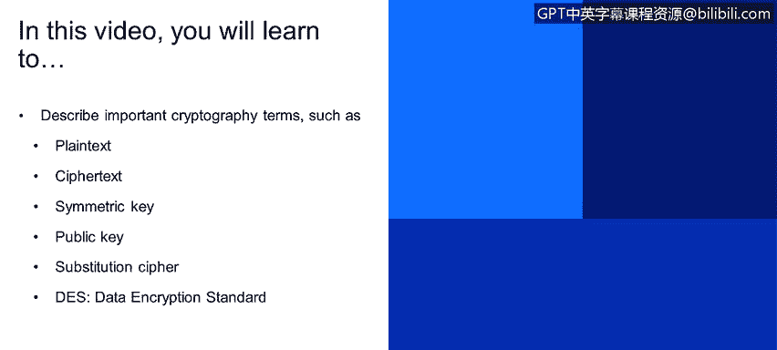
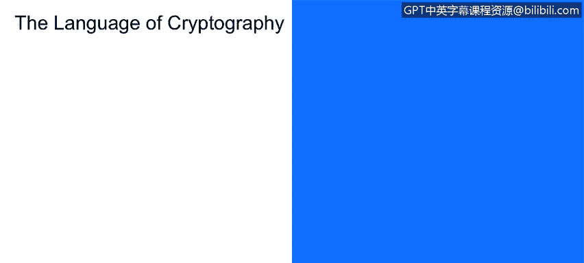
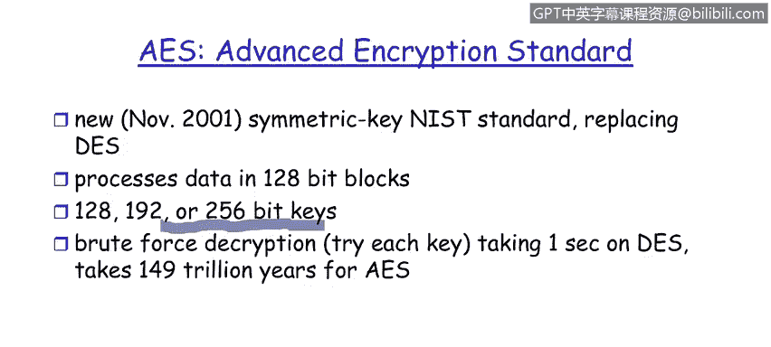

# 课程1：《网络安全工具与网络攻击简介》：68：来自安全架构师的不同角度的密码学

在本节课程中，我们将学习密码学的基础概念和术语，包括明文、密文、对称密钥、非对称密钥以及具体的加密算法。我们将从安全架构师的视角，理解这些概念如何在实际通信中应用。

## 密码学基础术语

在开始深入探讨之前，我们需要先建立关于密码学的词汇表。理解这些核心术语是学习后续内容的基础。

以下是几个关键术语的定义：

*   **明文**：这是人类可读的原始消息。它可以是电子邮件、Word文档、网页链接或任何Alice希望发送给Bob的内容。在未加密状态下，任何人都可以阅读它。
*   **密文**：这是明文经过加密算法处理后生成的加密消息。它看起来是乱码，无法直接理解。
*   **加密密钥**：这是一个用于加密和解密数据的秘密值。在示意图中，Alice使用的加密密钥被标记为 **K_A**（A代表Alice）。
*   **解密密钥**：这是用于将密文恢复为明文的密钥。Bob使用的解密密钥被标记为 **K_B**（B代表Bob）。

现在，让我们通过一个经典的通信模型来理解这些术语如何协同工作。

## 通信模型与密钥类型

观察此示意图，我们看到Alice再次与Bob通信。Alice是发送者，Bob是接收者。

Alice有一个她想发送给Bob的明文消息。她使用自己的加密密钥 **K_A** 和加密算法，将明文转换为密文。然后，密文通过通信信道发送给接收者Bob。Bob使用他的解密密钥 **K_B** 对密文进行解密，以恢复出原始的明文。

在通信信道中间的是拦截者或窃听者。

这里存在两种基本的密码学架构差异：

*   **对称密钥加密**：在这种架构下，接收者Bob的密钥和发送者Alice的密钥是相同的。即 **K_A = K_B**。
*   **非对称密钥加密（公钥加密）**：在这种架构下，密钥是不同的。Bob拥有一个私密密钥，因此 **K_A ≠ K_B**。

接下来，我们将更详细地探讨对称密码学的原理。

## 对称密码学原理

现在，让我们花些时间研究对称密码学背后的原理。我们将了解几种对称密钥加密的架构或风格。

首先，我们来看**替换密码**。这相当于一个“魔法解码器环”，即用一个字母简单替换另一个字母。它是一种单表替换密码，意味着在整个消息中，一个字母的替换规则保持不变。

观察这里的明文轮盘，我们简单地排列了A到Z。而密文轮盘是M到Q。由于M是字母表中的第13个字母，这意味着密钥 **K = 13**，即我们将密文字母向右移动了13位。

在单表替换示例中，从Alice发给Bob的明文是“Bob， I love you， Alice”。对应的密文，正如你所见，以“OBO”开头。一个显而易见的问题是：破解这种简单密码有多难？答案是一点也不难。因为英文字母的使用频率分布非常不均匀。例如，我们知道字母“E”出现得最频繁。因此，对密文中字母出现频率做一个简单的统计直方图，就能揭示出“E”对应哪个密文字母。在这种情况下，“E”将对应“R”。所以，这种频率分析会非常快地破解密文。事实上，这不是一种安全的加密方法。

从图形上看，对称密钥加密的架构如下所示：Alice发送明文消息，我们将其标记为 **m**。她使用一个专门为Alice和Bob设计的密钥（由下标A-B表示）加密明文。加密过程通过加密算法生成密文。注意这里的标记：密文被标识为 **K_{A-B}(m)**。这就是我们之前看到的字母移位示例的数学表示。

Bob收到密文后，应用解密密钥（与加密密钥相同，即 **K_{A-B}**）来恢复明文。用数学公式表示，消息 **m** 是通过对接收到的密文应用解密密钥得到的：**Decrypt(K_{A-B}, ciphertext) = m**。这里的元素是消息（密文）和解密密钥，它们共同作用以提取或恢复明文消息。

为了让这个过程生效，Bob和Alice必须共享同一个分发密钥 **K_{A-B}**。现在的问题是：Bob和Alice如何就密钥值达成一致？这实际上是对称密钥加密的弱点。加密算法本身（我们稍后会看其他方法）可能并不比非对称或公钥加密更弱，但问题在于密钥分发。Bob如何从Alice那里获得密钥？她可以通过电子邮件发送，但窃听者Trudy可以拦截那个密钥，然后用它来解密消息。答案显然是肯定的。因此，对称密钥加密的根本问题实际上在于密钥分发。

接下来，让我们看看另一种对称密钥方法。

## 数据加密标准

现在，让我们深入了解幻灯片6背后的一些技术。我们来谈谈**DES**。这是IBM一个具有历史意义的密码学方法。它实际上是根据美国国家标准与技术研究院发布的标准构建的。它使用56位对称密钥，这意味着从Alice到Bob的密钥长度是56位。当你看到64位明文输入时，这仅仅意味着DES加密算法以64位为一块来处理文本。如果你有一个640位的明文消息，你会有10个64位的组将被加密。当然，一个问题自然是：DES（数据加密标准）有多安全？56位密钥，正如我所说，是加密密钥的长度。大约几年前进行的一次暴力破解尝试表明，可以在大约4个月内破解它。那么如何防御呢？很简单，每三个月更换一次密钥，攻击者就不得不重新开始。此外，没有已知的后门。DES已经过密码学界的同行评审，这些人会报告加密标准中最微小的漏洞，但从未发布过此类漏洞。因此，我们认为它具有一定的强度。

我们可以通过在每个数据块（即我们看到的64位块）上使用三个密钥来使其更安全。这被称为密码块链接架构，让我们在下一张幻灯片上简要看一下。

## DES架构与高级加密标准

在幻灯片7中，是DES的一个架构元素。你可以看到，64位数据被分为左右两部分，然后进行交换。接着，我们从56位密钥中取出48位应用于这个部分，再进行左右交换和置换操作。关键在于，每个64位块都要经历**16轮**这种分段和加密循环。正如我之前所说，如果我们有640位的输入，这个过程会发生10次，然后将这10个结果连接起来作为加密消息发送。

在DES之后，NIST于2001年11月发布了一个新标准。NIST将输入块的大小增加了一倍，从64位提高到128位。密钥长度也从56位增加到了这里看到的更大数字：128、192或256位。为什么有三个选项？这是用户可选择的密钥长度。请记住，密钥越长，算法的计算强度就越大。因此，对于不同敏感级别的信息，有理由使用不同长度的密钥。使用128位相对于64位能使算法更高效。

如果你记得上一张幻灯片，我们提到过使用当今可用的高端计算机进行暴力破解，找到DES密钥只需要一瞬间。而正如你所见，对于AES，暴力破解时间延长到了149万亿年。因此，对于高级加密标准，暴力破解基本上已不现实。本培训模块的重点是要知道，第一个商业可用的电子加密算法是DES，随后是AES，后者有效地消除了暴力破解的威胁。

## 总结

在本节课中，我们一起学习了密码学的核心概念。我们从定义明文、密文和密钥等基础术语开始，然后通过Alice和Bob的通信模型理解了对称与非对称加密的根本区别。我们深入探讨了对称加密，包括简单的替换密码及其弱点，以及更复杂的数据加密标准DES的架构。最后，我们了解了DES的演进——高级加密标准AES，它通过增加密钥长度和块大小，极大地提升了安全性，使暴力破解变得不可行。理解这些基础是构建网络安全知识体系的重要一步。