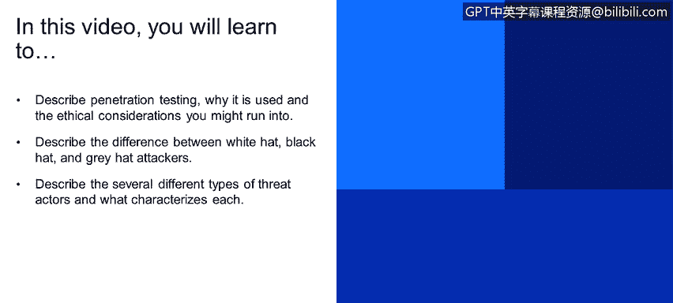
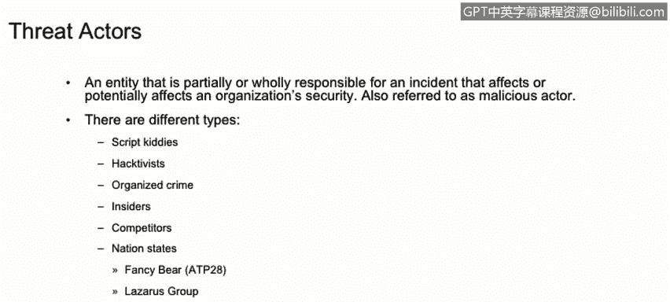

# 课程1：《网络安全工具与网络攻击简介》：69：渗透测试简介

## 概述
在本节课程中，我们将学习渗透测试的基本概念、其目的以及相关的伦理考量。我们还将区分不同类型的黑客和威胁行为者，了解他们的特征和动机。

---

## 渗透测试的定义与目的 🔍
渗透测试，通常简称为“渗透测试”或“道德黑客”，是一种测试计算机系统、网络或应用程序（如Web应用或软件应用）安全性的实践。其核心目标是**在攻击者之前发现并识别可利用的安全漏洞**，以防止未经授权的访问。

渗透测试的公式化描述是：**识别漏洞 → 评估风险 → 提供修复建议**。

## 渗透测试的伦理与法律框架 ⚖️
上一节我们介绍了渗透测试的基本定义，本节中我们来看看执行渗透测试必须遵循的框架。渗透测试并非随意进行，它需要在法律和合同的约束下开展。执行前通常需要签订服务级别协议、约定测试规则，并完成相关文档，以确保测试是双方之间的合法行为。

负责执行技术测试的人员被称为**渗透测试员**或**白帽黑客**。

## 黑客的类型：白帽、灰帽与黑帽 🎩
根据动机和行为的合法性，黑客主要分为三类。以下是各类黑客的特点：

*   **白帽黑客**：即道德黑客。他们在合同授权下，出于安全目的为公司执行渗透测试，其行为是合法且有益的。
*   **灰帽黑客**：他们介于白帽与黑帽之间。通常未经授权就对系统进行测试，但事后会向潜在受害方报告发现的漏洞。
*   **黑帽黑客**：即通常所说的“坏人”。他们未经授权进行攻击，动机可能包括个人声誉、金钱、政治目的或社会变革。

## 威胁行为者类型 🎭
除了黑客的分类，网络安全领域还存在各种**威胁行为者**，即对安全事件或攻击负有部分责任的实体。他们也被称为恶意行为者，拥有不同的技能水平和动机。以下是几种主要的威胁行为者类型：

*   **脚本小子**：经验不足的黑客，技术知识有限，依赖现成的自动化工具进行攻击，很少自己开发工具。
*   **黑客行动主义者**：通常出于政治议程或推动社会变革的动机而行动的有组织团体。
*   **有组织犯罪团伙**：通常来自公司外部，技术高度复杂，资金充足，常使用高级恶意软件（如勒索软件）进行攻击。
*   **内部人员**：包括现任或前任员工、承包商、合作伙伴等任何能接触到公司资产或机密信息的实体。他们可能有意或无意地构成安全风险。
*   **竞争对手**：其他竞争公司可能为了商业利益（如抢先发布产品）而构成安全威胁。
*   **国家资助的攻击者**：来自外部的、技术极其复杂且资金雄厚的实体，其动机常涉及政治、军事、技术或经济议程。例如，APT28、Lazarus Group、APT29等都是知名的国家背景黑客组织。

---

## 总结
本节课中，我们一起学习了渗透测试的核心概念及其在主动防御中的重要性。我们明确了渗透测试需要在伦理和法律框架内进行，并区分了白帽、灰帽和黑帽黑客的不同。最后，我们探讨了从脚本小子到国家资助攻击者等多种威胁行为者，了解了他们的特征和潜在动机。理解这些角色是构建有效网络安全策略的基础。