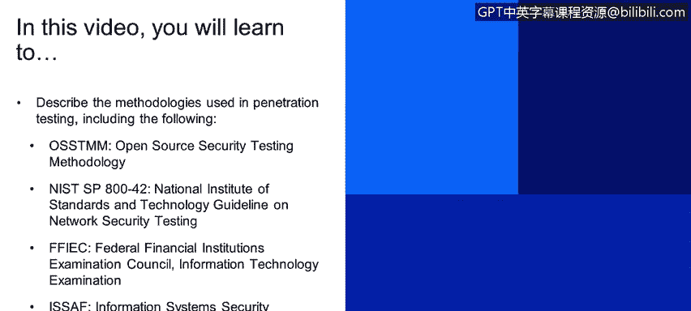
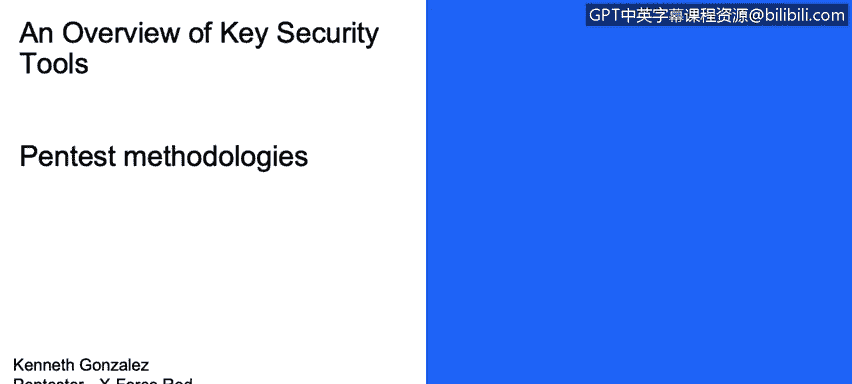
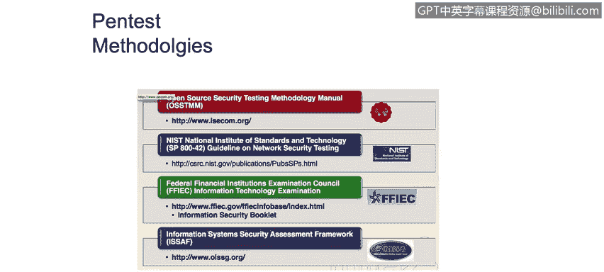

# 课程1：《网络安全工具与网络攻击简介》：70：渗透测试方法 🔍

在本节课程中，我们将学习渗透测试中使用的几种核心方法论。理解这些方法论对于规划和执行一次系统、有条理的渗透测试至关重要。

## 概述

渗透测试方法论为网络安全顾问（即道德黑客）提供了一套结构化的流程，用于执行一系列操作以尝试利用目标系统。这些方法论不仅指导如何发现和利用漏洞，更重要的是，它们能帮助你清晰地了解目标公司如何应对网络安全威胁、部署防御措施以及实施监控流程。

## 主流渗透测试方法论

以下是几种公开且广泛使用的渗透测试方法论：

*   **开源安全测试方法论手册**：即 OSSTMM。
*   **国家标准与技术研究院网络安全测试指南**：即 NIST 指南。
*   **联邦金融机构检查委员会信息技术检查手册**：即 FFIEC IT 手册。
*   **信息系统安全评估框架**：即 ISSAF。

除了以上几种，还有一个非常流行且结构清晰的方法论，称为 **渗透测试执行标准**。

## 深入解析：渗透测试执行标准

如果你在搜索引擎中查找“PTES technical guidelines”，可以访问其官方网站 `www.pentest-standard.org`。该网站提供了关于此方法论的详尽信息。

PTES 是当前最简明的方法论之一。它的核心是将整个渗透测试项目划分为几个清晰的阶段。每个阶段都列出了需要执行的具体任务。例如，在“情报收集”阶段，你可以点击查看需要执行哪些操作来获取足够的目标信息。

在现实世界中，作为一名渗透测试员或道德黑客，**情报收集和枚举过程是第一步，也是最重要的一步**。你需要彻底了解客户的攻击面，识别所有可能被利用的系统。这里存在一个常见的误解：有些人认为渗透测试员只是打开一个叫 Metasploit 的工具，输入命令就开始利用漏洞。事实并非如此。在实际工作中，你必须从目标处收集大量信息，进行充分的枚举，才能进入后续阶段。

当你收集到足够的信息后，就可以开始**威胁建模**过程。此时你已经掌握了目标的信息，接下来需要规划攻击的路线图。PTES 提供了一些示例、检查清单和可执行的操作，帮助你确定应该重点攻击组织的哪个部分、网络的哪个区域，因为你已经通过情报收集过程对其有了初步了解。

下一步是**漏洞分析**。作为渗透测试员，我们有时会使用漏洞扫描器或漏洞评估工具，以便更好地理解系统中哪些漏洞更可能被成功利用。例如，如果我们发现目标的 80 端口运行着一个 Apache 服务器，版本是 2.6，那么我们可以尝试寻找影响该特定版本 Apache 的漏洞。我们可以使用 OpenVAS、Nessus 等漏洞评估工具，也可以进行手动研究。例如，直接在搜索引擎中查询“exploit Apache 2.6”，就能找到大量影响该版本的信息，从而为下一步的利用做好准备。

接下来是**漏洞利用**阶段。在此阶段，首先必须明确：**未经授权，绝不能利用任何系统**。你需要与客户协调，商定进行漏洞利用的时间窗口。例如，如果你在客户网站销售高峰期攻击其 Apache 服务器，不仅可能获取系统访问权限，还可能因导致拒绝服务而中断客户的正常业务，这将带来严重问题。因此，协调沟通是渗透测试员必须理解的关键部分。

在 PTES 方法论中，利用阶段还有许多细节需要注意。例如，如果你想向目标系统发送一个用于建立反向连接的载荷，可能需要处理**规避或混淆**技术，以尝试绕过防病毒软件的检测。或者，如果你想加密你的攻击载荷或连接，可以使用加密的 Netcat 或其他工具，利用系统上开放的端口进行加密通信。

最后是**后渗透与报告**阶段。后渗透指的是在已经获得系统访问权限后，如何**维持访问**、如何进行**横向移动**（即从一台计算机跳转到另一台），以及如何执行**权限提升**。而**报告**则是整个过程中最重要的部分：你如何向客户展示你是如何执行每个步骤并最终成功入侵系统的。

## 总结

本节课我们一起学习了渗透测试的核心方法论。我们了解到，一个结构化的方法论（如 PTES）将测试过程分为情报收集、威胁建模、漏洞分析、漏洞利用和后渗透与报告等多个阶段。掌握这些方法论不仅能指导我们高效、系统地进行安全测试，更能帮助我们理解客户的安全状况，并最终通过专业的报告呈现测试结果。记住，协调沟通和遵守授权范围是渗透测试工作的基石。