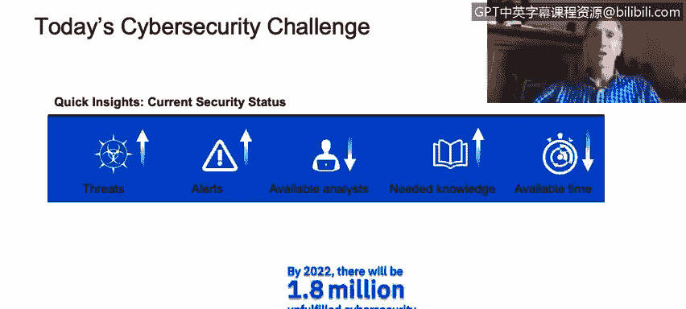
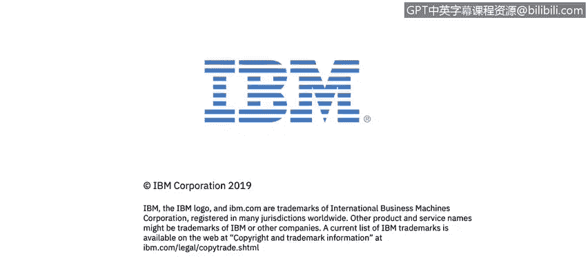

# 课程1：《网络安全工具与网络攻击简介》：74：介绍

大家好，我是杰夫·克鲁。我是IBM的安全架构师和杰出工程师。我在IBM工作了36年，其中大部分时间都专注于安全领域。我对这个特定主题的兴趣可以追溯到高中时期，那时我大部分下午都在实验室里进行黑客活动，试图弄清楚系统如何工作、如何被破坏以及如何防御攻击等。因此，对我而言，这始终是一个引人入胜的话题，我希望你们也能发现它的魅力。欢迎参加本课程，希望你们觉得它有趣。

我们将进入下一张幻灯片，其中提到了当前我们在网络安全领域面临的挑战，这些挑战是巨大的。事实上，这些挑战中的大多数已经存在很长时间了。我怀疑在未来很长一段时间内，这种情况仍将持续，这也是这个领域如此有趣、如此值得投入时间发展技能的原因之一。

例如，威胁持续增加。自从我们通过互联网将计算机互联以来，情况一直如此。威胁持续增加，没有理由认为这种情况会改变。攻击者进行黑客攻击的动机也在增加。为什么呢？因为越来越多的重要信息、有价值的信息以及具有实际货币价值的资源被存放在IT系统上。正如著名（或臭名昭著）的银行劫匪威利·萨顿被问到为何不断抢劫银行时所说：“因为钱在那里。”如果威利·萨顿今天还在抢劫银行，他很可能也会攻击IT系统，成为一名黑客，因为“钱在那里”，而且这种情况将持续下去。因此，威胁持续增加，系统变得更加复杂，这也扩大了威胁面，增加了我们为这些系统设定的目标范围。

我们收到的警报也在持续增加。换句话说，关于人们正在攻击、使用不同类型攻击向量和特定技术的通知在不断变化和演变。虽然有一些持续存在的普遍主题，但攻击的细节会不断变化。

不幸的是，这些情况对攻击者有利。对于防御者而言，分析师的数量却在减少。你们可以在本幻灯片底部看到一个统计数据，特别提到了我们预测的技能短缺问题：到2022年，将会有**180万个**网络安全职位空缺。这个数字非常庞大。有些人可能会争论说这个数字被夸大了，那么让我们将其减半，粗略地算作大约一百万，这仍然是一个巨大的数字。这意味着，即使有职位空缺，也没有足够的技术人员来填补。我们培养网络安全专家的速度无法满足这一需求。现在，你们观看本课程时，这段内容是在某个时间点录制的。因此，每当发布此类统计数据时，总存在未来情况可能有所不同的风险。但我怀疑，这将是我们在未来需要面对的一个问题。因此，我们需要更多网络安全专家来完成我们必须完成的任务，并且他们需要越来越多的知识。处理更复杂攻击所需的知识也在持续增加。

更不幸的是，我们处理这些问题的时间越来越少，因为在应对攻击时，时间就是金钱。响应时间越长，成本就越高，泄露的数据就越多，造成的损害就越大。在某些情况下，当我们谈论像欧洲的《通用数据保护条例》（**GDPR**）这样的合规法规时，如果未能足够迅速地响应并通知所有需要知晓数据泄露的人员，你的公司还将面临巨额罚款。综上所述，所有这些因素都指向一个不可避免的结论：我们需要更多具备网络安全技能的个人来帮助应对威胁。

那么，这些人员日常需要做些什么呢？如果你在**安全运营中心**（**SOC**）工作，顺便说一下，SOC是接收安全信息和事件管理信息的控制中心或神经中枢。你们看到的缩写**SIEM**指的是将所有警报和安全信息汇集到一个地方。我们需要能够在控制台上查看这些事件和事故，判断哪些重要，哪些不重要。这是此处进行事件分类的重要组成部分。在进行分类时，我们必须决定这是否是真实事件。如果是，我需要进行更多调查；如果不是，那么我可以继续处理其他事务，并且可能希望对其进行分类，以便将来不再浪费时间处理类似的信息和警报。因此，我们不断希望根据我们的环境进行调整，以避免浪费时间，提高工作效率。我们需要能够进行调查。

在某些情况下，调查涉及使用各种不同的安全工具。你可能有许多不同的控制台，尽管我们越来越倾向于创建一个集成的整体，以便能够从数据层、操作系统层、网络层、应用层、身份层等汇集信息，并以集成的方式将它们整合在一起。但在许多情况下，这些**入侵指标**可能来自不同的系统，我们需要能够将它们全部整合起来。因此，需要具备进行搜索、调查的技能，拥有好奇的头脑，能够将我们拥有的所有不同线索拼凑成一个完整的图景，并开始构建一个叙述：这件事发生了，然后导致了那件事，接着我们又遇到了这个情况，现在我们面临的不是一个单一事件，而是一个影响许多系统的大型恶意软件活动。

我们对此的缓解和响应协调方式，就成为我们必须关注的下一个关键技能。因此，首要任务是识别问题，然后尝试发现其范围和涉及的风险，例如，这对组织有多大影响，最终我们对此采取何种响应措施。我们能否将部分响应自动化以备将来使用？这是一个需要我们一次性处理的问题，还是需要通知特定人员来响应？是否需要与系统可能与我们相连的其他合作伙伴合作？我们的上游互联网服务提供商是否需要让他们在网络层面进行拦截以清除恶意内容？是否需要安装新工具来帮助未来进行缓解？可以看到，这里涉及许多不同类型的事情，我们只是触及了冰山一角。但我要再次告诉你们，这是一个迷人的领域，一个不断变化的领域。如果你喜欢挑战，喜欢解决难题，这是一个很好的工作领域。我希望你们能发现本课程中的信息有用。

## 课程概述

在本节课中，我们将学习网络安全领域当前面临的重大挑战、安全运营中心（SOC）分析师的核心职责，以及为什么网络安全是一个充满机遇且至关重要的职业领域。

## 核心挑战

以下是网络安全领域面临的主要挑战：

*   **威胁持续增加**：随着更多有价值的数据和资源转移到IT系统，攻击动机和威胁数量不断上升。
*   **系统日益复杂**：系统复杂性增加，扩大了可被攻击的“攻击面”。
*   **攻击手段不断演变**：攻击技术和向量持续变化和进化，防御者需要不断学习。
*   **技能人才严重短缺**：预计到2022年，网络安全职位缺口高达180万，专业人才供不应求。
*   **响应时间窗口缩小**：攻击造成的损失与响应时间直接相关，快速响应至关重要，合规要求（如**GDPR**）也规定了严格的响应时限。

## SOC分析师的核心工作流程

上一节我们介绍了网络安全领域的宏观挑战，本节中我们来看看安全运营中心（SOC）分析师具体需要做些什么。他们的工作主要围绕**SIEM**（安全信息和事件管理）平台展开，遵循一个系统化的流程：

1.  **监控与分类**：在控制台查看**SIEM**汇集的安全事件和警报，进行初步分类，区分重要与非重要事件。
2.  **调查与分析**：对疑似真实攻击的事件进行深入调查。这需要利用各种安全工具，从不同层面（网络、系统、应用等）收集**入侵指标**，并像侦探一样将线索拼凑起来，构建完整的攻击故事线。
3.  **评估与响应**：确定事件的影响范围和风险等级，然后协调响应措施。响应可能包括：阻断网络攻击、修复受影响系统、安装防护工具、通知相关方，以及制定未来自动化响应的规则。

## 总结

本节课中，我们一起学习了网络安全领域的现状与职业前景。我们了解到，由于威胁加剧和人才短缺，网络安全专家需求巨大。安全运营中心（SOC）分析师扮演着网络防线关键角色，他们的工作包括监控警报、调查事件、协调响应，这是一个需要好奇心、分析能力和快速学习精神的充满挑战的领域。如果你热衷于解决复杂且不断变化的问题，网络安全将是一个极具价值的职业发展方向。