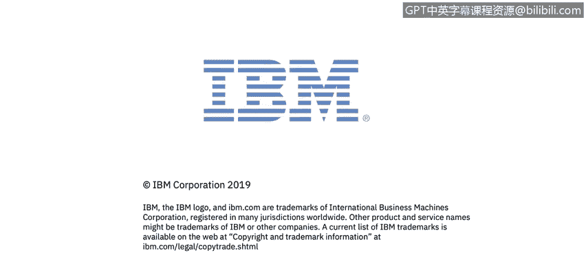

# 课程1：《网络安全工具与网络攻击简介》：75：1_04：网络安全历史简介

在本节课中，我们将开始学习网络安全的历史背景，并了解本课程的结构与专家团队。你将听到来自IBM的专家们分享他们对当前网络安全挑战的见解。

正如你刚才听到的，杰夫已经欢迎你加入本课程。网络安全技能目前需求巨大。

全球的公司、组织和政府机构都发现，很难招聘到足够数量的熟练网络安全专业人员来满足他们的需求。

我是特里·佩特，IBM安全部门的内容策略师和教学设计师。

在你的整个学习旅程中，我将与你同行，帮助你整合需要掌握的材料，以便在当今的网络安全市场中取得成功。你将听到来自IBM主题专家的讲解，他们对分析师当前面临的网络安全挑战拥有全球视角。

他们将为你提供信息，以达成本课程每个模块的学习目标。

在模块1中，来自IBM X-Force Red团队、位于哥斯达黎加的渗透测试员肯尼思·冈萨雷斯，将首先为你简要介绍网络安全的历史。

专注于美国联邦政府项目的执行安全架构师约翰·麦克劳克林，将进一步解释为什么网络安全在当今世界变得如此具有挑战性。

IBM X-Force的安全顾问克里斯滕·达尔，将讨论批判性思维。这是本课程中将要介绍的众多软技能中的第一个。

克里斯滕的视频借用了她向IBM的“网络安全女性”分会所做的一次网络研讨会。事实上，加入一个网络安全组织是向所有技能和经验水平的志同道合者学习的好方法。

本课程中会标注指向WISSS及类似组织的链接。

那么，让我们开始吧。

---

本节课中，我们一起学习了本课程的引入部分，了解了网络安全领域的高需求现状，并认识了将在后续模块中指导我们的IBM专家团队。下一节，我们将深入探讨网络安全的历史演变。