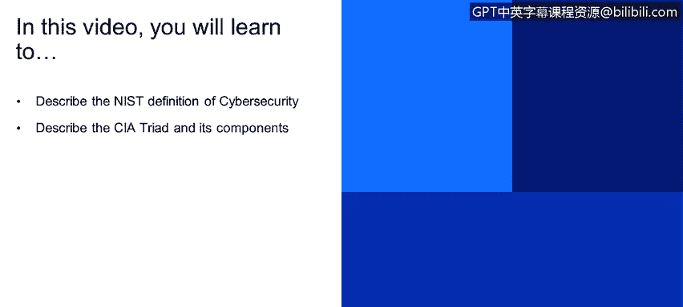
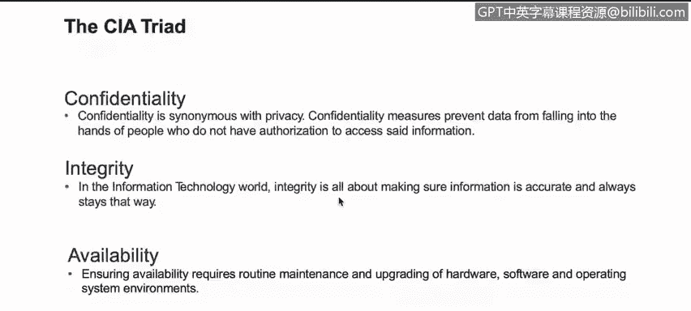

# 课程1：《网络安全工具与网络攻击简介》：76：2_01_网络安全定义

在本视频中，你将学习描述美国国家标准与技术研究院（NIST）对网络安全的定义，并描述CIA三要素及其组成部分。

## 概述

在本节中，我们将首先了解NIST对信息安全的官方定义，然后深入探讨构成信息安全基石的CIA三要素。

## 信息安全定义

根据NIST的定义，信息安全是指保护信息系统免受未经授权的活动，以提供**机密性**、**完整性**和**可用性**。这三个原则被称为CIA三要素。

## 详解CIA三要素

CIA三要素包含三个不同的原则：机密性、完整性和可用性。

### 机密性

机密性类似于或等同于隐私。对于机密性，对资源或数据的访问必须仅限于被授权的实体。数据加密是确保机密性的常用方法。

**核心概念示例**：
- **公式/描述**：`访问控制 -> 仅限授权实体`
- **代码示例（概念性）**：`数据加密算法（如AES）`

### 完整性

完整性涉及在整个生命周期中保持数据的一致性和准确性。数据在传输过程中（例如通过互联网或局域网发送时）不得被更改。必须采取措施确保未经授权的人员无法更改我们的数据。使用哈希值进行数据完整性验证非常常见。

**核心概念示例**：
- **公式/描述**：`原始数据哈希值 == 接收数据哈希值`
- **代码示例（概念性）**：`使用SHA-256计算并比对文件哈希值`

例如，当你从互联网下载一个新的操作系统时，下载完成后首先要做的事情之一，就是比较操作系统作者提供的哈希值与你下载文件的哈希值。它们必须匹配，以确保数据的完整性是准确的。

### 可用性

确保可用性需要对硬件、软件和操作系统环境进行维护和升级。这基本上是为了保持业务运营持续运行。防火墙、代理服务器、计算机等所有设备都必须保持24/7、全年无休的运行状态。业务连续性计划、灾难恢复和冗余虽然是可用性方面的最佳实践，但都是为了保障业务始终运行。

**核心概念示例**：
- **公式/描述**：`系统正常运行时间 / 总时间 = 可用性百分比`
- **代码示例（概念性）**：`实施负载均衡与故障转移集群`

## 总结

本节课我们一起学习了NIST对网络安全的定义，并详细探讨了构成信息安全核心的CIA三要素：**机密性**、**完整性**和**可用性**。理解这三个基本原则是构建所有网络安全策略和措施的基石。