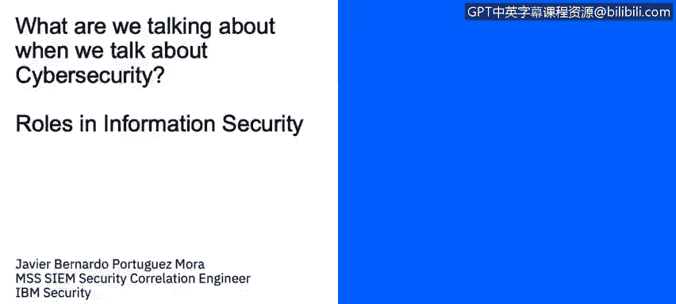
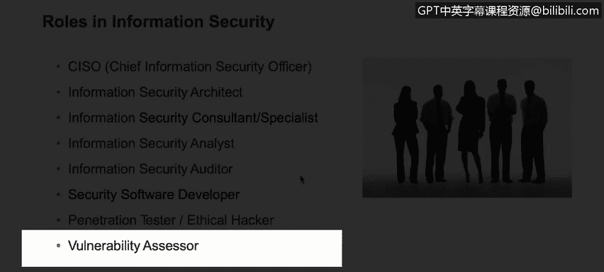

# 课程1：《网络安全工具与网络攻击简介》：80：6_05：信息安全中的角色 👨‍💼

在本节课程中，我们将学习描述一个典型网络安全组织中存在的各种角色。

## 概述
信息安全领域包含多种专业角色，每个角色都承担着保护组织数字资产的不同职责。尽管不同组织的具体岗位设置可能有所差异，但一些核心角色在大型企业中非常普遍。接下来，我们将逐一介绍这些关键角色。

以下是信息安全领域中一些常见的核心角色：

*   **首席信息安全官**：这是一个高级管理职位，负责领导整个安全部门及其团队。该角色负责监督整个安全部门，确保信息安全战略与业务目标一致。
*   **信息安全架构师**：负责设计和规划组织的整体安全架构与解决方案。
*   **信息安全顾问/专家**：提供专业的安全建议、指导以及解决复杂的安全问题。
*   **信息安全分析师**：负责日常监控与分析。该角色需要分析来自安全系统的**事件**、**警报**和**告警**，以识别潜在威胁。例如，当入侵防御系统向安全信息和事件管理平台发送威胁警报时，分析师需要调查相关事件，并追踪问题直至解决。
*   **安全审计员**：负责测试计算机信息系统的有效性，确保其遵循最佳实践和特定法规标准，例如 **ISO 27001** 或 **ISO 27002**，从而使组织得到尽可能完善的保护。
*   **安全软件开发人员**：开发具有安全特性的软件或应用程序。
*   **渗透测试员**：也称为红队成员，负责模拟攻击以评估系统安全性。
*   **漏洞评估员**：负责系统地发现和评估系统中的安全弱点。
*   **数字取证分析师**：属于蓝队成员，负责在安全事件发生后进行调查、证据收集和分析。
*   **安全工程师**：熟悉各种安全技术，负责实施、维护和优化安全工具与基础设施。

## 角色特点与演变
值得注意的是，这些角色中的许多在IT领域早已存在。如今，我们为其增加了专门的安全职责，使其更加具体并确保其工作以安全为导向。这些角色的共同目标是确保组织遵循安全最佳实践和标准。

## 总结
本节课我们一起学习了网络安全组织中的关键角色，从制定战略的**首席信息安全官**，到执行日常监控的**信息安全分析师**，再到进行合规审计的**安全审计员**。理解这些角色的分工有助于我们认识一个完整的安全团队是如何协同工作以保护组织信息资产的。