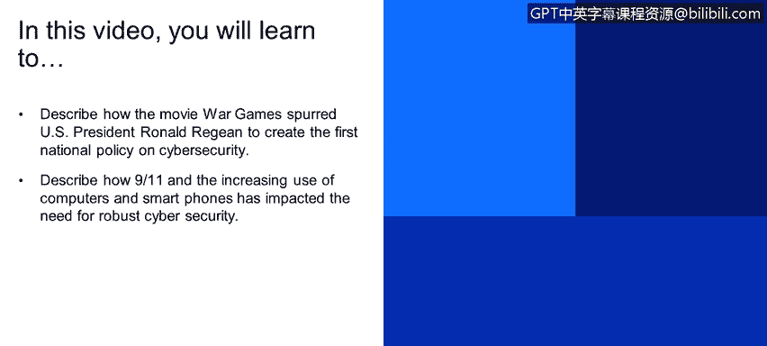

# 课程1：《网络安全工具与网络攻击简介》：81：7_01 从里根与《战争游戏》到今日网络安全格局

在本节课程中，我们将学习描述电影《战争游戏》如何促使美国总统罗纳德·里根制定了美国首个国家网络安全政策，并探讨“9/11”事件以及计算机和智能手机的普及如何深刻影响了对强大网络安全的需求。

接下来，我们将了解这些网络安全进程是如何开始的，以及政府是如何进入并发展其网络安全领域的。

一切始于罗纳德·里根。罗纳德·里根是一位曾为好莱坞演员的美国总统。他向他的安全人员、安全顾问提出了一个问题：他在一部电影中看到的情节是否可能成为现实。是哪部电影呢？让我们快速回顾一下里根观看并询问其顾问的那部电影。

（电影片段对话）
> “我们进来了。它以为我是‘猎鹰’。你好。”
> “我会问它任何它被设定要问的问题。你想听它说话吗？是的。”
> “我会问它感觉如何。我很好。你呢？”
> “好极了。好久不见。你能解释一下你的用户账户在1973年6月23日被移除的原因吗？”
> “它一定被告知他死了。人有时会犯错误。是的，他们会。我怎么能说话？”
> “这不是真实的声音，这个盒子只是解释来自计算机的信号并将其转化为声音。我们来玩个游戏好吗？”

这部电影就是《战争游戏》。这实际上是一部相当老的电影。但电影的主要情节是，一名青少年黑客入侵了五角大楼的计算机。他与五角大楼的主计算机——运行该计算机的人工智能——开始了一场游戏。人工智能理解这是一场战争游戏，但它实际上可能动用真实的导弹和核武库。因此，一个青少年从家里的地下室入侵了五角大楼的计算机，并从家中获得了导弹的控制权。

于是，罗纳德·里根询问他的顾问：这可能是真的吗？这可能正在发生吗？因此，他们开始着手制定美国网络安全领域的首项政策，即 **“国家电信与自动化信息系统安全政策”**，编号为 **NSDD-145**。

然后，我们跳到“9/11”事件。“9/11”事件发生后，美国政府的许多人开始思考：我们如何才能避免下一次“9/11”？我们如何才能避免下一个可能导致美国境内系统（例如，通信系统、发电厂能源系统）中断的网络威胁？

这部分历史课程的最后一个要点是技术的使用。30或40年前，没有人在家里拥有计算机。而现在，每个人家里至少有一台电脑和一部智能手机。因此，存在大量的人口、大量的技术，以及大量可能通过这些技术被分享、窃取或泄露的信息。

在本节课中，我们一起学习了网络安全意识兴起的关键历史节点。我们了解到，电影《战争游戏》引发了高层对网络威胁的重视，直接催生了美国首项国家网络安全政策 **NSDD-145**。随后，“9/11”事件凸显了保护关键基础设施免受攻击的紧迫性。最后，个人计算设备和智能手机的爆炸式普及极大地扩展了网络攻击面，使得强大的网络安全措施变得比以往任何时候都更加重要。这段历史清晰地展示了网络安全从特定军事关切演变为关乎国家稳定与个人隐私的全球性核心议题的过程。