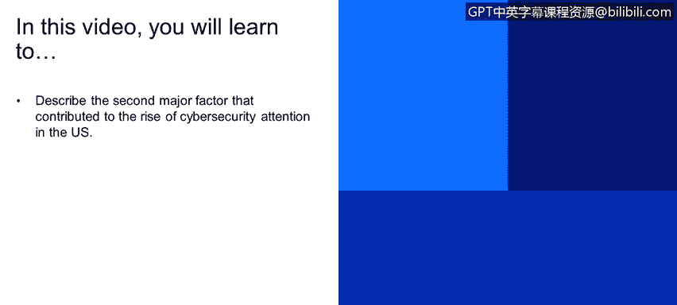
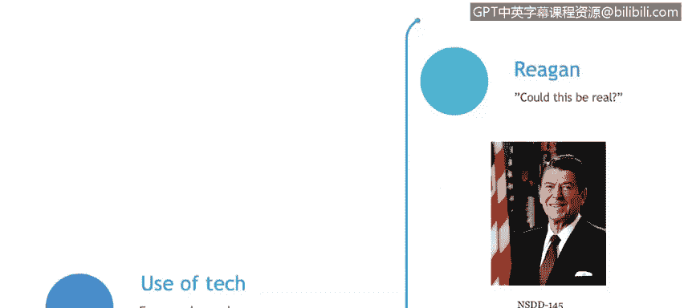

# 课程1：《网络安全工具与网络攻击简介》：82：8_02_9-11事件对网络安全的影响

在本节课程中，我们将探讨推动美国网络安全关注度上升的第二个主要因素：9/11事件。我们将了解这一事件如何从根本上改变了人们对网络威胁的认知，并回顾早期一些重要的国家级网络行动。

9/11事件显然是影响深远的事件，涉及飞机撞击纽约双子塔的悲剧。

美国政府试图理解几个关键问题：事件是如何发生的、不同部分之间如何协调，以及如果类似的灾难性事件发生在技术领域而非物理世界会怎样。例如，针对发电厂、电网或任何重要城市电力网络的破坏。

当前一个重要的关注点是技术几乎对所有人开放。如今，几乎每个人都拥有手机，可以访问数据，并能从互联网上传下载数据。我们稍后会详细讨论这一点。理解这一点很重要：近年来，技术变得触手可及。过去并非人人都有机会接触这些技术，但现在，任何人都可能利用家中的手机或电脑发起攻击。技术的普及性是需要理解的重要因素。

接下来，我们回顾一些早期涉及国家层面的网络安全行动或网络战。

以下是几个重要的早期网络行动案例：

*   **船桅行动**：由美国国家安全局开发。简而言之，该行动试图在美国大多数家庭的固定电话线路中植入芯片，以监听通信。这项行动未获国会批准，但根据爱德华·斯诺登的披露，我们知道类似监听不仅针对电话线路，也扩展到了电子邮件等其他通信方式。
*   **月光迷宫行动**：发生在2000年，是一项非常重要的行动。根据《新闻周刊》的系列报道，该行动旨在从Unix和Linux服务器上窃取密码，受害者包括NSA、NASA、美国国防部等多个机构。这被认为是网络战领域的早期事件之一，据信是俄罗斯所为。攻击者使用了名为`Lock to`的工具，并大量使用代理服务器。他们感染了全球（尤其是美国）的计算机，利用这些计算机作为跳板进行连接。因此，当美国政府开始监控网络活动时，追踪到的是攻击者使用的代理服务器，而非攻击者真实的源头。
*   **太阳日出行动**：该行动有一个有趣的组成部分。它是一系列针对美国国防部计算机网络的攻击，始于1998年2月。攻击者利用了国防部网络中一个已知的操作系统漏洞。攻击步骤包括：首先确认漏洞是否存在；如果存在，则利用该漏洞；接着植入后门或嗅探程序以收集数据；最后，攻击者会暂时离开，稍后再返回获取收集到的信息。攻击目标不仅包括国防部网络，还涉及空军、海军、海军陆战队以及以色列、法国、德国等其他国家的网络。他们试图获取关键网络部分的密码和文档。有趣的是，发动这次攻击的并非恐怖分子或敌对国，而是加利福尼亚州的两名青少年，其中一人来自以色列。这充分说明了即使没有国家背景的网络部队参与，如果我们的网络不安全，同样可能遭受严重攻击。
*   **对Y军事基地的入侵**：被时任国防部长威廉·J·L.称为美国军方计算机有史以来最严重的入侵事件之一。该事件是2008年一系列入侵行动的一部分。起因是中东军事基地的一台电脑被插入了一个受感染的USB驱动器，其中包含名为`agent BTC`的木马。这个木马蠕虫在网络上潜伏了14个月，才被军方IT安全人员清除。目前虽怀疑攻击来自中国，但尚未有官方正式指控。这是过去10到15年间一起重大的安全漏洞和网络战行动。
*   **其他例子**：例如90年代初的“沙漠风暴”行动和波斯尼亚战争。这两场战争本身并非网络战，但包含了网络战成分。在“沙漠风暴”行动中，美军通过干扰或向雷达系统注入虚假信息，成功攻击了萨达姆·侯赛因的一些关键军事设施。在波斯尼亚，则大量运用了网络行动，例如向战场上的军队传递假新闻和虚假信息。

**总结**

本节课中，我们一起学习了9/11事件如何成为推动美国网络安全发展的关键转折点，它促使人们思考物理世界之外的数字威胁。我们还回顾了“船桅行动”、“月光迷宫”、“太阳日出”等早期国家级网络行动案例，这些案例揭示了网络攻击的多样性和潜在威胁来源的广泛性，从国家行为体到个人青少年都有可能。这些历史事件共同强调了构建和维护强大网络防御体系的必要性和紧迫性。