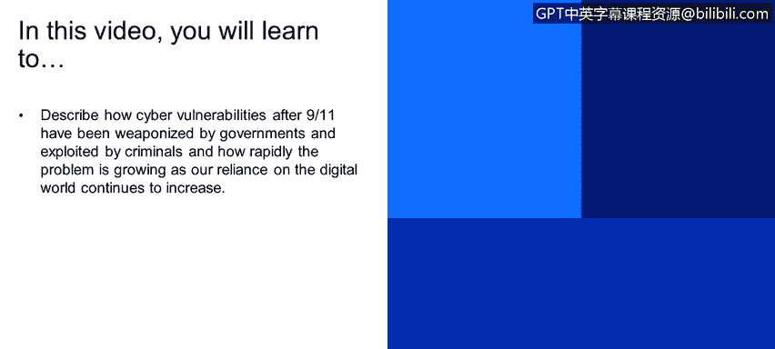
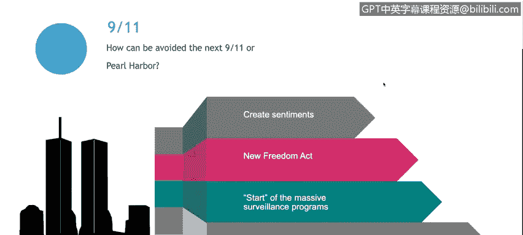
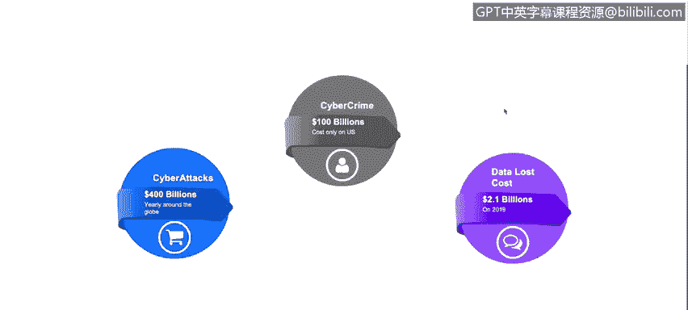
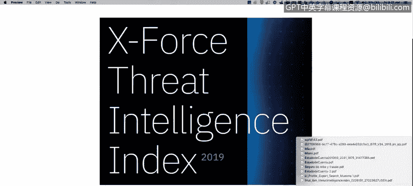
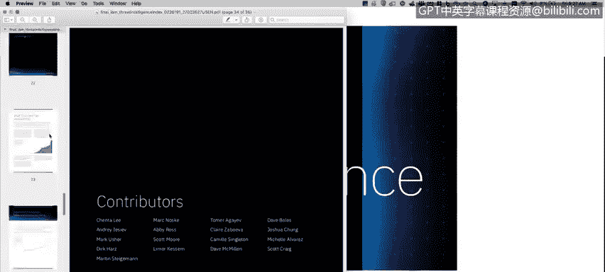
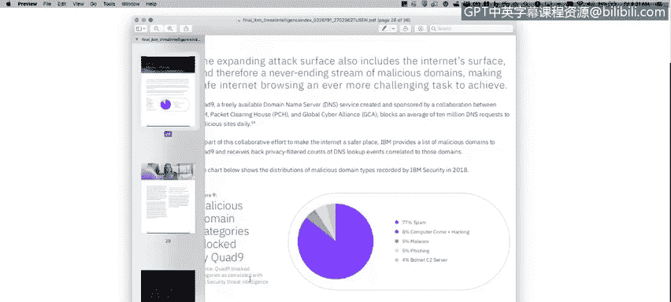

# 课程1：《网络安全工具与网络攻击简介》：83：9_03_当今网络安全态势 🔍

在本节课中，我们将学习“9·11”事件后网络漏洞如何被政府武器化并被犯罪分子利用，以及随着我们对数字世界依赖的持续加深，网络安全问题是如何迅速增长的。

---

上一节我们介绍了课程背景，本节中我们来看看“9·11”事件对网络安全领域的深远影响。

“9·11”事件后出台的《爱国者法案》是启动大规模监控计划的关键。这些计划在几年后由斯诺登揭露。事实上，“9·11”袭击是开启新型网络战争的基石。

例如，我们不会深入讨论，但存在一种名为**Stuxnet**的病毒，它被植入伊朗核设施。这种病毒、特洛伊木马程序，据称是由美国和以色列通过一项名为“奥运会”的行动创建的。

此类事件的发生，根源在于“9·11”事件。美国政府不仅希望了解网络世界的动态，更试图通过在网络空间先行行动，来预防和阻止现实世界的战争。**Stuxnet**病毒就是这样一个例子。

---

了解了历史背景后，我们来看看一些具体的统计数据，这对于理解网络安全的规模至关重要。

以下是2017年的数据（报告基于2016年的统计）。软件漏洞数量庞大，例如：
*   **跨站脚本攻击**
*   **SQL注入攻击**
*   **本地文件权限提升**
*   **权限升级漏洞**
*   **本地及远程文件上传**（试图创建系统后门）

尽管各公司努力修复、检测和纠正这些漏洞，但软件漏洞数量仍逐年呈**指数级增长**。我们将在今年的《X-Force威胁情报指数报告》中看到更多相关数据。

另外一些来自《福布斯》2016年研究的数据显示：
*   全球每年因网络攻击造成的损失接近**4000亿美元**。
*   网络犯罪在美国已成为一项价值**1000亿美元**的产业。
*   预计该年度数据丢失量达**21亿**条。

这些数字涵盖了拒绝服务攻击、数据泄露和国家资助的攻击等。

---

为了获取最新洞察，我们查阅了《X-Force威胁情报指数报告》。以下是该报告的核心发现。

首先，我们来看2018年最常被攻击的行业：
*   **金融与保险业**：显然，因为这里资金密集。
*   **医疗保健业**：占2018年攻击目标的6%。
*   **能源业**：这很重要，我们稍后会讨论乌克兰的案例。黑客使用大量恶意软件和工具攻击能源基础设施。

其次，关于漏洞趋势，报告第23页更新了2018年的数据，显示漏洞数量大幅增加。这很容易理解：如今我们使用的系统（如Twitter、Instagram、各类Web和移动应用）远比15年前多。每个软件或应用都可能携带未被发现的漏洞，为攻击者提供了可乘之机。

最后，报告第28页列出了被Quad 9屏蔽的恶意域名类别：
*   **垃圾邮件**：占被屏蔽URL的77%。
*   **网络犯罪与黑客行为**：占8%。
*   **恶意软件与网络钓鱼**：占5%。
*   **僵尸网络命令与控制服务器**：占4%。

本课程后续视频将详细讨论这些主题。

---

该报告包含了大量信息，我强烈建议你下载并阅读这份约35页的报告，这对于理解当前网络安全状况非常重要。

---

本节课中，我们一起学习了“9·11”事件如何重塑了网络安全的格局，将其推向国家层面武器化和大规模犯罪利用的新阶段。我们通过具体数据看到了软件漏洞的指数级增长、网络攻击造成的巨大经济损失，以及金融、医疗、能源等行业面临的主要威胁。最后，我们借助权威报告分析了当前的攻击趋势和恶意活动的主要类型。理解这些现状是构建有效网络安全防御的第一步。