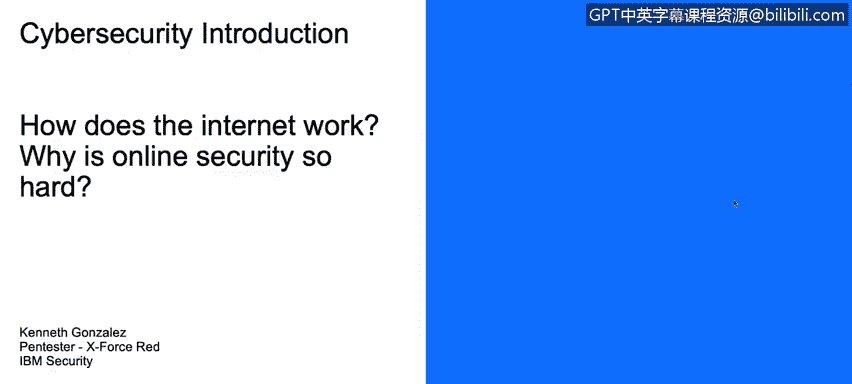
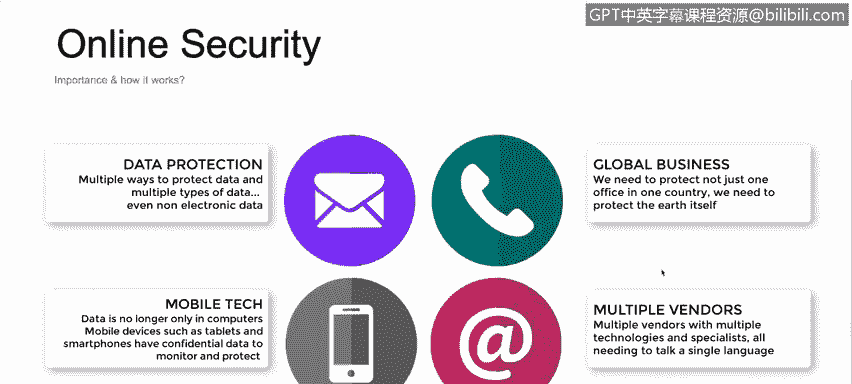

# 课程1：《网络安全工具与网络攻击简介》：84：10_01_网络安全简介

在本视频中，你将学习描述为何全面的网络安全架构在现实中实施起来可能非常复杂。

现在我们来讨论互联网的工作原理，以及为何在线安全如此难以实施和维护。

首先，理解我们当前在线存在的整体图景很重要。

这实际上是Domo公司在2018年发布的一份报告摘要。

在这里我们可以看到，例如，每分钟在Facebook Messenger上发送近25000个GIF。这是一个有趣的事实。实际上，每分钟有近423000条推文在Twitter上发送，还有420万个视频在Snapchat上被观看。

这些数字为何重要？这些数字代表着每个人，每个拥有智能手机或电脑的人，都在互联网上，不仅从网络服务器，也从互联网上的其他人那里发送和接收信息。

这里有趣的部分在于，这些数字是每分钟的数据。所以每分钟有420万个视频在Snapchat上被观看，每分钟有25000个GIF在Facebook上发送。这意味着有大量的数据，大量的信息，我们正在互联网上使用和处理。

一个简单的例子，也是一个很好的练习。Tomb是一个在全球范围内收集和理解数据的组织。他们尝试使用大数据技术和人工智能等技术来分析数据。

他们建立了一个网站，你可以计算你在互联网上的信息价值。

例如，通过几次点击，说明你有一个Facebook页面，你经常发送推文，或者你在WordPress上有一个个人博客等，我们可以估算出你已经在互联网上拥有的信息价值近1000美元。

这很重要，因为通常我们不会真正关注我们在互联网上分享或拥有的信息。这是我们需要理解的事情之一，以便在我们的账户上实施控制。

我们将讨论身份验证。我们将讨论识别以及我们可以用来保护信息的方法，不仅是在商业层面，也包括在我们的个人数字生活中。这很重要。

我们需要理解我们为攻击者、为网络犯罪提供了多少可供利用和窃取的价值。

那么，如今实施、理解和跟踪互联网安全或互联网隐私为何如此困难？

首先，我们需要关注数据保护，这很重要。但在过去，如果我们想保护数据，我们保护服务器，保护电脑，保护我们的打印文件并把它们锁在盒子里。

现在，我们实际上不仅需要保护电脑。我们需要保护我们的平板电脑。我们需要保护我们的智能手机。我们需要保护我们的智能手表。我们有很多设备，这些设备承载着我们分享和关心的信息。

范式必须改变。我们现在不需要保护资产本身，我们需要保护资产上的数据。资产本身也很重要，但我们应该关心的是数据，而不是资产。

其次，我们面临移动技术。现在移动设备非常多。我们有4G网络，其速度实际上模仿甚至超过了某些企业或家庭中的Wi-Fi速度。

人们现在大多使用手机和平板电脑，并试图用它们取代电脑。同样，我们需要保护设备，但更需要保护设备上的机密数据。我们需要确保这些设备通过身份验证方法得到保护，这些方法应增加或具备足够的控制机制来保护移动设备所承载的数据。

我们现在处理的是全球性业务。我们面对的不是单一办公室或单一城市的总部。我们面对的是世界各地的许多办公室和地点。

因此，我们需要保护每一栋建筑，每一个业务点，这些业务点之间、办公室之间的通信，以及同一公司内不同企业和办公室之间的数据传输，这些都需要保护，而这很困难。我们不仅需要理解技术层面，还需要理解行政层面，例如各国的政策、合规性等，这些很难跟踪。

最后，我们面临多个供应商。过去，我们与联想、戴尔、华硕等打交道来购买电脑和服务器。然后我们有提供路由器、网络设备等的供应商。接着我们有提供互联网接入的ISP。

但现在，我们不仅与一个供应商打交道。我们在电脑方面与多个供应商打交道。在任何办公室看到不仅有PC，还有Mac，不仅有Windows电脑，还有Linux电脑，这很常见。

我们现在还处理云计算。云计算是技术扩展的关键部分，但同样存在许多供应商。那里有很多技术，我们需要理解这些技术，以便保护我们正在公司或个人生活中实施或拥有的基础设施。

## 概述

在本节课程中，我们探讨了实施全面网络安全架构的复杂性。我们首先了解了互联网上数据流动的巨大规模，然后分析了在当今环境下保护信息安全所面临的多重挑战。

## 核心挑战总结

以下是当前网络安全实施困难的主要原因：

*   **数据无处不在**：信息不再局限于单一设备或服务器，而是分布在智能手机、平板电脑、智能手表等多种设备上。安全重点应从保护**资产**转向保护资产上的**数据**。
*   **移动化普及**：4G/5G网络和移动设备的广泛使用，使得数据和访问入口点激增，增加了保护边界。
*   **业务全球化**：企业拥有遍布全球的多个办公点，需要保护跨地域的网络通信和数据传输，同时还需应对不同国家的法律与合规要求。
*   **技术栈多元化**：现代IT环境通常混合了Windows、Linux、macOS等多种操作系统，以及来自众多供应商的硬件和云服务，统一的安全策略和管理变得复杂。

## 总结

本节课我们一起学习了网络安全在现实世界中复杂性的根源。关键在于认识到，安全已从保护固定的物理设备，转变为保护流动在庞大、异构且全球互联的数字生态系统中的数据。理解这些根本性的挑战，是设计和实施有效网络安全策略的第一步。