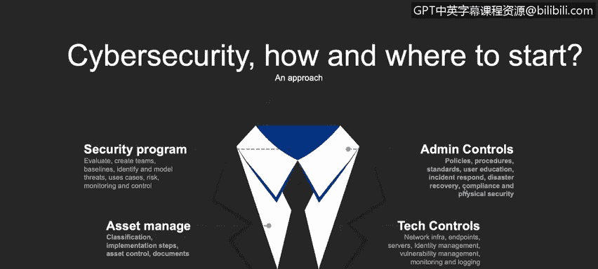

# 课程1：《网络安全工具与网络攻击简介》：85：11_02：启动网络安全计划时的考虑事项

在本节课程中，我们将学习启动一个网络安全计划时必须考虑哪些因素。

## 概述 📋

启动一个网络安全计划需要系统性的思考。本节将介绍构建有效安全计划的核心步骤与关键考虑领域，帮助初学者理解如何为组织或个人数字生活建立安全基础。

## 启动网络安全计划的方法 🚀

上一节我们介绍了网络安全的重要性，本节中我们来看看如何具体启动一个安全计划。首先，我们需要建立一个安全计划。这要求我们进行评估、识别和理解所面临的风险与威胁。我们需要评估、监控并控制这些风险和压力。

## 资产管理 💼

在评估风险之后，我们需要管理资产。这里的“资产”不仅指你面前的电脑、手机或服务器，还包括文档和系统。你电脑上的每一份文档都应被视为一项资产，并通过分类、控制、保密性、完整性和可用性进行管理。我们将在接下来的视频中详细探讨这些术语。

## 实施控制措施 🛡️

理解了资产的重要性后，下一步是实施控制措施。我们不仅需要实施技术控制，例如：
*   **网络基础设施**：如服务器、端点保护。
*   **漏洞管理**：定期发现和修复安全弱点。
*   **安全设备**：如统一威胁管理（UTM）设备、防火墙。

还需要实施管理控制，例如：
*   **策略与规程**：明确的安全政策和操作流程。
*   **事件响应团队**：专门处理安全事件的团队。
*   **灾难恢复程序**：确保业务在遭受攻击后能继续运行。
*   **合规性与物理安全**：遵守相关法规并保护物理设施。

## 总结 🎯

本节课中我们一起学习了启动网络安全计划的关键步骤。我们了解到，一个完整的安全计划始于对风险的理解和评估，进而需要对所有数字资产进行系统化管理，并最终通过结合技术与管理层面的多重控制措施来构建防御体系。以上只是我们需要在公司或个人数字生活中实施事项的一个简要示例，实际上还有很多内容，我们将在后续视频中继续探索。

