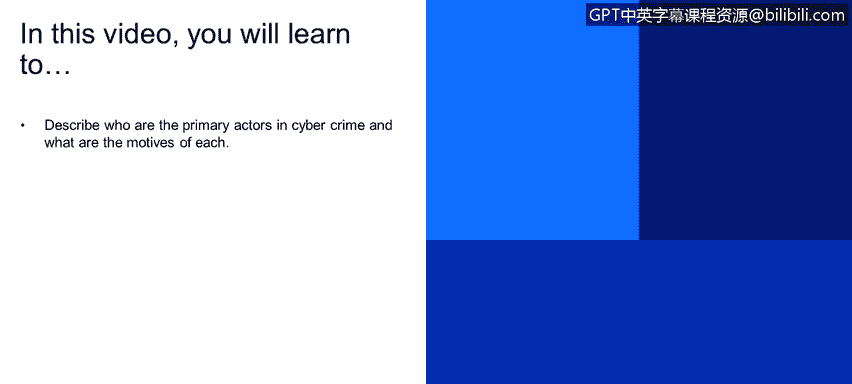
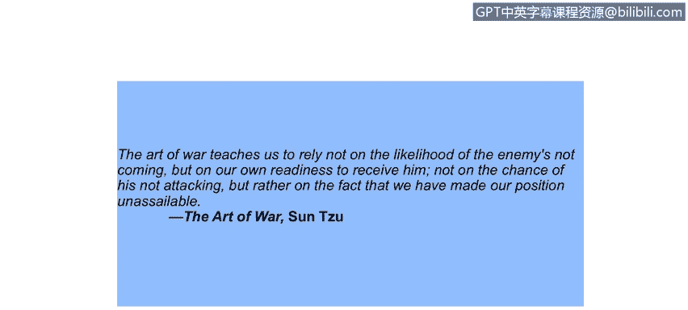
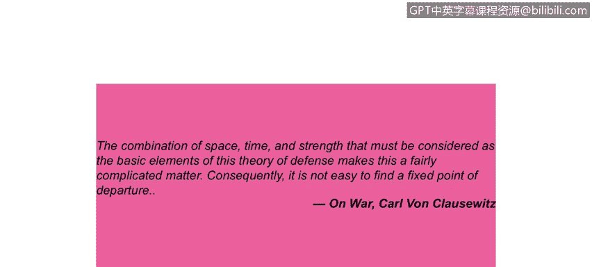
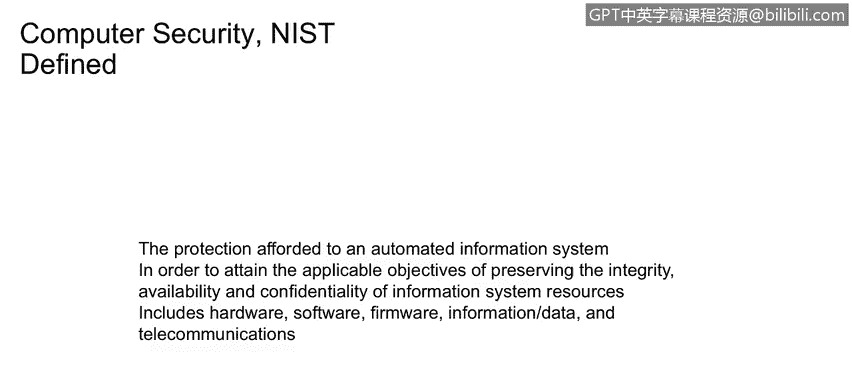

# 课程1：《网络安全工具与网络攻击简介》：86：什么是安全 🔒

在本节课中，我们将学习网络安全的核心概念，特别是“安全”的定义及其基本原则。我们将了解安全模型中的主要角色，并探讨保护信息系统的关键目标。

---

## 什么是安全？

在安全原则中，你经常会听到 **CIA** 这个概念，它代表了**机密性**、**完整性**和**认证**。实际上，它的范畴比这三个词更广一些。

**机密性** 是一个主要原则，指的是只有发送方和接收方能够理解消息内容。如果消息在传输中途被截获，截获者将无法理解其含义。从根本上说，在文献中常以Bob为例的发送方会发送加密消息，而另一端的Alice则接收并解密该消息。

与此相关的是 **认证**，在我们的例子中，发送方Alice和Bob需要在发送消息前确认彼此的身份。

与认证同等重要的是 **完整性**，即发送方和接收方（Alice和Bob）需要确保消息在传输过程中或接收端的某个中间阶段**没有被更改**。最重要的是，他们希望能够**在未被察觉的情况下**确认消息是否被更改。我们将探讨几种实现这一点的机制。

最后是 **访问与可用性**，即企业内可用的安全服务和IT服务需要配备正确的访问控制机制，并具备高度的可用性，以确保企业能够按照服务等级协议（SP）正常运营。

> 我同样非常欣赏孙子。《孙子兵法》教导我们：“无恃其不来，恃吾有以待也；无恃其不攻，恃吾有所不可攻也。”这恰恰反驳了“这不可能发生在我身上”的想法。在很大程度上，你需要做好准备。

---

## 安全是一个复杂的领域

防御理论的基本要素——空间、时间和力量的结合——使得问题相当复杂。因此，找到一个固定的出发点并不容易。

所以，安全是一个动态变化的复杂领域。在我们深入探讨其与密码学的动态交互之前，让我们先来看看“战场”，以便定义相关的术语和角色。

---

## 主要角色：Alice、Bob 与 Trudy

在密码学文献中，你经常会看到 **Alice**、**Bob** 和 **Trudy**。A、B、T代表了不同的参与者。早在60年代的一些论文中，这些角色就被赋予了这些名字，并沿用至今。

*   **Bob 和 Alice** 希望进行安全通信，原因可以是个人或商业的。
*   **Trudy** 是拦截者，意图**拦截、删除、添加或更改**消息，本质上是一个恶意行为者。

让我们看一下示意图。右侧的Alice有一些数据（可能是一封电子邮件、一个便条或一个网页）。她将消息从**明文**转换为**密文**，然后通过一个**信道**进行传输。

*   **信道** 可以是任何我们考虑的传输形式，例如电子邮件、直接传输、文件传输协议，或是当今的短信。在拿破仑时期，这可能是一位年轻的海军候补少尉在白厅与伦敦其他地区之间传递的一封信件。
*   **数据** 是信道中的有效载荷，包括控制信息（例如收件人是谁、有效期多长、收件人地址）。在互联网世界中，我们看IP地址和MAC地址；在人工世界中，可以想象成拿破仑时期英国情报机构开始崛起时使用的姓名和实际邮寄地址——实际邮寄地址就是控制信息的人工解读形式。

Bob接收到消息后，对其进行解码，获得Alice发送给他的明文。Trudy有能力在信道上拦截这些消息，但由于加密的安全保护，她无法读取、删除或更改这些消息。

那么，Bob和Alice可能是谁呢？他们可能就是真实的人，但也可能代表一种**客户端-服务器关系**，例如：
*   银行系统中的客户端与服务器。
*   在IP地址分配阶段，DNS服务器与客户端之间的通信。
*   网络路由器之间交换信息并更新路由表。
*   防火墙与安全情报系统之间的通信。
*   安全情报系统与数据库保护系统之间的通信。

因此，发送方和接收方有许多不同的实例。

---

## NIST 对计算机安全的定义

美国政府的NIST小组拥有非常活跃的计算机安全实践，并提供了以下计算机安全定义：

> “为自动化信息系统提供的保护，以达到维护信息系统资源（包括硬件、软件、固件、信息/数据和电信）的完整性、可用性和机密性的适用目标。”

反过来看这个定义的范围：计算机安全的范围涵盖了**OSI协议栈**，从顶层的应用程序开始，向下经过表示层、会话层、传输层，直至物理层。所有这些都属于计算机安全的范畴。

请注意，定义中提到的是“为自动化信息系统提供的保护”。这保护的不只是平台和主机软件，还包括这些系统正在**处理的信息**。

---

## 总结

本节课中，我们一起学习了网络安全的基础。我们明确了安全的三大核心目标——**机密性**、**完整性**和**认证**（常与访问控制及可用性结合）。我们认识了安全模型中的经典角色：希望安全通信的**Alice和Bob**，以及试图破坏通信的恶意拦截者**Trudy**。最后，我们了解了NIST对计算机安全的广义定义，它涵盖了从硬件、软件到数据和通信的整个信息系统栈。理解这些基本概念是进一步学习网络安全工具和应对网络攻击的坚实基础。