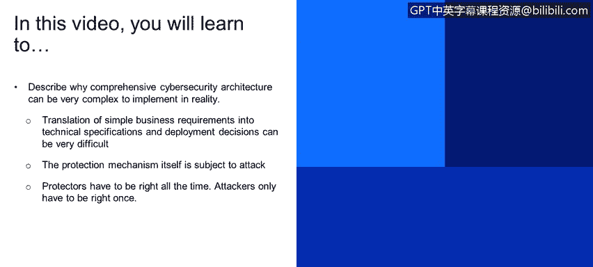
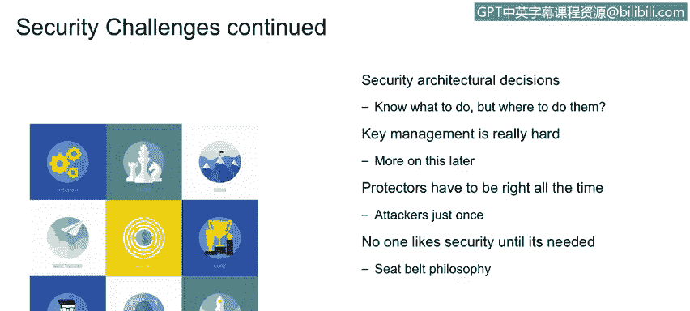
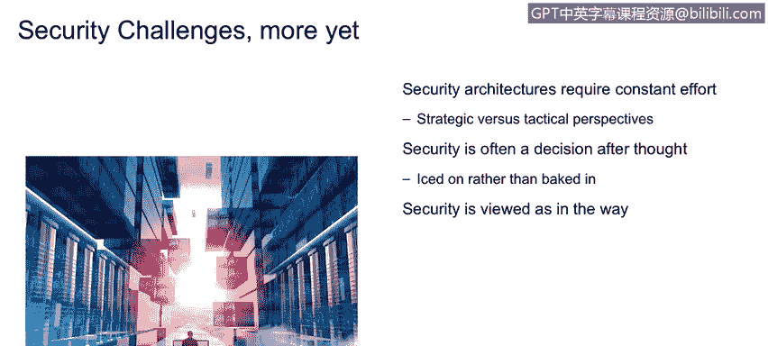

# 课程1：《网络安全工具与网络攻击简介》：87：13_02_额外的安全挑战

## 📋 概述
在本节课程中，我们将探讨在现实中实施全面网络安全架构时面临的复杂性。我们将了解将简单的业务需求转化为技术方案所遇到的困难，以及安全机制本身可能成为攻击目标这一独特挑战。最后，我们会分析安全专业人员面临的其他几项关键难题。

---

## 🔍 安全并非看上去那么简单
上一节我们介绍了网络安全的基础概念，本节中我们来看看实施安全架构时遇到的实际挑战。第一个核心观点是：安全远比看上去复杂。

将简单的业务需求转化为技术规范和部署决策可能非常困难。保护机制本身也可能成为攻击目标。**防御者必须始终正确，而攻击者只需成功一次。**

安全生态系统的一个额外挑战与解决方案的复杂性有关。因此，“安全并非看上去那么简单”这一说法实际上是一个巨大的轻描淡写。

---

## 🏗️ 从需求到实现的复杂性
我们的客户经常有非常简单的需求。例如，一个需求可能是“所有用户都必须向企业进行身份验证”。听起来很简单，但当我们开始研究一个全面的访问控制系统的实现和工程细节时——包括基于角色的访问控制、基于属性的访问控制、特权用户管理和归档——解决方案会变得非常复杂，尽管其高层需求非常简单。

以下是安全专业人员工作的一部分：将这些看似简单的需求分解为可完成或可实现的功能模块。

安全架构的另一个复杂性在于，解决方案本身可能受到攻击。这涉及到**安全执行点**的概念。

*   **安全执行点** 是业务策略的技术实现。例如，业务安全要求是“所有用户都将登录系统”。其技术实现可能是强身份验证（结合“你知道的”和“你拥有的”信息），以及对特权用户或系统管理员行为的跟踪。

我们拥有软件、硬件和固件等技术来实现这些业务安全要求的技术解决方案，这就是安全执行点的定义。关键在于，对手知道，要获取他们想要的信息，他们需要击败这些保护机制。他们需要“突破护城河、翻越城墙、打破大门”。因此，这些执行结构与实际数据本身一样，都是攻击目标。这是其他技术学科中不存在的复杂性层次，也是我们在安全领域需要非常清楚认识到的。

正如我们所指出的，保护这些安全执行点结构不仅可能，而且必然会增加解决方案的复杂性，因为你增加了保护保护机制这一额外层面。

---

## ⚖️ 安全架构师面临的决策挑战
安全专业人员面临的其他挑战与我们的安全架构决策有关。

我们讨论描述“做什么”而非“怎么做”的逻辑架构。然后我们开始研究这些执行机制在架构中的部署拓扑。

例如，通常我们希望访问控制技术更靠近网络边界，更靠近DMZ（隔离区）。然而，一些网络流量传感器可能更靠近企业网络的中心。因此存在一些架构决策、权衡研究、风险与收益分析。这需要经验丰富的架构师来帮助确定这些技术的部署位置。

第二点，**密钥管理**非常困难。当我们谈论密钥管理时，我们指的是加密密钥。

回想一下之前爱丽丝和鲍勃的图示，爱丽丝在将消息放入传输通道之前会对其进行加密保护。加密系统使用一个密钥，而在鲍勃的领域有一个对应的密钥用于解密该消息。这些密钥的创建和分发管理是一个非常复杂的解决方案，这一点需要保持注意。

然后是一个更广泛的原则：我们作为防御者必须始终正确。外界不断变化的动态攻击，要求安全架构必须足够灵活，能够100%地防御这些攻击。人员、地点、事物、时间和金钱，所有这些资源都以某种方式影响着建立一个能够保护信息、保护执行点、抵御这些不断变化因素的动态安全架构，并且这个架构必须始终正确。

一个只能提供90%时间保护的安全架构不会被任何企业所接受。然而，攻击者实际上只需成功一次就能达到目的。因此，你可以看到攻击者和保护者之间在成功概率上存在差异、不平衡和不成比例。

---

## 🚧 业务视角与持续努力
业务部门通常认为安全是必要的，但存在一种“安全带哲学”：在车辆中安装安全带的成本约为200美元，但在发生严重车祸前的半秒钟，那条安全带的价值超过一百万美元。安全结构也是如此。

业务部门经常将安全视为一种障碍。作为安全专业人员，我们有责任确保安全结构实际上是**赋能者**，使在复杂世界中开展业务变得更加容易。

我们最后要讨论的一系列挑战，这些挑战层次较高，但可以分解为更多具体难题。它们涉及持续的努力、安全的事后考虑，以及安全常被视为障碍。

*   **安全常被视为障碍**：企业内的业务部门经常将安全视为障碍和壁垒，认为它是一种“必要的恶”。这有时会鼓励人们试图绕过安全措施。安全专业人员的职责是使安全成为赋能者，使其成为积极的价值，帮助我们在复杂且充满威胁的世界中开展业务。
*   **安全未及早集成**：安全有时被视为障碍的另一个原因是，它没有及早集成到生命周期、开发生命周期或系统生命周期中。在诸如瀑布模型或迭代工程等生命周期模型中，我们看不到安全出现在功能定义阶段。安全专业人员需要说服项目领导者，将安全尽早纳入是成本最低的集成方式，这样应用程序开发人员、基础设施人员、安全人员、测试工程师、质量保证人员都能在早期参与进来。
*   **安全架构需要持续努力**：这一点说明了攻击的动态性。对手不断引入新的攻击模式，软件制造商发布的新漏洞被转化为攻击手段。这场“战争”每周都在变化。因此，我们的防御机制、安全架构也需要非常灵活、敏捷，以适应和应对这些不断变化的攻击。否则，我们就会像20世纪90年代那样，采用非常静态的“城堡、护城河、吊桥”式的安全架构。

---

## 📝 总结
本节课中，我们一起学习了实施网络安全架构时面临的多重挑战。我们认识到将业务需求转化为技术方案的复杂性，以及安全机制自身可能成为攻击目标的独特风险。我们还探讨了密钥管理的困难、防御者必须始终正确而攻击者只需成功一次的不对称性，以及安全在业务中常被视为障碍而非赋能者的现状。最后，我们强调了将安全尽早集成到开发生命周期中，并保持架构灵活性以应对持续变化威胁的重要性。理解这些挑战是构建有效安全防御的第一步。