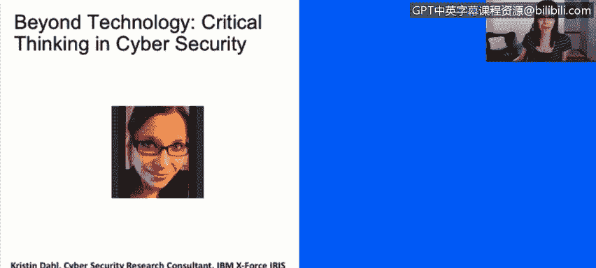

# 课程1：《网络安全工具与网络攻击简介》：88：14_01：超越技术——网络安全中的批判性思维 🧠

在本节课程中，我们将学习批判性思维的基础知识，并探讨它为何是网络安全领域任何职业都不可或缺的一项核心技能。

上一节我们讨论了网络安全的技术层面，本节中我们来看看一个同样关键但常被忽视的要素：人的思维。

我的名字是Kristendal。我是Exforce Iris的一名情报开发员，在IBM工作了大约九个月。在此之前，我是MIT林肯实验室的一名研究员。本次演讲“超越技术”是我几个月前为波士顿一个名为“Day of Shacur”的会议准备的。这是一个面向网络安全领域女性的会议，我的演讲主要针对那些职业生涯初期的女性。

我的目标是强调批判性思维是网络安全的重要组成部分。通常，当我们想到网络安全时，第一反应是这是一个技术性很强的领域。我们的思维会自动转向操作系统等非常技术性的东西。我认为，我们思考和批判性分析问题的能力常常被忽视。这正是我想通过这次演讲来阐述的。

那么，什么是批判性思维？它没有一个硬性、快速的定义，每个人对批判性思维都有自己的理解。我做了一些研究，找到了一些定义，然后总结了一个我自己喜欢的定义，放在最下面。为了本次讨论的目的，**批判性思维是**：

> **有控制的、有目的的、指向一个目标的思考。**

这与做白日梦不同，也不同于思考早餐吃了什么或待办事项清单。它是非常受控、有目的的思考。

我本次演讲的目标是介绍批判性思维的基本基础，并强调这是网络安全领域任何职业的一项基本技能。无论你从事金融、人力资源、法律工作，还是担任技术角色，你都能从中有所收获，并应用这项技能，无论你的角色或项目是什么。

为什么在网络安全领域要特别关注批判性思维？除了我本身从事网络安全工作之外，这个领域的一些特性也使得这种讨论非常必要。

以下是网络安全领域的一些关键特征，它们凸显了批判性思维的重要性：

*   **环境瞬息万变**：这是一个快节奏的领域，技术日新月异。
*   **涉及多方利益相关者**：参与者来自不同背景，如经济、法律、人力资源等。
*   **存在明确的对手**：网络空间中存在敌对方。
*   **领域相对较新**：网络安全是一个相对较新的领域，我们并未掌握所有答案。

批判性思维技能迫使我们在没有明确答案、也没有特定流程可循的情况下进行思考和行动。这既是艺术也是科学，没有固定的方法，它是主观的，无法精确衡量，但讨论它至关重要。

我还想提出另一点：我们生活在一个“谷歌时代”。当我们面临问题时，下意识的反应往往是使用谷歌，在搜索框中输入问题，然后互联网告诉我们答案。这与过去我们必须依赖书籍、图书馆和较慢的研究方法来寻找答案的情况不同，那时信息并非如此广泛可得。

然而，这种信息富集并不总是好事。更多的数据并不总是等于更多的知识，它可能迅速压垮我们的推理能力。正因如此，**批判性思维比以往任何时候都更加重要**。它指的是：

> **从浩瀚的信息海洋中辨别重要信息，并做出有根据的、明智决策的能力。**

本节课中，我们一起学习了批判性思维在网络安全中的核心地位。我们了解到，批判性思维是一种有目的、受控的思考过程，它能帮助从业者在技术、对手和规则都快速变化的复杂环境中，有效分析信息、评估风险并做出明智决策。掌握这项思维技能，是成为一名优秀网络安全分析师的关键一步。