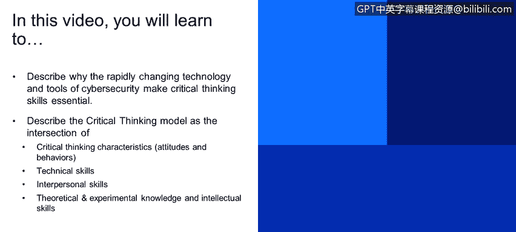
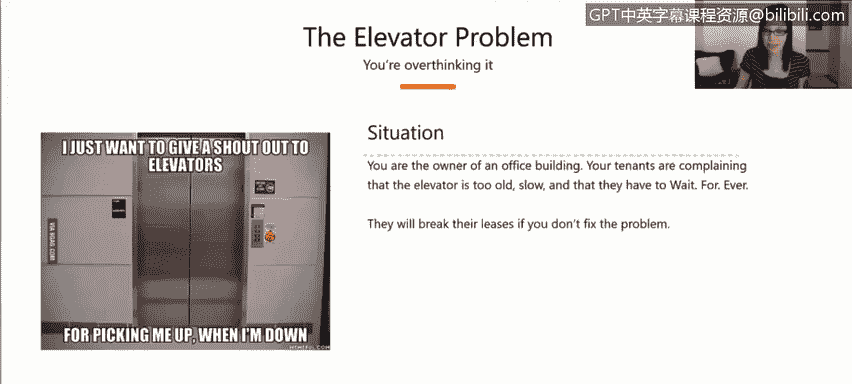

# 课程1：《网络安全工具与网络攻击简介》：89：批判性思维模型

在本节课程中，我们将学习为何快速变化的网络安全技术与工具使得批判性思维技能变得至关重要。我们将描述批判性思维模型，它位于批判性思维特质、技术技能、人际交往技能、理论与经验知识以及智力技能的交汇处。

首先，我们通过一个思维实验来聚焦理解批判性思维的必要性。

假设你是一栋市中心高层建筑的物业经理。楼内有多个租户，包括零售店、公寓和办公室。你最近收到大量关于电梯运行缓慢的投诉，包括邮件和电话。人们对此感到不满，甚至威胁要解除租约。你当然不希望租户流失。

那么，你会如何解决这个问题？存在多种可能的方案。你可以从软件层面入手，更新电梯调度算法；可以建议人们走楼梯；可以安装更多电梯；或者选择不作为。在本次讨论过程中，请思考你将如何解决此问题，以及你是如何得出这个结论的。我们将在讨论结束时再次回到这个例子。

现在，让我们正式开始。当我们思考网络安全领域备受追捧的技能时，首先想到的往往是技术技能。

我对一些大型科技公司的网络安全招聘要求进行了非正式调查，包括IBM、微软、Facebook、谷歌等。调查结果中，技术性工作技能非常突出，例如操作系统、入侵检测、逆向工程等。这些技能无疑非常重要。

随之而来的是一系列支持这些活动的工具，例如Wireshark、Splunk以及各种数据库工具。这就带来了一个难题：有成百上千的工具在定期更新，每个人都有自己的偏好，工具的数据格式各异，有时互不兼容。处理起来可能很混乱，要跟上所有工具的更新几乎是不可能的，精通所有工具更是难以实现。

因此，这里存在一个常见的误解：认为跟上最新的技术工具和趋势是成功的关键。但现实是，技术和我们的对手都在不断变化。

好消息是，安全与设计的基础原理变化缓慢。例如，TCP/IP、操作系统、内核基础等。因此，将批判性思维技能与对安全基础原理的理解相结合，将使我们能够识别出针对未知、未定义复杂问题和情境的解决方案，而不受具体技术或眼前工具的限制。

我进一步思考了批判性思维，并想知道是什么区分了优秀的批判性思考者和不那么优秀的思考者。哪些特质促成了批判性思维？我做了一些研究，但未能找到专门针对网络安全领域的模型。然而，医疗保健领域对此有深入研究。

设想一下急诊室的情景：医生和护士处于高压环境，有时必须在几分钟内，仅凭不完整的数据做出可能关乎生死的决策。因此，在短时间内进行批判性思考、做出明智决策的能力至关重要，批判性思维在该领域得到了大量研究。

幻灯片上的这个模型实际上源自一本医疗保健教科书。我非常喜欢这个模型，并认为同样的原则也适用于网络安全。

接下来，我将简要介绍模型中的每个特征。顶部的圆圈代表**批判性思维特质**，即个人的态度和行为。这包括你的个性、世界观以及处理问题的方式。它由你的成长经历、生活经验和职业经历塑造，因人而异。这种多样性是好事，因为在这个领域，我们需要多样化的视角。

根据我的职业生涯观察，特别是在网络安全领域，最成功的人往往也是最好奇的人。他们对世界充满好奇，拥有持续学习和成长、解决问题的渴望。无论是在进行威胁追踪还是调查工作，他们都有一种内在的动力去寻求答案、找到解决方案。仅仅这种好奇心就能让你走得很远。

顺时针方向看，下一个特征是**理论与经验知识**。这包括你在学校学到的关于操作系统如何工作的基础知识，以及你在工作中从不同项目中学到的知识。

接着是**智力技能**，即分析、推理和解决问题的能力。

然后是**人际交往技能**。你与他人互动的能力如何？你在多大程度上与同事、同行互动？你是否提问？是否提供自己的见解？因为网络安全不是一项单打独斗的职业。我每天都依赖我的同事，无论是分享信息、提问还是寻求帮助。我也依赖公司内外的其他研究人员，他们可能来自不同领域。因此，你与他人协作和分享信息的能力至关重要。

最后是**技术技能与能力**。这包括你使用Wireshark的能力、处理SIEM警报的能力等。这些就是之前提到的技术性工作技能，如逆向工程实践。

在这个模型中，这些特征的交集代表了一个人的**批判性思维能力**。

😊

---

**总结**

本节课中，我们一起学习了批判性思维在快速变化的网络安全领域中的核心重要性。我们通过一个电梯问题的思维实验引入了批判性思维的应用场景。随后，我们剖析了一个源自医疗保健领域的批判性思维模型，该模型指出，强大的批判性思维能力源于**批判性思维特质**、**技术技能**、**人际交往技能**、**理论与经验知识**以及**智力技能**这五个方面的交汇与融合。掌握安全基础原理，并运用批判性思维技能，是应对未知复杂安全挑战的关键。