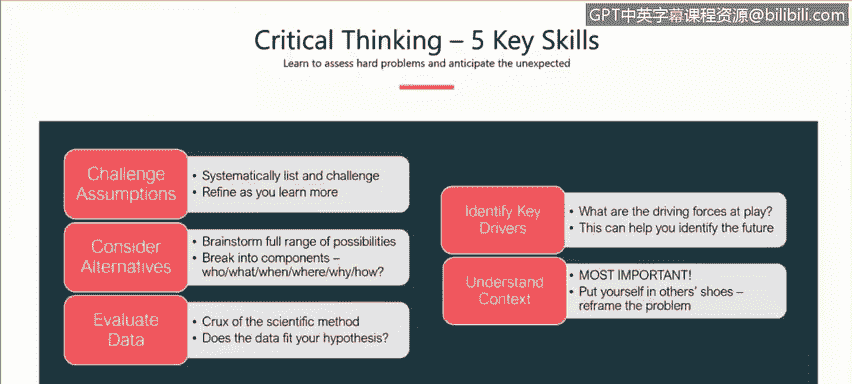
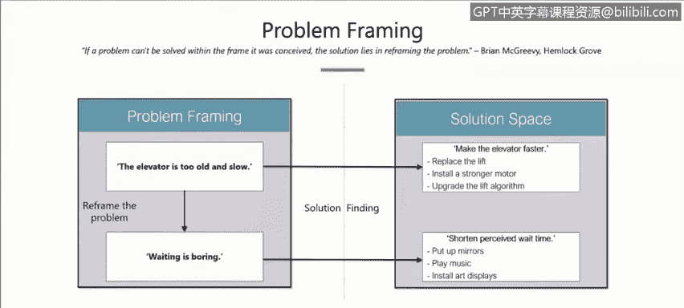
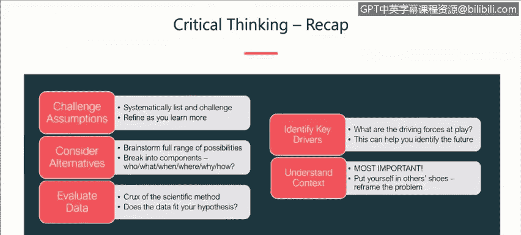

# 课程1：《网络安全工具与网络攻击简介》：90：批判性思维的五个关键技能

在本节课程中，我们将学习并描述批判性思维的五个关键技能。这些技能是：**挑战假设、考虑替代方案、评估数据、识别关键驱动因素**以及**理解情境**。掌握这些技能对于网络安全领域的分析和决策至关重要。

现在，我们面临一个实际问题：如何练习并应用这些技能？如何在日常工作和生活中运用它们，从而成长为一名更出色的批判性思考者？这五项技能并非凭空而来，它们源于一位心理学研究者在长期工作中的总结，旨在揭示人类如何做出决策。

接下来，我们将逐一深入探讨每一项技能。我会解释它们的含义，并提供如何在网络安全领域应用这些技能的具体方法，以及如何通过练习来强化它们。

首先，我们从**挑战假设**开始。这听起来简单，实践起来却颇具挑战。它要求我们质疑支撑自身推理的**心智模型**。我们常常意识不到自己正在做出假设，因为这些假设根植于过去的经验、思维、证据甚至个性之中。

一个有效的方法是引入外部视角。与他人交流，进行头脑风暴，明确列出你的所有假设，并在项目整个生命周期中持续进行这一过程。通过收集更多数据，采取系统化、有纪律的方法来审视它们。

我通常建议将其构建成一个框架，分解为具体步骤：

以下是实施挑战假设的步骤框架：
1.  **明确列出所有假设**：邀请所有相关利益方（如项目经理、同事）参与头脑风暴，尽可能列出每一个可能的假设。
2.  **逐一审视假设**：对每个假设提出关键问题，例如：
    *   我为什么认为这是正确的？
    *   在什么情况下这可能不成立？
    *   我对这个假设的有效性有多大信心？
    *   如果它是无效的，会产生什么影响？
3.  **对假设进行分类**：根据证据支持程度进行分类：
    *   **坚实且有充分支持的假设**
    *   **正确但附带条件的假设**
    *   **缺乏支持或存疑的假设**（这不代表错误，仅意味着需要更多数据）
4.  **精炼与迭代**：根据分类结果，修正或移除假设，按需收集额外数据，并在项目进程中不断重复这一过程。

这就是进行关键假设检查的方法。

在检查了假设之后，我们需要进入第二项技能：**考虑替代解释**。对于某种行为或活动，是否存在其他合理的解释？我们的大脑倾向于用少量数据拼凑出一个情境，但危险在于，如果我们未能考虑缺失的数据或替代方案，就可能导致误判。

我们必须避免固守于单一解释。我亲身经历过多次，因为过于沉浸于一种解释而忽略了其他可能性，最终发现最初的判断是错误的。

那么，如何做到考虑替代解释呢？同样，**头脑风暴**和引入多元视角是关键。你需要不同的人以不同的视角和创造性思维来看待问题。

我喜欢使用经典的**记者六问法**作为框架，从多个维度评估不同的解释。同时，考虑**零假设**（即与你主要假设完全相反的假设）也是一个极佳的练习，因为它能强迫你从不同角度审视问题。

**记者六问法**非常简单实用，包括：**谁、什么、何处、何时、为何、如何**。在网络安全领域，例如进行威胁追踪时，可以这样应用：

以下是应用六问法分析威胁的示例：
*   **谁**：谁被卷入？受害者是谁？目标是谁？利益相关者有哪些？谁会受此结果影响？
*   **什么**：面临什么风险？是数据还是物理资产？发生了什么问题？期望的结果是什么？
*   **何处**：事件发生在哪里？地理位置重要吗？基础设施、受害者、对手位于何处？
*   **何时**：时机是否重要？有哪些关键日期或截止日期需要注意？
*   **为何**：我们为什么要做这件事？确保你在解决正确的问题。关键驱动因素或动机是什么？
*   **如何**：我们如何应对？方案是否可行？需要具体、详细地思考每个替代解释的可行性和合理性。

因此，要通过这六个问题的视角来审视替代解释，从不同维度刻画并检验每一种可能性。

我们已经识别了假设，评估了替代解释，现在进入第三项技能：**评估数据**。这是科学方法的核心——根据多个假设来评估数据的吻合度。如果你有一个偏爱的假设，但数据不支持它，那么你必须放弃这个假设。

关于评估数据，有几点虽不直接关联批判性思维，但非常重要。首先，**网络数据 notoriously 难以获取**，人们往往在需要时才意识到这一点。原因可能包括政策隐私问题（如HIPAA、GDPR）、客户限制，或者数据根本未被收集（如网络或主机系统未配置相应的日志记录功能）。

因此，我建议采取**主动措施**。在建立新的网络环境或系统时，就应**建立正常行为基线**，理解网络中什么重要，需要捕获哪些数据来排查问题或监控健康状态。这样做不仅能帮助你发现异常，还能让你留意到不一致的数据。

总之，评估数据时，如果数据不存在，那就无法评估。要主动建立良好的数据收集实践。

第四项技能是**识别关键驱动因素**。关键驱动因素是能显著影响局势的因素，它们**不总是技术性的**。

在网络安全背景下，关键驱动因素包括：

以下是网络安全中可能的关键驱动因素：
*   **技术因素**：加密、认证工具、框架、基础设施可用性。
*   **法规与政治因素**：隐私法规（如GDPR）、安全法规、知识产权。
*   **供应链与物流问题**。
*   **人员因素**：员工的培训需求、观点、技能。
*   **威胁行为者**：对手的技术能力、动机、机会。例如，国家支持的威胁行为者与脚本小子在资金能力和动机上截然不同。

了解这些多样化的驱动因素至关重要，因为它们并非总是技术性的。

第五项技能是**理解情境**。情境是指你工作的**操作环境**。IBM的情境与大学、微软或其他公司的情境都不同。

情境很重要。你需要意识到你的经理、同事、客户的不同视角。问自己这些问题：他们需要我做什么？我该如何构建这个问题？我是否需要将问题置于更广阔的背景下？

这就引入了**框架化技术**的概念。回想本课程开始时，我概述了本次演讲的目标以及我对批判性思维的定义，那就是一种框架化技术，旨在确保我们达成共识，使用相同的词汇，从而避免混淆和后续问题。

我非常推崇框架化技术，将其作为缓解后续问题的一种解决方案。

要更客观地看待问题或情境，可以遵循以下步骤进行框架化：

以下是进行问题框架化的步骤：
1.  **识别关键组成部分**：将情境分解为组成部分，列出关键行为者和类别。
2.  **识别影响因素**：在理解组成部分的基础上，识别起作用的驱动力量。这有助于揭示最初可能未意识到的额外见解和关系。
3.  **审视关系与模式**：不同组成部分和因素之间存在何种关系和模式？它们是静态的还是动态的？在威胁追踪调查中，图数据库可能有助于可视化实体间的关系。
4.  **寻找相似与差异**：是否存在历史类比？你是否在其他情境或经验中见过类似的模式、行为或情况？能否借鉴？
5.  **重新定义问题**：尝试用不同方式重新构建问题。写下已知和未知的信息。能否从不同角度看待它？是否存在尚未发现的根本原因？

让我们回到电梯问题的例子来加深理解。作为高层公寓楼的管理者，住户抱怨电梯太慢。解决这个问题有多种方法。

这是一个真实案例，最终的解决方案是**安装镜子**。投诉随之消失，所有人都觉得电梯变快了。

这是一个经典的问题框架化案例。通过安装镜子，他们改变了问题空间，从而根本性地改变了解决方案空间。真正的问题并非电梯太慢，而是**等待很无聊**。安装镜子后，等电梯的人被分散了注意力，不再专注于等待。因此，解决方案从“让电梯更快”转变为“缩短感知的等待时间”，这可以通过安装镜子、播放音乐或设置显示屏等更简单、更廉价的方式实现。

这个例子展示了问题框架化的力量，以及如何通过识别问题的不同方面，为看似棘手的问题提供创新的解决方案。

这也再次说明了在网络安全领域，保持思维和认知的多样性是多么重要。

最后，让我们回顾一下批判性思维的五个关键技能：

**挑战你的假设**：随着了解更多信息不断精炼它们。
**考虑替代解释**：不要固守于一种解释。
**评估数据**：数据是否支持你的假设？
**识别关键驱动因素**：记住驱动因素不总是技术性的，可能是政治、人员等问题。
**理解情境**：理解你工作的环境。能否换位思考？能否重新构建问题以改变解决方案空间？

掌握并练习这五项技能，将极大地提升你在网络安全乃至更广泛领域的分析与决策能力。

