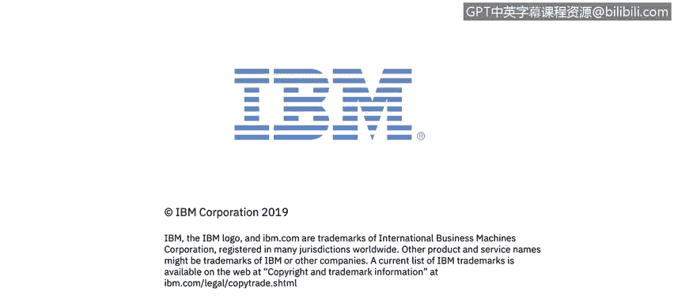

# 课程1：《网络安全工具与网络攻击简介》：91：17_01：欢迎了解安全攻击、攻击者及其动机 🔐

在本节课中，我们将学习网络安全攻击的类型、这些攻击的影响，以及不同类型的攻击者及其动机。我们还将了解安全分析师在安全运营中心（SOC）中处理实时网络攻击的日常工作。

## 课程内容概述

在模块2中，您将听到来自Kenneth和John的讲解，以及一位新的主题专家——Domenico Ruusio的分享。Dom是IBM Security意大利分公司的首席技术官，他将介绍网络安全攻击的类型、这些攻击的影响，以及攻击者的类型和他们的动机。

您还将听到来自IBM安全运营中心的Javier Portuguemoura的分享。Javier将描述安全分析师在实时应对网络攻击时的日常工作状态。

此外，您需要下载并阅读波耐蒙研究所关于网络弹性组织的第四份年度研究报告。现在，让我们开始学习。

## 总结

本节课我们一起学习了模块2的主要内容，包括网络安全攻击的类型、影响，以及攻击者的动机。我们还了解了安全分析师在安全运营中心的工作日常，并明确了需要阅读的扩展研究报告。