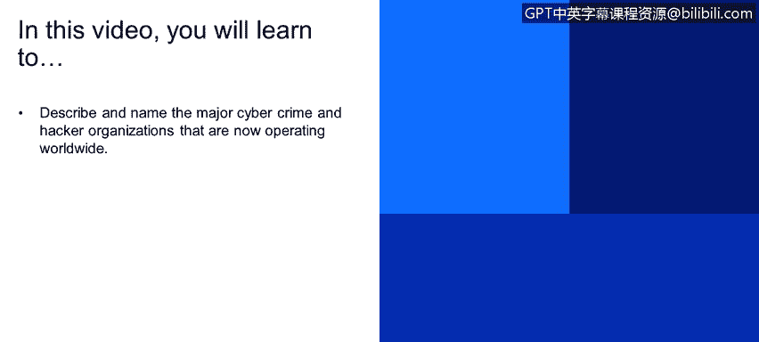
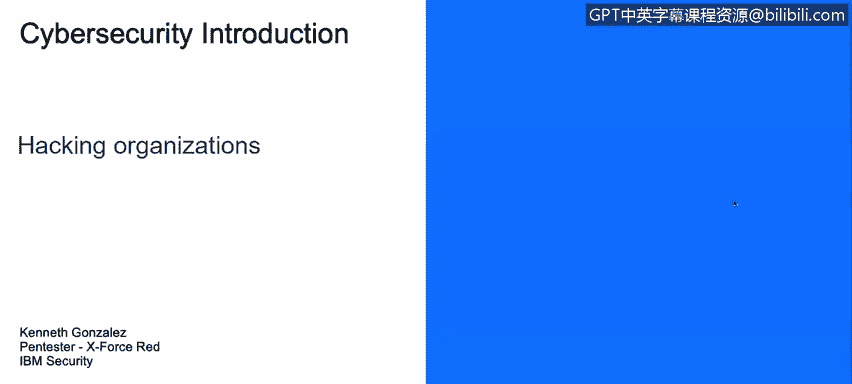

# 课程1：《网络安全工具与网络攻击简介》：93：19_03：黑客组织 🕵️♂️

在本节课程中，我们将学习描述并列举目前在全球范围内活动的主要网络犯罪组织和黑客组织。

上一节我们讨论了网络攻击的类型，本节中我们来看看实施这些攻击背后的主要组织。

黑客组织主要可以分为几类：犯罪组织、黑客活动组织等。以下是几个著名的例子：

*   **Fancy Bear**：该组织被指控与2016年美国大选黑客攻击、民主党全国委员会遭入侵以及希拉里·克林顿竞选团队办公室信息泄露事件有关。
*   **Lazarus Group**：这是一个知名的黑客组织。
*   **Anonymous**：即著名的“匿名者”黑客组织。
*   **叙利亚电子军**：一个与叙利亚相关的黑客组织。
*   **和平卫士**：这是另一个黑客组织，曾导致索尼公司发生数据泄露。数年前，索尼公司制作了一部关于朝鲜领导人金正恩的电影，而“和平卫士”组织入侵了索尼，试图阻止这部电影的发布。

除了这些非国家行为体，我们还有另一类行为体：政府行为体。例如：

*   **美国**：拥有“定制访问行动”等行动部门以及**国家安全局**。
*   **以色列**：拥有**8200部队**。
*   **中国**：拥有**61398部队**。

由此可见，网络安全领域存在着众多不同的行为体。当然，这里没有列出商业行为体，例如安全运营中心或构成网络安全生态系统的公司。

接下来，我们展望一下未来的趋势。网络间谍活动可能会增加，无论是来自国家还是其他行为体。我们将面临更多、更先进的恶意软件。目前已经出现了一些新型恶意软件的案例，它们不使用常规方法进行隐藏、传播或利用系统漏洞，我们正在努力分析其工作原理。

随着新技术、新智能手机、新操作系统和新设备不断加入技术生态系统，新的安全漏洞也会随之出现。我们需要找出这些漏洞，以保护相关资产和技术。

未来几年，我们将面临大量的黑客攻击和高级持续性威胁。我们将在后续视频中详细讨论**高级持续性威胁**。

此外，**人员意识差距**也是一个重要问题。人们需要认识到网络安全的重要性，关心他们在互联网和个人设备上的数据。虽然这个差距可能会扩大，但我们需要与用户共同努力来缩小它。

本节课中，我们一起学习了当前全球主要的黑客与网络犯罪组织类型，并展望了网络安全领域未来的挑战与趋势。理解攻击者的构成是构建有效防御的第一步。