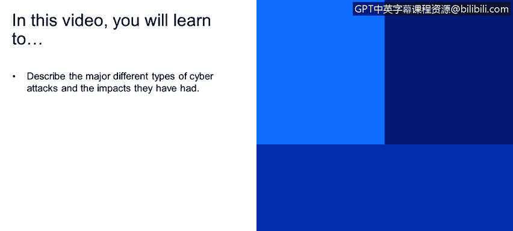
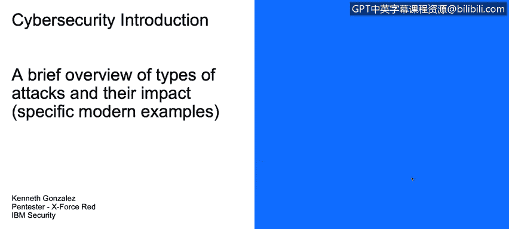

# 课程1：《网络安全工具与网络攻击简介》：94：主要网络攻击类型及其影响 🛡️

在本节课程中，我们将学习描述几种主要的网络攻击类型，并了解它们所造成的实际影响。我们将通过回顾近年来发生的真实攻击案例，来具体说明这些攻击的运作方式和严重后果。

## 概述

网络攻击的形式多种多样，其影响范围从个人数据泄露到关键基础设施瘫痪，后果十分严重。本节我们将通过一系列真实世界的案例，来认识几种主要的攻击类型及其带来的破坏。

## 主要网络攻击案例回顾

以下是近年来发生的一些重大网络攻击事件，它们清晰地展示了攻击的多样性与破坏力。

*   **索尼攻击（2011年）**：黑客组织“LulzSec”入侵了索尼的PlayStation网络系统，导致大量用户信用卡信息和账户数据泄露。
*   **新加坡攻击**：大量黑客对新加坡的各类网站（包括政府网站、银行和公司网站）发起攻击，以抗议新加坡政府通过的某些政策与法律。
*   **2014年系列攻击**：这一年发生了多起重大事件，包括领英数据泄露、易趣网攻击、家得宝攻击等，波及众多企业和政府机构。
*   **塔吉特百货攻击（2015年）**：此次攻击导致至少1亿张信用卡信息泄露。
*   **2016年系列攻击**：包括影响美国大选的攻击、美国有线电视新闻网攻击，以及利用“Mirai”恶意软件首次通过物联网设备对DNS服务提供商Dyn发起的DDoS攻击。
*   **2017-2018年系列攻击**：出现了“影子经纪人”组织、“永恒之蓝”漏洞利用工具、“想哭”勒索软件、“NotPetya”恶意软件以及美国国家安全局工具泄露等重大事件。
*   **华硕供应链攻击（近期案例）**：这是一个典型的供应链攻击案例。攻击者在华硕电脑出厂前的操作系统或软件安装流程中植入恶意软件，导致在过去几个月内出厂的部分华硕电脑可能已感染恶意程序。如果您拥有华硕设备，建议联系供应商并运行杀毒软件进行检查。

## 利用SWIFT系统的网络攻击

上一节我们回顾了多种攻击形式，本节我们来看看一种针对特定金融系统的攻击。SWIFT是一个银行间跨境资金转移的协议系统。攻击者通过身份冒充和数据窃取来利用该系统。

攻击流程通常如下：用户可能会收到一封伪造的电子邮件，声称其账户有交易提醒或需要更新个人信息。诱导用户点击链接并提交个人信息后，攻击者便利用这些信息，通过SWIFT系统发起非法的国际资金转账。

例如，2015年厄瓜多尔的Banco del Austro银行就因此类攻击损失了近1000万美元。

## 攻击者使用的工具与影响

在了解了攻击案例和手段后，我们来看看攻击者具体使用的一些工具及其造成的广泛影响。

以下是部分已知的黑客工具及其用途：

*   **Cdaddy 和 CDukeuc**：在美国大选黑客事件中，网络行为者使用这些工具在政党委员会的系统中创建后门，以窃取电子邮件和文档，访问时间可能长达六个月。
*   **BlackEnergy**：俄罗斯黑客使用的工具，用于利用监控与数据采集系统或可编程逻辑控制器中的漏洞。这些系统通常应用于发电厂、核电站、水厂等关键基础设施。乌克兰在2016年和2017年遭受的一系列攻击中就涉及此工具。
*   **其他工具**：如Shannon、Duqu、Flame、DarkSeoul和WannaCry等。这些工具被犯罪分子或受政府资助的黑客用来攻击基础设施、窃取企业数据、个人隐私信息乃至整个互联网。拥有重要知识产权（可能被窃取并在黑市出售）的公司，如谷歌、西门子等，常成为这类攻击的目标。

## 总结

本节课我们一起学习了多种主要的网络攻击类型，包括数据泄露、DDoS攻击、供应链攻击以及针对金融系统的欺诈攻击。通过分析索尼、塔吉特、华硕等真实案例，我们看到了这些攻击对企业和个人造成的巨大经济损失与隐私风险。同时，我们也了解了攻击者使用的如BlackEnergy、WannaCry等具体工具及其攻击目标。认识这些攻击模式与工具是构建有效防御策略的第一步。