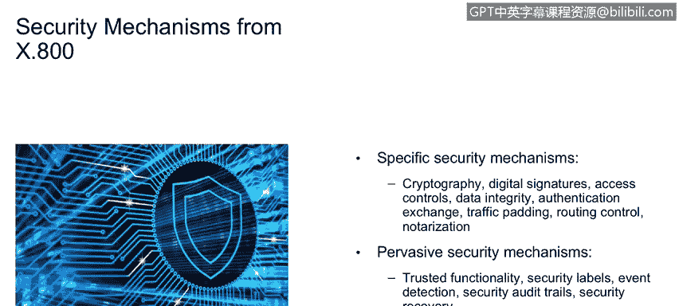

# 课程1：《网络安全工具与网络攻击简介》：97：安全机制

在本节课程中，我们将学习安全机制的定义、组成部分及其在企业安全中的角色。我们将探讨安全机制如何作为安全策略的技术实现，并了解其具体示例和分类。

---

安全机制被定义为**硬件、软件和流程的组合**，旨在增强IT安全性。这实质上是安全策略的技术实现。安全策略源于业务策略，业务策略描述“要做什么”，而安全策略则描述“如何去做”。安全机制就是执行这些“如何做”的技术手段。

因此，安全机制是安全策略的实施机制或交付载体。以下是其核心概念的总结：
*   **业务策略**：定义组织目标（做什么）。
*   **安全策略**：定义实现目标的安全规则（如何做）。
*   **安全机制**：技术性地执行安全策略（具体实现）。

上一节我们介绍了安全机制的基本概念，本节中我们来看看一些具体的例子。

以下是安全机制的一些具体示例：
*   **协议抑制**：例如，根据“禁止FTP”的安全策略，在技术上禁用FTP服务。
*   **标识与认证**：这是访问控制服务的组成部分，包括标识、认证和授权。
*   **加密技术**：用于保护数据的机密性。
*   **数字签名**：用于验证数据的完整性和来源。
*   **访问控制**：控制谁可以访问哪些资源。

这些具体的服务之上，是控制它们的安全策略。而安全策略本身又源于逻辑上的业务策略。这就是从业务到技术的完整链条：**业务策略 → 安全策略 → 安全机制（执行点）**。

除了上述针对特定策略的机制，还有一些机制是普遍存在的。

以下是几种普遍性的安全机制：
*   **可信功能**：涉及如何信任内部用户，特别是特权用户（如系统管理员）与普通用户的行为。特权用户的行为需要受到更严格的关注。
*   **安全标签**：为数据附加分类标签（如“秘密”、“绝密”、“机密”）。这些标签用于控制数据的访问和流转，经典的模型如**Bell-LaPadula模型**。
*   **事件检测**：这是安全智能的核心，用于发现异常或高风险活动。
*   **安全审计跟踪**：收集安全情报数据，并确保这些数据可用、受保护、不可篡改，且能送达正确的负责人。这在取证领域至关重要，类似于刑事证据的保管链。
*   **恢复机制**：包括备份与恢复，影响我们对安全事件的响应方式。

我们可以看到，这些机制与NIST安全模型及本课程第一模块中介绍的IBM安全框架存在类比关系。

现在，让我们通过一个具体架构图来理解安全机制的部署。

上图展示了一个网络架构中的安全机制（或称安全执行点）示例。我们主要关注访问控制策略的实施：
*   安全执行机制首先部署在**DMZ区域的两个防火墙之间**。一个良好的设计原则是使用不同设计的防火墙，这样即使攻击者突破了一个，也无法将同一攻击方法直接用于突破第二个。
*   在安全域和安全管理层中，我们看到了**凭证管理**，用于管理包含角色、权限和身份信息的凭证。
*   同时，系统能够**采集事件**并进行管理。

---

本节课中我们一起学习了安全机制。我们明确了安全机制是执行安全策略的技术手段，它由硬件、软件和流程组成。我们区分了具体的安全机制（如加密、访问控制）和普遍性的安全机制（如审计跟踪、安全标签），并通过一个网络架构图了解了它们在实际环境中的部署位置和作用。理解安全机制是设计和实施有效网络安全防御的基础。