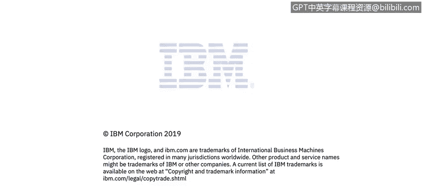

# 课程1：《网络安全工具与网络攻击简介》：98：网络安
全模型

在本视频中，你将学习描述各种网络安全模型。

现在，让我们来看几个网络安全模型。我们将从机制、流程和逻辑分解的角度来理解，以明确我们想要实现的目标。

首先，我们来讨论一个通用的网络安全模型。在幻灯片17页，我们引用了Stallings教材中的一个例子，描述了发送方和接收方之间的通信。

这个模型涉及爱丽丝和鲍勃之间的通信。他们之间有一个不安全的通信信道。他们需要发送一条希望被保护的消息。这条消息可能被拦截，因此需要确保其完整性和机密性，同时网络本身也需要具备可用性。

那么，爱丽丝和鲍勃可以做什么呢？显然，我们有一个初始的明文消息，就是爱丽丝要发送给鲍勃的内容。发送方是爱丽丝，接收方是鲍勃。

与安全相关的转换过程通常是加密。在绝大多数情况下，这个过程涉及加密。这里有一些秘密内容，实际上就是加密密钥。加密密钥使得安全转换或消息加密成为可能。

现在，我们得到了加密后的安全消息。爱丽丝将这个加密消息放到信息信道上。此时，对手特鲁迪可以拦截这个消息，但由于特鲁迪无法获取此处的密钥，她将无法读取消息内容。

接着，鲍勃从通信信道上接收这个消息。他收到的消息与爱丽丝发出的加密消息是相同的。鲍勃使用他的密钥（这里的密钥可能与爱丽丝的相同或不同，我们稍后会解释）以及和爱丽丝相同的加密/解密协议，最终得到明文。这里的明文消息与爱丽丝最初要发送的消息是相同的。

现在我们已经理解了通用模型及其在模块1中描述的基础概念，接下来让我们开始探讨安全架构，以及攻击安全架构意味着什么。

快速回顾一下安全的含义。根据X.800标准（国际电信联盟的文件，属于联合国治理框架的一部分），安全的本质在于管理漏洞及其对资产和资源带来的风险暴露。

在我们的语境中，资产可以指企业持有的任何有价值信息，也可以指安全执行点——即安全策略的技术实现。如果安全执行点被禁用，就会增加企业的风险。这两者都属于安全资产的范畴。

根据Stallings和X.800标准，漏洞是指任何可被利用来违反系统或其包含信息的弱点。在安全专业术语中，漏洞是未被利用的“后门”或“窗口”，是可能绕过安全策略并窃取信息的方式。一个被投入使用的漏洞被称为“漏洞利用”。

威胁则是指对安全的潜在违反。因此，我们定义了安全，而威胁正是我们要防范的对象。

接下来是安全架构及其动机。X.800标准讨论了开放系统安全的动机。我们先来定义一下开放系统。开放系统的绝对对立面是专有或封闭系统。开放系统不一定由标准定义（大多数标准组织的发展速度非常缓慢），但其协议和接口是公开的。IBM在软件系统中的安全方法就是基于开放系统，但不一定完全遵循某个特定标准。

国际电报电话咨询委员会（CCITT，隶属于国际电信联盟ITU）提出：由于社会对计算机的依赖日益加深，而这些计算机通过需要防范各种威胁的数据通信进行访问或连接，因此我们需要增强开放系统的安全性。这是基本事实：世界联系越紧密，就越需要保护。

有几个国家已经出台了越来越多的数据保护立法，例如欧盟的“安全港”协议，旨在管理与数据相关的风险。因此，安全系统的提供者需要考虑其系统带来的风险和法律后果。

开放系统通常非常流行，也应该如此。在安全架构及其保护要素方面，我们需要审视的一个问题是：究竟需要保护什么？这并不复杂，我们之前已经讨论过。

显然，信息和数据需要被保护。这是企业的“皇冠上的明珠”，包括客户信用卡信息、健康记录、银行信息等所有相关内容，甚至包括密码等安全措施本身（例如雅虎数据泄露事件中密码被盗）。所有这些都是对手的目标。

此外，我们还需要保护通信和数据处理的上下文、流程和服务。这些就是我们之前提到的安全执行点。请记住，安全执行点是源自业务策略的安全策略的技术实现。我们显然还需要防止设备与设施被修改或破坏。

**总结**

本节课我们一起学习了网络安全的基础模型。我们首先探讨了一个通用的网络安全通信模型，理解了加密、密钥和通信信道在保护消息机密性与完整性中的作用。接着，我们回顾了安全的核心定义，区分了资产、漏洞、漏洞利用和威胁等关键概念。最后，我们讨论了安全架构的必要性，特别是在开放系统环境中，明确了需要保护的对象包括关键数据、安全执行点以及物理设施。这些概念为理解更复杂的网络安全机制奠定了基础。