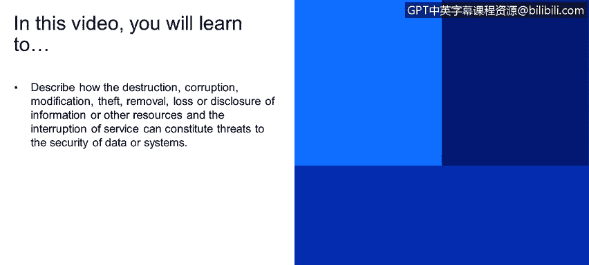

# 课程1：《网络安全工具与网络攻击简介》：99：25_05_组织威胁

## 📖 概述
在本节课程中，我们将学习如何描述信息的破坏、损坏、修改、盗窃、移除、丢失或泄露，以及服务的中断，如何构成对数据或系统安全的威胁。我们还将探讨这些威胁的来源和分类。

---

## 🔍 数据通信系统的威胁
上一节我们讨论了安全的基本概念，本节中我们来看看具体有哪些行为会构成对数据通信系统的威胁。这些威胁主要针对企业环境，包括以下要素：

以下是构成威胁的具体行为列表：
*   **破坏**：指信息或其他资源的毁灭。例如，拒绝服务攻击就是大规模信息处理企业面临的主要威胁。这还包括对安全执行点（如防火墙）的破坏。
*   **修改**：我们之前讨论过完整性问题。在通信过程中修改信息（例如，在Alice和Bob之间传输时篡改消息）是一个重大风险。许多人，包括政府部门，更担心的是**修改**而非损坏，因为损坏可以被检测到，而修改则不易察觉。
*   **盗窃**：主要目标是窃取关键信息，例如信用卡号或攻击的目标数据。在国防网络中，也可能是机密或保密信息的**盗窃和移除**。
*   **泄露**：指信息的披露。从保密性的角度来看，这很有趣。例如，过去一年让政府深感忧虑的维基解密文件发布，就是信息泄露。这绝对是对IT企业的威胁，属于保密性违规。
*   **服务中断**：这涉及到可用性方面。我们之前在模块一中讨论过，我们不仅需要关注服务是否可用，还需要担心时间限制。例如，我们提交消息并期待回复时，回复需要在及时的时间内发生。

---

## ⚠️ 威胁的类别：意外与故意
了解了威胁的具体形式后，我们来看看这些威胁的来源如何分类。威胁主要可以分为两类：

以下是威胁的两个主要类别：
*   **意外威胁**：指没有犯罪意图的行为。例如，特权用户一时疏忽造成的“失误”。
*   **故意威胁**：指有意违反安全策略的行为。

从安全防护的角度来看，我们并不太区分这两者。无论是一个员工无意中的失误，还是有人故意违反安全策略并影响到企业，**结果完全相同**。因此，在结果层面，我们不对两者做过多区分。但需要了解意外威胁和故意威胁之间的区别。

---

## 🎯 从漏洞到攻击
那么，如何判断一个威胁已经实际发生呢？关键在于是否有**响应或行动**。无论是意外还是故意，只要企业数据被移出、权限被降低或安全生态系统的状态发生了任何变化，这就构成了**攻击**或**利用**。

这里是我们从**漏洞**（可能发生的事情）过渡到**攻击**（已经发生的事情）的关键点。我们担心的是**漏洞**（可能发生什么），并对**攻击**（已经发生什么）做出反应。

---

## 🔄 被动攻击与主动攻击
最后，我们再次区分被动攻击和主动攻击。**被动攻击**极其危险，攻击者可以长期存在于网络上，而Alice、Bob或其他用户都未察觉。行业数据显示，攻击在被检测到之前，平均可以在网络上**被动潜伏284天**。

被动攻击和主动攻击的一个关键区别在于，**主动攻击会导致安全生态系统的状态发生改变**。

---

## 📝 总结
本节课中，我们一起学习了构成组织威胁的各种行为，包括破坏、修改、盗窃、泄露和服务中断。我们探讨了威胁的两种来源：意外和故意，并理解了从潜在漏洞到实际攻击的转变过程。最后，我们再次强调了被动攻击的隐蔽性和长期危害，以及它与主动攻击的核心区别——是否改变了系统的安全状态。理解这些概念是构建有效防御策略的基础。