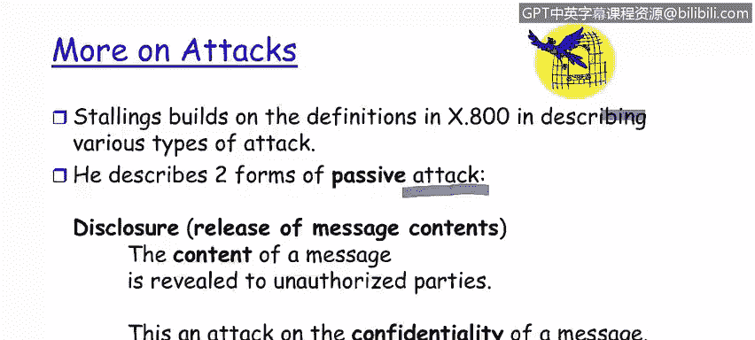

# 课程1：《网络安全工具与网络攻击简介》：100：攻击的定义与类型

在本节课中，我们将学习如何描述由人类意图违反安全的行为如何构成一次攻击。我们将探讨攻击的基本定义，并深入了解几种不同类型的攻击，包括被动攻击和伪装攻击。

---

## 攻击的定义

上一节我们介绍了网络安全的基本概念，本节中我们来看看攻击的具体定义。

根据标准定义，**攻击**是指**由人类意图违反安全的行为**。关键在于攻击者的意图，而非攻击是否成功。无论攻击者是否成功地将一个漏洞转化为实际的利用，只要其意图违反安全并采取了行动，攻击即被视为发生。

攻击的发起者是人，虽然攻击过程可能涉及协议、代理服务器等中间环节，但事件的源头总是一个启动了攻击链的人。

---

## 被动攻击的类型

了解了攻击的基本定义后，接下来我们看看攻击的具体分类。以下是两种主要的被动攻击类型。

### 1. 泄露攻击

泄露攻击是指**将消息内容透露给未经授权的各方**。这好比拦截了一封信，不仅打开了信封，还阅读了内容并将其告知他人。

这种攻击主要针对信息的**机密性**。例如，如果攻击者特鲁迪拦截了鲍勃和爱丽丝之间的消息，并且没有透露其内容，这就不构成泄露攻击。只有当内容被揭示时，才构成泄露攻击。

### 2. 流量分析攻击

流量分析攻击，也称为流量流分析，与泄露内容不同。它是指**通过分析消息的频率和大小来推断发送方行为的相关信息**。

这种攻击同样威胁信息的机密性，因为它允许第三方通过分析通信模式来洞察发送方的意图。例如，如果观察到系统管理员和数据库管理员之间的通信流量异常高于正常水平，即使不知道具体内容，也可以推断出数据架构可能出现了问题（如数据泄露或存储问题）。

---

## 主动攻击：伪装攻击

在讨论了被动攻击之后，本节我们将转向一种常见的主动攻击形式。

伪装攻击是指**冒充已知或授权用户或系统的行为**。这种攻击导致**身份验证**和**识别**的失败。

伪装攻击主要有两种形式：
*   **冒充用户**：例如，攻击者特鲁迪冒充爱丽丝与鲍勃进行通信。
*   **冒充系统/服务**：例如，特鲁迪设置一个虚假的谷歌登录页面来收集用户的用户名和密码。在这种情况下，爱丽丝误以为自己在与真正的谷歌服务交互，但实际上是在与特鲁迪的虚假系统通信。

---

本节课中我们一起学习了网络攻击的核心定义，即由人类意图违反安全的行为。我们探讨了被动攻击的两种主要类型：泄露攻击和流量分析攻击，它们都威胁信息的机密性。此外，我们还学习了伪装攻击，这是一种通过冒充用户或系统来破坏身份验证机制的主动攻击方式。理解这些基本攻击类型是构建有效网络安全防御的第一步。