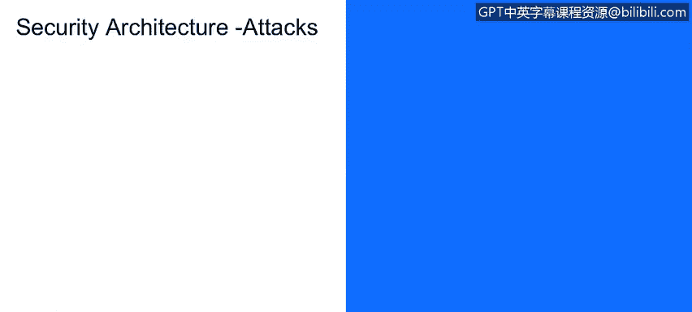

# 课程1：《网络安全工具与网络攻击简介》：101：27_07_安全架构与攻击分类 🔐

在本节课程中，我们将学习如何识别和分类各种形式的主动攻击与被动攻击。上一节我们介绍了被动攻击，本节中我们来看看主动攻击的具体类型。

## 重放攻击 🔄

第二种来自攻击者端的主动攻击形式是重放攻击。

在这种攻击中，攻击者特鲁迪（Trudy）或拦截者会捕获一份合法消息的副本，并在稍后时间重新发送它。

这可能是类似“我们休息一下去吃午饭吧”或“我们去喝一杯吧”这样的消息。

消息被拦截、延迟，然后在星期四才被发送出去。

鲍勃（Bob）收到这条消息，以为是爱丽丝（Alice）发送的。实际上，消息确实来自爱丽丝，只是“去吃午饭”这个动作从星期三被延迟到了星期四。

现在，你可以理解在金融服务的背景下，一条“完成股票订单”或“转账”消息的延迟，会如何严重影响金融服务的核心任务能力，即忠实执行客户指令。这在金融社区中是一个非常大的问题。

因此，这并不意外地构成对系统**完整性**的攻击。

之所以是完整性攻击，是因为消息没有及时发送。消息本身是合法的。例如，“从我的储蓄账户转账100美元到支票账户”是一条合法消息，但它在稍晚的时间被重新传输。这就是完整性失效。

我们需要思考：消息是被修改了，还是被延迟了？

我们之前讨论的攻击，无论是修改还是延迟，都是针对合法消息完整性的攻击。

## 拒绝服务攻击 🚫

接下来，我们看看针对企业的一种最主要的主动攻击：拒绝服务攻击。

在拒绝服务攻击中，对手特鲁迪会阻止授权用户鲍勃和爱丽丝访问某个系统。这可能是他们的电子邮件系统、短信系统或通信信道中的某个环节。

攻击阻止了授权用户鲍勃和爱丽丝访问通信信道以进行交流。

这是一种**可用性**攻击，因为它涉及时间因素。爱丽丝发送给鲍勃的消息可能数天都无法送达，甚至永远无法到达。

这涉及到服务的及时性部分，以及服务在时间函数上是否可用的可访问性部分。

---

**本节课总结**

本节课中，我们一起学习了两种主要的主动攻击类型：
1.  **重放攻击**：攻击者拦截并延迟发送合法消息，破坏系统的**完整性**。核心在于消息的**及时性**。
2.  **拒绝服务攻击**：攻击者阻止授权用户访问服务或资源，破坏系统的**可用性**。核心在于服务的**可访问性**和**及时性**。

理解这些攻击如何分别针对信息安全的CIA三要素（机密性、完整性、可用性）中的不同方面，是进行有效安全防御的基础。