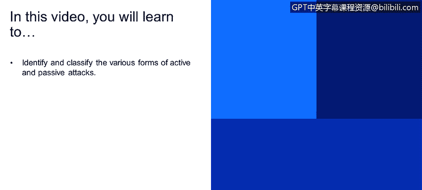
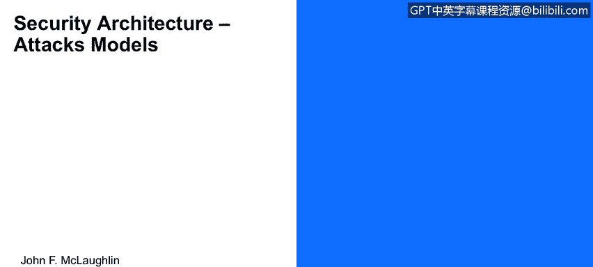
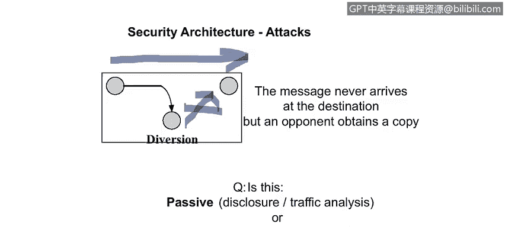

# 课程1：《网络安全工具与网络攻击简介》：102：安全架构与攻击模型

在本节课程中，我们将学习识别和分类各种形式的主动攻击与被动攻击。

现在，让我们来看一下这些攻击的几种模型描述。

## 正常通信流程

这是信息正常流动的方式。在此上下文中，信息源是Alice，信息目的地即接收者是Bob，中间是之前描述过的通信信道。图中未展示加密能力，我们稍后会讨论。这是信息从Alice到Bob的正常流动。

## 中断攻击

这是一种服务中断攻击。Alice试图发送一条消息给Bob，但消息在途中被拦截者Trudy破坏。这是一个被动攻击还是主动攻击？这是一个主动攻击。因为Bob会知道消息在某个时刻未被接收，Alice也会知道消息从未被送达。由于Alice和Bob双方都会知晓消息未送达，这就不是一个被动攻击，因此它必须是主动攻击。

从流量分析的角度看，Bob可能会说：“嘿，Alice，我以前每天收到你10封邮件，现在一封都没有了。”这表明出了问题。我们不知道内容是什么，但围绕**消息传递**本身的参数就承载了信息。这是一个主动系统。

在我们讨论的四种模型（伪装、重放、修改、拒绝服务）中，这显然是**拒绝服务**攻击，因为Trudy只是阻止了所有消息通过。

## 窃听攻击

现在看第32张幻灯片。同样，Alice发送消息给Bob，Trudy是拦截者。这里唯一发生的是，Trudy复制了从Alice流向Bob的消息流量。问题是，这是被动攻击还是主动攻击？我认为这是被动攻击。因为Alice发送消息给Bob，Bob收到了来自Alice的消息，它可以被认证，内容合理。我们可以设置一些机制来检测修改，并且所有这些都通过了，所以这是一条合法消息。唯一的问题是拦截者Trudy拥有消息的副本。

那么，这种攻击的影响是什么？因为它不是主动的，所以上述四种主动攻击模型都不适用。但它的潜在威胁在于**信息泄露**。Trudy可能会将邮件副本泄露给老板，或利用好人之间的信息副本做坏事。

## 修改攻击

再次，我们有Alice和Bob在发送消息。请注意，这次消息路径没有直接从Alice到Bob，而是转向并经过了Trudy。对手Trudy拦截了消息，并将修改后的消息转发给Bob，使其看起来来自原始发送者。

这是什么类型的攻击？是被动攻击还是主动攻击？显然，这是主动攻击。因为Trudy拦截了消息，选择修改它，并使其看起来来自Alice发送出去。那么这是伪装攻击吗？是的。因为Trudy修改消息使其看起来来自Alice，所以Trudy正在伪装成发送者Alice。这是重放攻击吗？可能是，但我们没有讨论消息发送的时间。消息被修改了吗？绝对被修改了。是拒绝服务吗？不是。

## 伪造攻击

请注意，Alice从未给Bob发送消息，她可能在忙自己的事，甚至可能在睡觉。Trudy给Bob发送了一条消息：“我们去吃午饭吧，我是Alice。”她在此上下文中**冒充**Alice。这也可能是其他任何形式，例如一个服务，或者你的银行打电话让你更改密码，然后设置一些机制来拦截那个密码，使其看起来来自合法来源。

再次提问，被动还是主动？显然是主动攻击。并且它是伪装攻击，因为Trudy在与Bob通信时冒充了Alice。这是一种严重的攻击类型，因为Alice实际上什么都没做，从她的角度来看没有任何问题。由于攻击看起来来自Alice，对安全攻击的察觉可能会被延迟。这不是拒绝服务攻击。

## 拦截与泄露攻击

再次，Alice试图向Bob发送通信，但Trudy拦截并阻止了向Bob的传输。那么这里发生了什么？Alice发送消息给Bob，Trudy拦截了它。Alice认为消息已送达，因为在这种情况下显然没有消息送达确认机制。

关于这是被动还是主动的问题？这显然是主动攻击，因为Trudy采取了一个改变系统状态的行为。

那么这是什么类型的主动攻击？我认为这实际上是**拒绝服务**攻击，因为它改变了系统状态并阻止了服务发生——消息传递服务没有发生，符合拒绝服务的正式定义。同时，因为Trudy拥有消息的副本，她可以将此内容泄露给未经授权的第三方。这是一种危险的攻击方式。

## 课程总结

在本节课中，我们一起学习了网络安全中的几种核心攻击模型。我们首先回顾了正常的通信流程，然后逐一分析了**中断攻击**、**窃听攻击**、**修改攻击**、**伪造攻击**以及**拦截与泄露攻击**。我们明确了主动攻击与被动攻击的关键区别：主动攻击会改变系统状态或数据流，而被攻击方通常能察觉；被动攻击则主要是秘密窃听，不影响正常通信流。理解这些基础模型是识别和防御实际网络威胁的第一步。