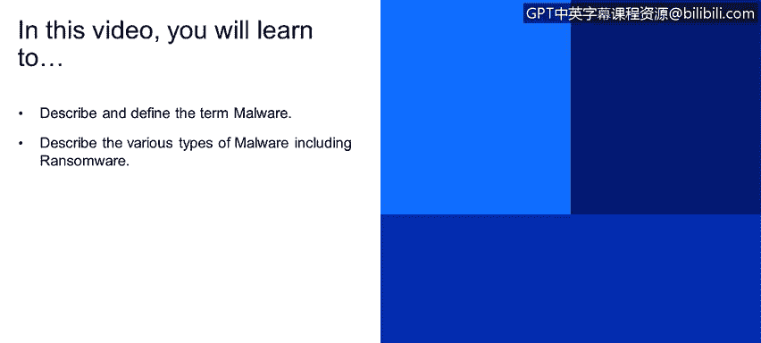
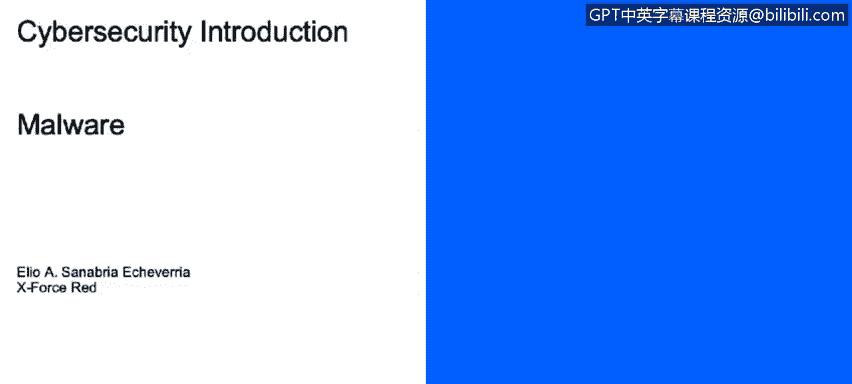
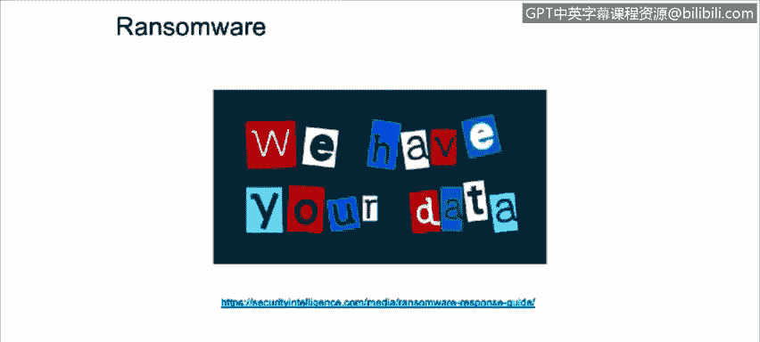

# 课程1：《网络安全工具与网络攻击简介》：103：恶意软件与勒索软件

在本节课程中，我们将学习如何描述和定义“恶意软件”这一术语，并了解包括勒索软件在内的各种恶意软件类型。我们将尝试回答以下问题：什么是恶意软件？恶意软件有哪些种类？我们如何防范它？

首先，我们来定义恶意软件。

恶意代码或恶意软件，是指任何在主机上运行的、非期望或未经授权的软件，其目的是破坏操作或利用主机资源为自己谋利。

近期的恶意软件攻击试图通过利用主机资源来保持隐蔽，以实现潜在用途，例如发起其他服务攻击、托管非法数据、窃取个人或商业信息。

**恶意软件的类型**

市面上存在多种形式的恶意软件，它们具有不同的特征。以下是主要的几种类型：

*   **病毒**：一种恶意代码片段，通过将自己附加到其他文件上，利用自我复制从一台计算机传播到另一台计算机。**注意**：它需要人为交互才能自我复制。由于其自我复制的特性，它们很难从系统中彻底清除。它们还使用高级技术来隐藏自己，例如**多态代码**，它会加密并复制自身，这使得杀毒软件更难发现它，这被称为**多态病毒**。另一种是**装甲病毒**，它试图通过混淆其在系统中的真实位置和代码来保护自己，这使得逆向工程师更难为其创建特征码。

*   **蠕虫**：一种自我复制的恶意软件，**不需要**人为交互。其主要目标就是传播并耗尽资源，或将计算机变成“僵尸”。

*   **特洛伊木马**：一种伪装成良性软件的恶意软件，会对系统造成损害或为攻击者提供对主机的访问权限。它们通常通过伪装成游戏、壁纸或任何类型的下载包等看似无害的软件被引入计算机环境。

*   **间谍软件**：其主要目标是跟踪和报告主机的使用情况，或收集攻击者希望获取的数据。这些数据可以包括网络浏览历史、个人信息、财务信息，以及攻击者想要获取的任何类型的文件。

*   **广告软件**：一种会自动显示或下载未经请求的广告的代码，通常在浏览器弹出窗口中看到。

*   **RATs**：代表**远程访问工具**或**远程访问木马**。RATs允许攻击者获得未经授权的访问并控制计算设备。

*   **Rootkit**：一种旨在以最低级别完全或部分控制系统的一段软件。

现在我们来了解勒索软件。我们经常听到勒索软件，但它到底是什么？

勒索软件是一种恶意软件，它用代码感染主机，从而限制对计算机或其上数据的访问。攻击者要求支付赎金以换回数据。如果未在规定时间内支付，数据将被销毁。

在右侧，我们可以看到勒索软件控制主机后显示的横幅，要求支付赎金并带有倒计时。最近一次大规模爆发是2017年5月的WannaCry勒索软件。

如果您想了解更多关于如何应对勒索软件攻击的信息，请查看提供的链接。该链接包含以下主题：如何保护您的关键信息和资源、如何识别特定变种的勒索软件，以及如何从受感染的系统中遏制和清除勒索软件。

**总结**

在本节课中，我们一起学习了恶意软件的核心定义，即任何未经授权运行以破坏系统或窃取资源的软件。我们详细探讨了病毒、蠕虫、木马、间谍软件、广告软件、远程访问工具和Rootkit等多种恶意软件类型及其特点。最后，我们重点介绍了勒索软件的工作原理和危害。了解这些不同类型的恶意软件是构建有效网络安全防御的第一步。