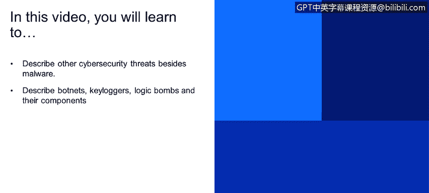
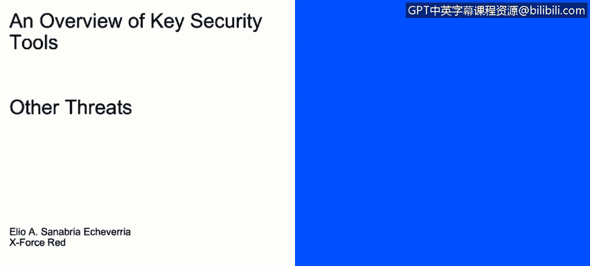
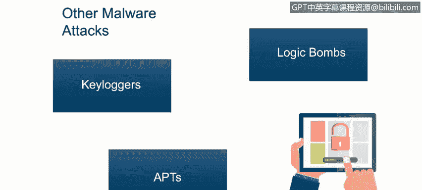
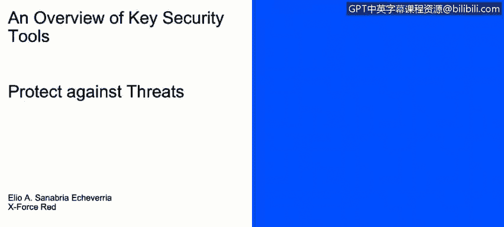

# 课程1：《网络安全工具与网络攻击简介》：104：其他网络安全威胁示例


在本节课程中，我们将学习除恶意软件之外的其他几种常见网络安全威胁。我们将具体介绍僵尸网络、键盘记录器、逻辑炸弹和高级持续性威胁，并了解它们的工作原理与危害。

## 僵尸网络



上一节我们讨论了恶意软件，现在让我们来看看僵尸网络。僵尸网络是由大量被入侵并受控的主机组成的网络，攻击者可以利用这些计算机资源发起攻击。



以下是僵尸网络的关键组成部分：
*   **僵尸主机/傀儡机**：被恶意软件感染并受控的计算机，也称为“僵尸”或“无人机”。
*   **僵尸牧马人**：控制整个僵尸网络的攻击者或服务器，也称为“僵尸主控机”。

攻击者利用僵尸网络进行多种非法活动，例如：
*   发送垃圾邮件。
*   发起分布式拒绝服务攻击。
*   传播网络钓鱼和间谍软件。
*   窃取个人信息。
*   挖掘加密货币。

## 键盘记录器

了解僵尸网络后，我们来看一种更侧重于窃取信息的威胁：键盘记录器。键盘记录器是一种硬件或软件，它能记录用户的所有键盘输入。

其核心功能可以用以下伪代码描述：
```
记录(每次按键事件)
将按键数据发送至攻击者服务器
```
这使攻击者能够窃取密码、信用卡号等敏感信息。

## 逻辑炸弹

接下来是逻辑炸弹，它是一种具有潜伏性的恶意代码。逻辑炸弹会嵌入在目标系统中，直到被特定条件（如某个日期时间）触发。

其行为逻辑如下：
```
如果 (触发条件满足) {
    执行恶意操作; // 例如删除数据、破坏系统
}
```
在条件满足前，它可能一直保持休眠状态，难以被发现。

## 高级持续性威胁

最后，我们探讨一种更为复杂和危险的威胁：高级持续性威胁。APT的主要目标是长期、隐蔽地侵入并监控网络以窃取信息，通常针对政府、军事、金融或拥有高价值信息的公司。

一些知名的APT组织包括：
*   **Fancy Bear**：被认为与俄罗斯有关。
*   **Lazarus Group**：被认为与朝鲜有关。
*   **Periscope Group**：被认为与中国有关。

## 课程总结





本节课我们一起学习了除恶意软件外的几种关键网络安全威胁。我们了解了**僵尸网络**如何控制大量计算机发起攻击，**键盘记录器**如何窃取输入信息，**逻辑炸弹**如何潜伏并在特定条件下引爆，以及**高级持续性威胁**如何长期隐蔽地针对特定组织进行间谍活动。认识这些威胁是构建有效防御的第一步。