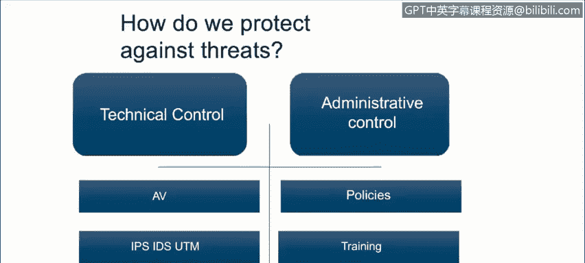

# 课程1：《网络安全工具与网络攻击简介》：105：威胁防护定义

在本节课程中，我们将学习如何描述保护系统免受恶意软件和网络攻击的方法。

上一节我们讨论了恶意软件及其行为。现在，我们来探讨一下如何防范它们。

我们如何保护自己？我们拥有多种防护手段。首先是技术控制措施。

技术控制措施是指用于保护系统和信息的硬件或软件。这包括**防病毒软件**，它能扫描可执行代码文件，并与已知病毒的**特征码**进行比对。我们还有**入侵检测系统**和**统一威胁管理系统**，这些系统可以实时检测网络流量中的攻击特征，以发现环境中可能存在的入侵迹象。每种实现方案都是独特的，取决于组织的具体安全需求。

其次是**更新**。对于所有已部署的软件，我们需要保持其最新状态，以防止出现新的安全漏洞。这通过应用**安全补丁**来完成。

然后是操作控制措施，也称为管理控制措施。这些措施由管理层制定，其有效性依赖于员工的遵守。

以下是几种主要的操作控制措施：

*   **策略**：这是组织发布的书面文件，旨在确保所有用户遵守与安全相关的规则和指导方针。例如，一个**密码策略**可能要求密码至少包含15个字符，且其中至少有一个特殊符号。
*   **培训**：培训旨在确保组织的用户了解其安全策略以及外部存在的威胁。例如，**社会工程学培训**可以教导用户如何识别和应对社会工程学攻击。
*   **审查与跟踪**：这意味着确保我们刚才提到的各项措施（如策略、软件）始终保持最新状态。

本节课中，我们一起学习了保护系统免受网络威胁的两种主要方法：技术控制措施（如防病毒软件和入侵检测系统）和操作控制措施（如安全策略和员工培训）。结合使用这些措施，是构建有效网络安全防御体系的关键。