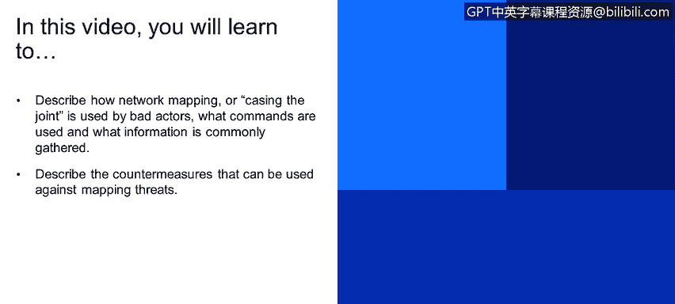

# 课程1：《网络安全工具与网络攻击简介》：106：32_01：互联网安全威胁——网络映射 🗺️

在本节课程中，我们将学习网络映射（或称“踩点”）如何被恶意行为者利用，了解他们使用的命令和收集的信息类型，并探讨针对此类威胁的防御措施。

---

上一节我们介绍了互联网企业面临的安全威胁概览。本节中，我们来看看其中一种具体的威胁：网络映射。

在幻灯片12中展示的就是网络映射的概念。这本质上就是“踩点”，即攻击者会扫描网络，以发现网络上有哪些设备、运行着哪些服务和协议。

攻击者会使用诸如 `ping` 命令等工具，以及像 **NMap** 这样的专业工具来确定网络上有哪些主机及其地址。端口扫描也在此过程中扮演重要角色。我们之前简单讨论过 **NMap**，它是一个网络探测工具。

那么，面对攻击者扫描网络、探测拓扑结构的问题，我们可以采取哪些措施呢？

以下是我们可以采取的一些关键对策：

*   **监控网络流量**：记录进入网络的流量，寻找可疑活动，例如IP地址被顺序扫描端口。这些网络异常可以被像 **QRadar** 这样的优秀安全信息与事件管理（SIEM）系统检测到并生成警报。
*   **使用主机扫描器进行资产管理**：例如，利用 **QRadar** 这样的工具，维护一份准确的网络主机清单。良好的资产管理（至少是补丁管理所必需的）能让我们创建一份基于MAC地址的**白名单**，即允许接入网络的授权设备列表。这样，如果网络中出现额外的活动或其他未经授权的主机，我们就能通过白名单违规来发现。

---

本节课中，我们一起学习了恶意行为者如何进行网络映射来收集信息，并探讨了通过流量监控、资产管理和白名单策略来防御此类威胁的方法。理解攻击者的侦察手段是构建有效防御的第一步。