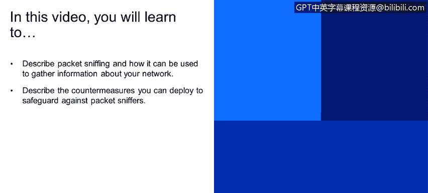

# 课程1：《网络安全工具与网络攻击简介》：107：33_02_互联网安全威胁-数据包嗅探

在本节课程中，我们将学习数据包嗅探的概念，了解攻击者如何利用它来收集网络信息，并探讨相应的防御措施。

数据包嗅探是另一种主要的互联网安全威胁。它采用广播方式工作，例如使用**UDP**这类广播协议。

网络接口卡（NIC）在定义上，当处于**混杂模式**时，会读取所有流经它的数据包。它能读取所有未加密的数据。例如，如果密码以明文形式发送，一个处于混杂模式的网卡就能捕获到它。

现在，让我们看一下幻灯片14上的图表。图中显示客户端B正在与客户端A通信。IP数据包的字段头部指明源地址是B，目的地址是A，以及载荷内容。而客户端C正运行在混杂模式下，它将能够检测到所有这些信息。

那么，我们如何针对这种威胁实施防御措施呢？以下是针对数据包嗅探的一种对策。

所有主机，包括计算机客户端以及服务器、路由器、交换机等网络服务设备，都应运行定期检查其网络接口是否处于混杂模式的软件。由此可见，网卡的混杂模式是危险因素。

此外，基本的防御设置还包括：在广播媒体（无论是交换式还是家庭网络）的每个网段上只设置一个主机。幻灯片15底部的图表再次展示了这种威胁，以及当客户端C处于混杂模式时，它有机会截获A与B之间的通信流量。

---

**总结**

本节课中，我们一起学习了数据包嗅探的工作原理。我们了解到，当网络接口卡处于**混杂模式**时，它可以捕获网络上的所有数据包，包括未加密的敏感信息（如明文密码）。为了防御此类攻击，关键措施包括在所有网络设备上部署软件以定期检测混杂模式，并合理规划网络结构，例如限制每个广播域内的主机数量。