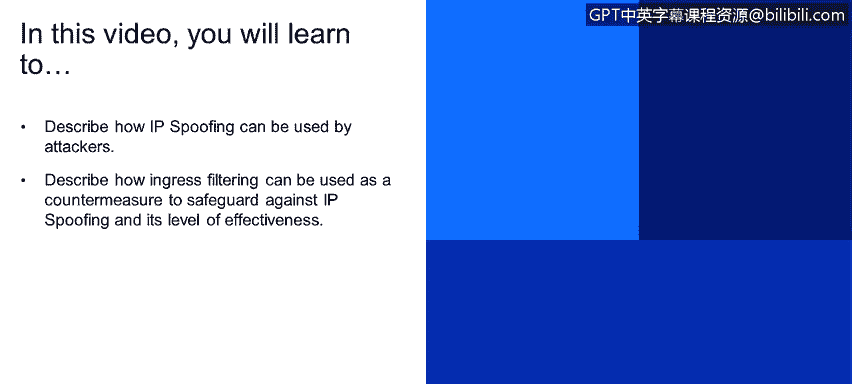

# 课程1：《网络安全工具与网络攻击简介》：108：34_03_安全威胁-IP欺骗

在本节课程中，我们将学习IP欺骗攻击的原理，并了解一种名为入口过滤的防御措施及其效果。

## IP欺骗攻击描述 🎭

IP欺骗是一种网络攻击技术。攻击者可以伪造IP数据包的源地址，使其看起来像是来自另一个可信的来源。

我们在早期关于认证的模块中简要讨论过这一点。攻击者能够直接从应用程序生成虚假的IP数据包，并在IP报头的源地址字段中填入任何想要的值。这种技术被用于伪装成合法用户，例如攻击者试图伪装成“爱丽丝”。接收方，例如“鲍勃”，无法辨别数据包的源地址是伪造的。

下图（第16页）直观地展示了客户端C试图伪装成客户端B的过程。攻击者在发送的数据包源地址字段中填入B的地址。

## 防御措施：入口过滤 🛡️

那么，我们如何防范这种攻击呢？接下来介绍的防御措施是**入口过滤**。

入口过滤指的是内部路由器不转发那些源地址无效的数据包。具体来说，这些无效源地址是指不属于该路由器所在网络的数据报源地址。

然而，我们无法强制所有网络都实施这一策略。因此，入口过滤最多只能算是一种**部分解决方案**，其防护效果是有限的。

## 课程总结 📝

本节课我们一起学习了IP欺骗攻击。我们了解到，攻击者通过伪造IP数据包的源地址来隐藏真实身份或冒充他人。作为应对，入口过滤技术通过让路由器检查并丢弃源地址不合法的外发数据包，提供了一定程度的防护。但需要注意的是，由于无法全网部署，这种方法的效果是局部的。

理解这些基础攻击与防御原理，是构建更全面安全策略的第一步。