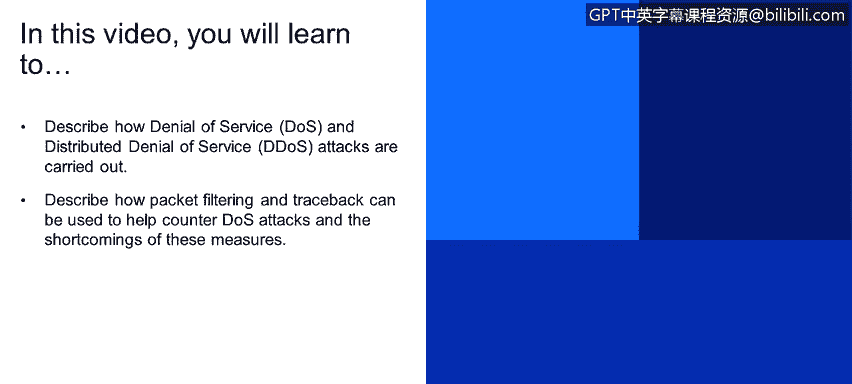
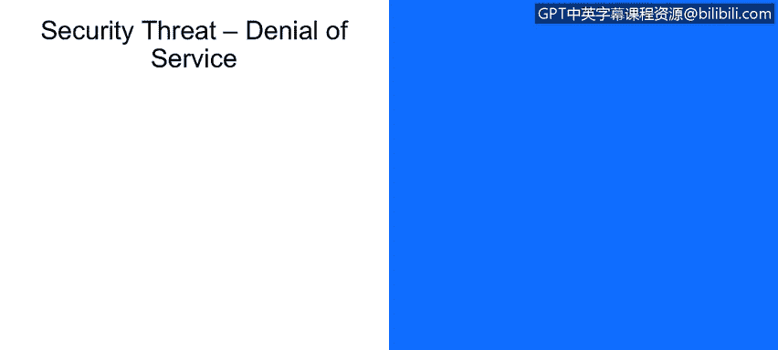

# 课程1：《网络安全工具与网络攻击简介》：109：拒绝服务攻击与防御

在本节课程中，我们将学习如何描述拒绝服务攻击与分布式拒绝服务攻击的实施方式。同时，我们也将探讨如何使用数据包过滤和溯源技术来帮助抵御这类攻击，并了解这些防御措施的局限性。

## 拒绝服务攻击概述

上一节我们介绍了网络攻击的多种类型，本节中我们来看看其中一种主要的攻击场景：拒绝服务攻击。

拒绝服务攻击是指攻击者通过发送大量恶意生成的数据包，使目标系统资源耗尽、网络带宽饱和，从而无法为合法用户提供正常服务的一种攻击方式。其核心在于用海量的无效请求淹没接收方，使其耗费所有时间处理这些涌入的数据包，而无暇执行其他计算密集型任务。

## 分布式拒绝服务攻击

在理解了基本的拒绝服务攻击后，我们进一步探讨其更强大的变体：分布式拒绝服务攻击。

分布式拒绝服务攻击与普通拒绝服务攻击的主要区别在于攻击源。它利用分布在多个不同地理位置的、被攻陷的设备（常称为“僵尸网络”）同时向一个目标发动攻击。由于攻击来自大量不同的IP地址，这使得通过简单封锁单个IP地址来防御攻击的方法失效。下图（位于教材第18页底部）直观地演示了这种攻击模式。

## 防御措施与挑战

了解了攻击原理，我们来看看有哪些可能的防御手段。以下是两种常见的防御思路及其面临的挑战：

1.  **数据包过滤**
    在恶意流量到达目标主机之前进行过滤。这种方法的问题在于，过滤器可能难以精确区分恶意数据包与合法数据包，导致在阻挡攻击的同时也错误地拒绝了正常流量。

2.  **攻击溯源**
    追踪洪水攻击流量的源头。然而，这种技术主要对溯源到被利用的“无辜”或被攻陷的机器有效，往往难以找到背后的真正攻击者。

## 更有效的防御策略

面对上述挑战，我们需要更智能的动态防御策略。

结合**动态过滤**（能够根据实时流量模式进行调整）与**智能数据包识别**技术，可以更有效地减轻拒绝服务攻击的影响。动态过滤系统能够学习正常的流量模式，并在检测到异常洪水攻击时自动更新过滤规则，从而在阻挡攻击的同时，最大限度地减少对合法流量的影响。

## 课程总结

本节课中我们一起学习了拒绝服务攻击与分布式拒绝服务攻击的基本概念、实施方式以及主要的防御措施。我们了解到，虽然数据包过滤和溯源是基础防御手段，但它们存在误杀合法流量和难以追踪真凶的局限性。因此，采用动态、智能的过滤策略对于有效缓解此类攻击至关重要。