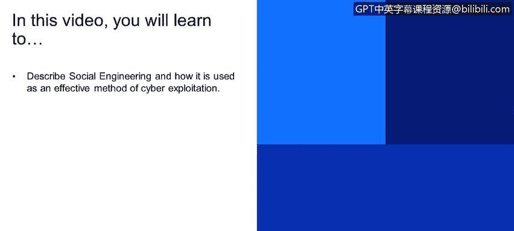

# 课程1：《网络安全工具与网络攻击简介》：112：什么是社会工程学攻击？🔐

在本节课程中，我们将学习社会工程学的概念，并了解它如何被用作一种有效的网络攻击手段。

---

## 概述

社会工程学是一种利用人际互动和心理操纵来获取机密信息或诱使他人执行特定操作的攻击方法。它不直接攻击技术系统，而是以人为突破口。理解社会工程学对于认识网络安全的“人性”层面至关重要。

---

## 社会工程学的核心概念

社会工程学的核心在于**操纵**。攻击者通过欺骗、诱导或施压，让目标在不知情或违背自身意愿的情况下，泄露敏感信息或执行危险操作。

其基本过程可以概括为以下公式：

**社会工程学攻击 = 欺骗 + 心理操纵 → 获取敏感信息/权限**

---

## 社会工程学为何有效？

上一节我们介绍了社会工程学的定义，本节中我们来看看它为何如此有效。

在网络安全中，技术防御（如防火墙、入侵检测系统）日益完善。然而，人是安全链中最薄弱的环节。当技术攻击路径被封锁时，攻击者往往会转向利用人的信任、好奇心或恐惧心理。

例如，攻击者可能已经获得了目标公司VPN系统的外部登录地址，但缺少用户名和密码。此时，最直接有效的方法可能就是通过社会工程学攻击，从内部员工那里骗取这些凭证。

---

## 如何进行社会工程学攻击？

了解其原理后，我们来看看攻击者可能使用的一些具体方法。攻击者会利用各种工具和策略来实施欺骗。

以下是几种常见的社会工程学攻击手法：

*   **钓鱼攻击**：发送伪装成可信来源（如银行、同事）的电子邮件或信息，诱骗受害者点击恶意链接或下载附件。
*   **网站克隆**：创建与真实网站（如公司登录页面、社交网络）一模一样的虚假网站，诱骗用户输入账号密码。
*   **伪装来电**：冒充技术支持、上级领导或其他权威人士，通过电话骗取信息或指令受害者进行操作。
*   **诱饵攻击**：在公共场所留下带有恶意软件的U盘等物品，利用人们的好奇心诱使其插入自己的电脑。

---

## 社会工程学工具示例：SET

为了更直观地理解，我们可以看一个具体的工具。**社会工程学工具包** 是一个功能强大的开源框架，集成了多种攻击向量。

SET工具包通常预装在Kali Linux等安全测试发行版中，也可以单独安装。它允许安全研究人员（在授权范围内）模拟各种攻击场景。

以下是SET工具包的一些主要功能：

*   **创建钓鱼网站**：快速克隆任意网站，用于凭证窃取。
*   **生成钓鱼邮件**：制作并发送带有恶意链接或附件的欺骗性邮件。
*   **进行凭证收集**：当受害者在克隆网站上输入信息时，自动捕获并存储。
*   **实施其他攻击**：如基于Arduino设备的攻击、无线接入点欺骗等。

**重要提示**：使用此类工具进行任何测试**必须**事先获得明确授权。未经许可对任何系统或个人进行社会工程学测试是非法且不道德的行为。

---

## 总结

本节课中，我们一起学习了社会工程学攻击。我们了解到，社会工程学是一种通过心理操纵而非技术漏洞来实施网络攻击的方法。它之所以有效，是因为它利用了人性中的信任、帮助意愿或恐惧等弱点。我们介绍了几种常见的攻击手法，并以SET工具包为例，展示了攻击者可能使用的工具。最后，我们必须牢记，所有安全测试都应在合法授权的范围内进行。理解社会工程学，能帮助我们更好地识别和防范这类以“人”为目标的威胁。