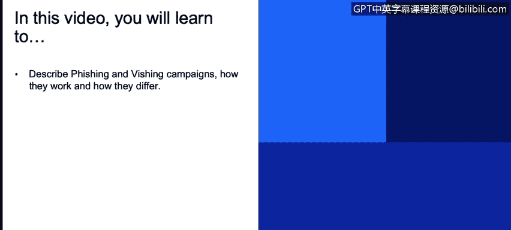
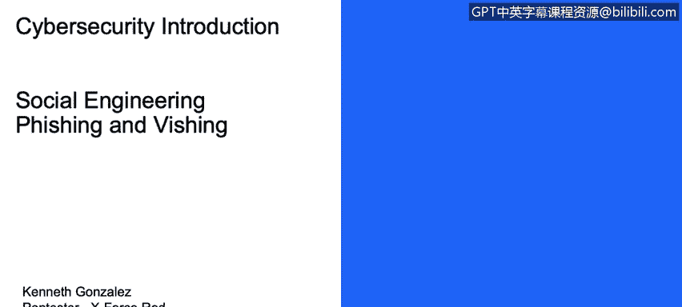
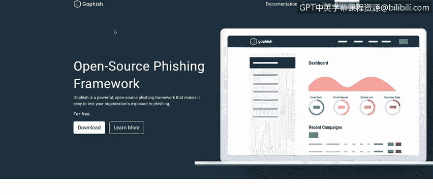
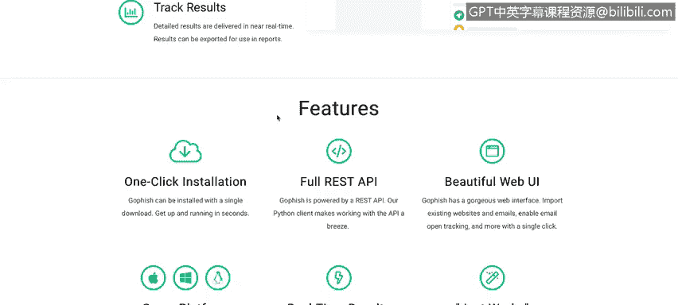
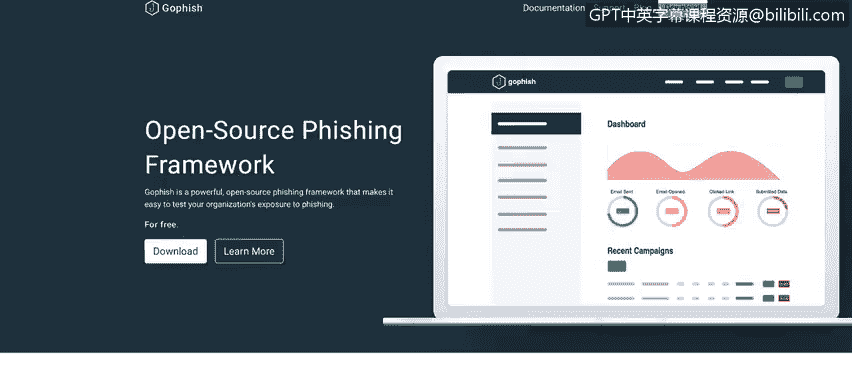
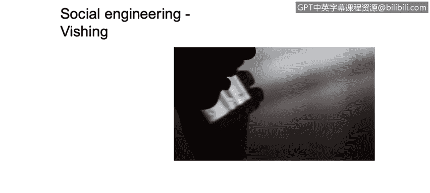
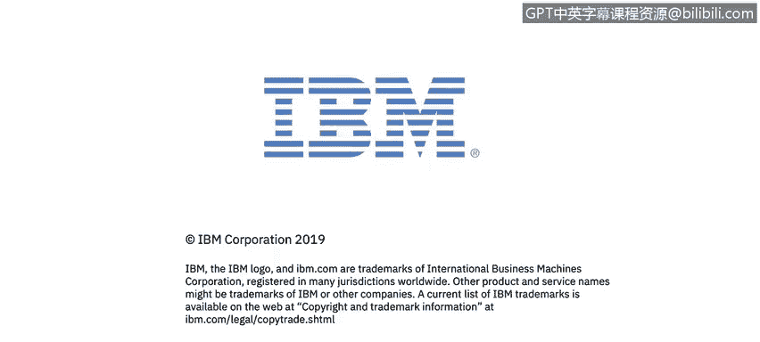

# 课程1：《网络安全工具与网络攻击简介》：113：39_03_社会工程学、网络钓鱼与语音钓鱼

在本节课程中，我们将学习如何描述网络钓鱼攻击及其活动，理解其工作原理，并区分其不同类型。我们将重点介绍用于模拟和测试钓鱼攻击的工具，并通过实例分析社会工程学的其他形式，如语音钓鱼。

## 概述

本节课程将介绍网络钓鱼攻击的核心概念，包括如何发起钓鱼活动以测试企业安全意识培训的效果。我们还将探讨另一种社会工程学攻击——语音钓鱼，并分析攻击者所使用的技巧。

## 网络钓鱼活动与测试工具

上一节我们介绍了社会工程学的基本概念，本节中我们来看看如何具体实施和测试网络钓鱼攻击。

你可以发起一种我们称之为“钓鱼活动”的行动。市面上有很多优秀的工具可供使用。

我通常使用的一个工具是 **Gofish**。Gofish 是一个开源的钓鱼平台，它能为你提供大量工具和信息，帮助你评估公司内部的网络安全培训计划是否真正提升了用户的知识水平，并创造了价值。

以下是一个简单的例子：一旦你开始使用 Gofish 框架，你就可以创建一个钓鱼活动。这个活动可以包含伪造的电子邮件、虚假的网址和伪造的HTML页面。

然后，你可以将这封伪造的邮件发送给一组用户。通过这个活动，你可以了解用户是否点击了邮件、是否打开了邮件，或者是否在虚假的网址中输入了凭据。这些信息能帮助你判断，公司现有的所有安全意识培训项目是否足够有效，能否让用户在收到钓鱼邮件时明白自己不应该做什么。

## 语音钓鱼攻击实例

网络钓鱼是社会工程学的一种形式，另一个例子是语音钓鱼。

这段YouTube视频展示了一个我们称之为“语音钓鱼”的攻击实例。在视频中，你会看到一位名叫Carol的人与一家电话公司的客服代表通话。

她试图欺骗电话公司的客服人员，将她添加为她丈夫电话计划的联系人。这里有几个关键点需要注意。

这显然是一个语音钓鱼攻击的简要示例。网络钓鱼攻击通常涉及发送包含虚假信息的伪造电子邮件，以诱使用户向你提供某些信息。而在语音钓鱼中，你做着同样的事情，但使用的不是电子邮件，而是你的声音。因此我们称之为“语音钓鱼”。

我建议你观看这个视频，并密切关注她所使用的技巧，这些技巧旨在欺骗电话公司的客服人员。你需要尝试理解社会工程学过程中的所有不同层面。

## 实施攻击所需的技能

要执行这类攻击，你需要具备一定的技能。

显然，你需要有自信。你需要掌握一些技能，这些技能在你与他人交谈并试图操纵对方以获取信息时会非常有帮助。

## 总结

本节课中我们一起学习了网络钓鱼活动的运作方式及其测试工具（如Gofish框架），并了解了另一种社会工程学攻击——语音钓鱼。我们认识到，无论是通过邮件还是电话，攻击者都依赖于操纵人性弱点来获取信息，而防御的关键在于持续有效的安全意识教育。