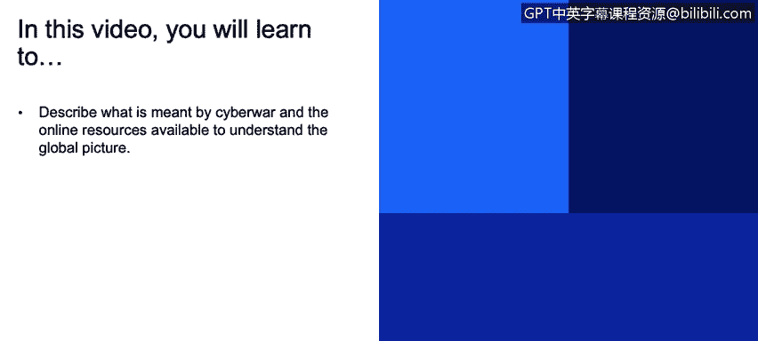

# 课程1：《网络安全工具与网络攻击简介》：114：网络战概述

## 概述
在本节课程中，我们将学习网络战的基本概念，并了解用于追踪全球网络攻击事件的在线资源。我们将探讨网络战的主要参与者、攻击类型，并通过具体案例和数据来理解当前的网络冲突格局。

## 什么是网络战？
网络战是指国家或国家支持的组织，通过计算机网络发起的、旨在破坏、间谍活动或施加影响的冲突行为。它既包括直接的军事网络行动，也包括由非国家行为体（如受雇黑客）实施的、但可能具有国家背景的攻击。

上一节我们介绍了网络攻击的基本类型，本节中我们来看看国家层面的网络冲突——网络战。

## 全球网络事件追踪资源
为了理解网络战的全球图景，我们可以利用一些公开的在线资源。其中一个重要资源提供了自2006年以来的重大网络事件信息。

该资源记录了当前由各国或其盟国力量执行的网络行动。信息图表中一个有趣的部分是每个国家涉及的网络事件数量，包括该国发起的攻击和遭受的攻击。

以下是基于该网络安全资源的一个数据示例：

*   **中国**：在本年度发起了近100起网络攻击事件，同时也遭受了25起攻击事件。
*   **美国**：在本年度遭受了117起攻击事件，同时发起了9起攻击事件。

这些数据有助于我们了解不同国家在网络空间中的活跃程度和面临的威胁。

## 网络战的参与者与复杂性
理解网络战的一个关键点是其参与者的复杂性。当我们看到新闻报道称“某国黑客”发动攻击时，这并不一定意味着该国政府直接实施了攻击。

网络战场景中通常存在多种行为体：
1.  **国家网络部队**：例如美国的网络司令部、中国的网络力量等，这些机构直接开展进攻和防御性网络行动。
2.  **国家雇佣的黑客组织**：一些国家会雇佣非官方的黑客团体来执行攻击任务，以掩盖官方参与的证据。

因此，网络战的棘手之处在于，攻击行动常常被伪装成其他国家的行为，即使用“虚假旗帜”来掩盖真正的攻击源。在阅读相关新闻或报告时，区分攻击的真正发起者至关重要。

## 网络战实例分析
以下是一些具体的网络战实例，它们说明了攻击的不同来源和性质：

*   **非国家行为体示例**：今年四月，据报道伊朗黑客对英国的地方政府网络、银行及其他公共机构发起了一系列黑客攻击。需要强调的是，“伊朗黑客”的标签不一定代表伊朗政府是攻击的直接执行者。
*   **国家行为体示例**：今年三月，伊朗情报部门入侵了以色列前参谋长兼反对派领导人本尼·甘茨的手机，时间点恰在以色列四月大选之前。以色列情报部门将收集到的所有指标和证据都指向了伊朗政府的情报机构。这是一个由政府直接生成和部署的网络行动案例。

通过这些例子，我们可以看到网络战中官方行动与非官方行动交织的复杂局面。

## 深入学习资源：震网病毒
若想更深入地理解网络战，可以参考相关的书籍和资料。一个很好的资源是关于“震网”病毒的书籍《零日倒计时：震网病毒攻击内幕》。

震网是一种恶意软件病毒，据信由某个国家开发，旨在破坏伊朗的核计划。它发生在2007年，是互联网近代史上首次有记录的国家间重大网络攻击。这本书以故事的形式，详细讲述了震网病毒的来龙去脉，是了解早期网络战形态的绝佳材料。

## 总结
本节课中，我们一起学习了网络战的定义及其复杂性。我们了解到追踪全球网络事件的资源，并通过数据看到了不同国家在网络攻防中的角色。我们重点分析了网络战中的不同参与者，包括国家直接行动和雇佣黑客行为，并通过“伊朗黑客攻击英国”和“伊朗入侵以色列官员手机”等案例加深了理解。最后，我们介绍了震网病毒作为学习网络战历史的经典案例。理解这些概念有助于我们更全面地认识当今网络空间的安全态势。