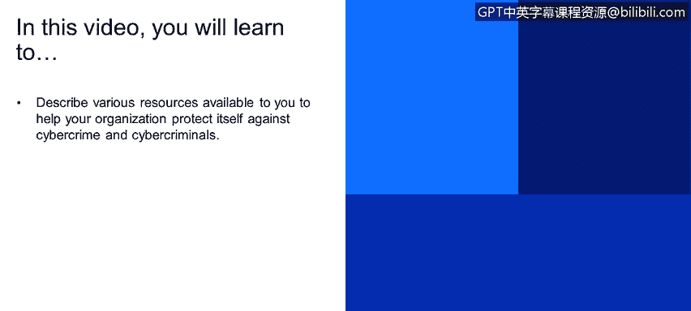

# 课程1：《网络安全工具与网络攻击简介》：115：41_05_网络犯罪资源

在本节课程中，我们将学习如何描述可供组织用于防范网络犯罪和网络犯罪分子的各种资源。

上一节我们介绍了攻击方法。了解攻击方法是必要的，因为你需要知道潜在攻击者可能拥有的攻击手段。

但这里还有很多信息需要充分理解和消化。以下是一些建议你查阅的信息资源。当然，你也可以在互联网上搜索更多其他信息。

信息至关重要。网络安全领域与自动化等领域不同，每天都有新变化。如果不坚持每天学习，就无法保持竞争力，也无法在网络安全领域生存。每天都有新的攻击手段出现，如果不充分了解这些信息，你就无法防御未知的威胁。

以下是你可以利用的一些关键信息资源。

首先，是网络犯罪或网络安全趋势报告。IBM会发布X-Force威胁情报报告。这份报告由IBM安全研究团队编制。这些报告非常可信，会定期（通常是每季度）发布。我建议你下载并始终关注这些报告。

其次，还有一些可以提供更个性化信息的数据源。例如，IBM有一个名为X-Force Exchange的门户网站。在这个门户中，你可以查询特定的IP地址、域名、哈希文件或电子邮件地址。然后，该门户会告诉你它所掌握的关于该特定目标的所有信息。这非常有用。

此外，IBM还提供了一个门户，可以提供针对特定行业、特定国家的网络安全报告。例如，你想了解SQL注入攻击在意大利的使用情况。你可以请求一份关于此的特定统计报告。这有助于你理解威胁的重要性。如果你需要保护你的客户或自身，了解针对特定客户或特定区域的威胁，可以帮助你决定将资源重点投入哪个领域。

例如，如果你知道你的业务不涉及数据库，并且了解到SQL注入攻击在你所在的地区并不流行，那么你可能就不需要过度投资于防范SQL注入。你可以将这一部分资源投入到其他更紧迫的威胁上。

同样，我推荐使用数据泄露成本报告。这份报告基本上提供了数据泄露可能给特定客户带来的成本估算信息。这虽然不是精确的成本数据，但你可以利用它，无论是在销售场景中，还是在决定投资方向时。如果你知道数据泄露可能造成巨大损失，那么投资于防范此类威胁就显得尤为重要。

本节课中，我们一起学习了用于防范网络犯罪的关键资源。我们了解了如何利用IBM的X-Force威胁情报报告、X-Force Exchange查询门户、行业/国家特定报告以及数据泄露成本报告，来获取威胁情报、进行个性化分析并指导安全投资决策。持续关注并利用这些资源，是保持组织安全态势与时俱进的重要一环。