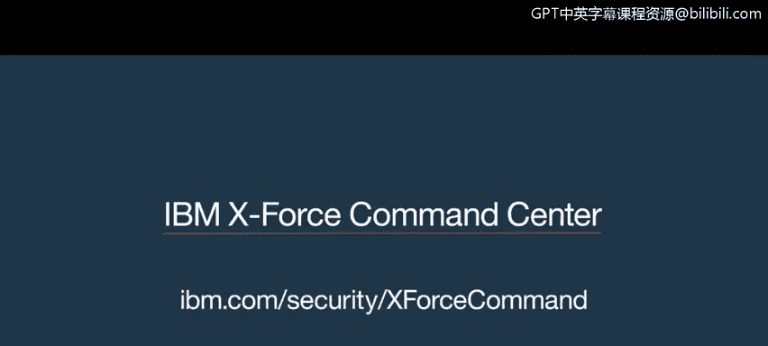

# 课程1：《网络安全工具与网络攻击简介》：116：X-Force指挥中心简介

## 概述
在本节课程中，我们将通过一个模拟的网络安全事件响应场景，了解安全团队如何协作应对网络攻击。我们将看到从威胁检测、分析到采取防御措施的全过程。

## 课程内容

上一节我们介绍了网络安全的基本概念，本节中我们来看看一个真实团队如何应对突发的安全事件。

团队成员在防火墙日志中发现了异常活动。

> 嘿，各位，你们在防火墙上看到这个了吗？
> 是的，我也看到了。

安全分析师确认了威胁并请求采取行动。

> 好的，团队。我们刚刚验证了一个威胁。你能在那个防火墙上设置一个分类拦截吗？我们想测试一些东西。

团队开始评估攻击的影响范围并尝试隔离威胁源。

> 有多少台机器被感染了？
> 稍等，我们正在隔离这个IP地址。
> 这次攻击到底是从哪里发起的？

安全负责人向管理层汇报情况，说明了事件的严重性和不确定性。

> 正如我们所说，艾米，他们看起来是一起非常复杂的网络犯罪集团重大数据泄露的受害者。
> 很难说黑客目前是否仍在网络中。我们真的不知道攻击来自何处或幕后黑手是谁。
> 我们谈到了对金融部门和华尔街的影响。

团队进入紧急响应状态，决定实施永久性封锁。

> 好了各位，行动，快行动，威胁就在外面。我们需要将其设为永久性封锁，所以快行动。

在压力下，团队进行倒计时，准备执行关键操作。攻击模式可能正在发生变化。

> 我需要一些答案。詹姆斯，快点。快点，快点，快点，我们还有60秒准备。
> 情况不会更糟了，就我们所能判断的来看，他们实际上可能正在改变策略。

操作执行后，团队评估了事件的广泛影响。

> 三，二，一。执行。
> 这次事件的波及范围很广。

## 总结与沟通
在处理不确定性的同时，安全负责人向外界传达团队正在努力解决问题。

> 我们现在面临很多不确定性。我能告诉你们的是，我们有一支优秀的团队正在全天候工作，以解决出现的任何问题。一旦有任何新信息，我将很乐意实时向大家通报。

## 本节总结
本节课中，我们一起学习了一个网络安全团队在应对真实攻击时的协作流程。我们看到了从**威胁检测**、**分析确认**、**紧急响应**到**执行封锁**和**事后沟通**的关键步骤。这个过程强调了在网络安全事件中，清晰的沟通、快速的决策和团队协作至关重要。