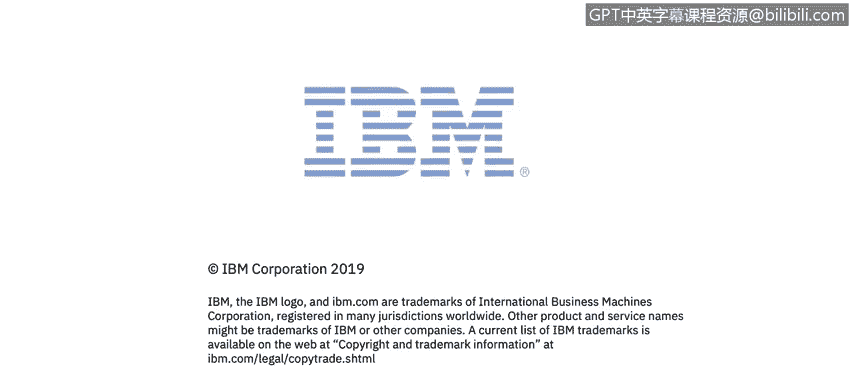

# 课程1：《网络安全工具与网络攻击简介》：117：43_01_哈维尔的网络安全技能视角

在本节课中，我们将通过网络安全工程师哈维尔的视角，了解网络安全领域的核心技能、日常工作内容以及关键工具的应用。这对于初学者理解网络安全实践至关重要。

大家好，我是哈维尔，我是IPM安全公司的网络安全工程师，我在这个团队已经工作了大约四年。

我最初在十年前以网络安全工程师的身份开始了我的职业生涯。

当我开始工作时，我与安全运营中心紧密合作，审查网络安全事件并做出决策，以提升我们的威胁检测能力。

作为我日常工作的一部分，我经常与威胁情报打交道。

我进行演练，以审查和理解攻击及其技术，例如在MITRE ATT&CK框架中描述的那些，并协助集成更好的工具来追踪恶意行为者。

我对诸如**SIEM**、防火墙、**IPS**、弹性机器学习等技术非常熟悉。其中，我认为**SIEM**是一个至关重要的工具，因为它使我们能够执行高级关联分析和威胁情报集成，这无疑为我们的运营带来了巨大价值。

非常感谢。

---

## 课程总结

本节课中，我们一起学习了网络安全工程师哈维尔的职业经历与日常工作。我们了解到，网络安全工作涉及与安全运营中心协作处理事件、利用**MITRE ATT&CK**等框架分析攻击技术，并依赖**SIEM**等关键工具进行威胁检测与情报集成。这些内容为初学者勾勒出了网络安全实践的基本轮廓。