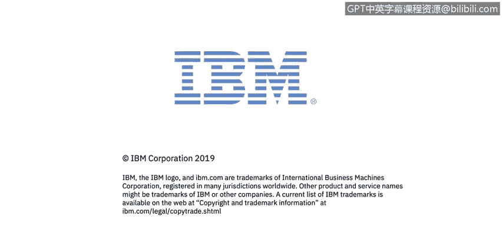

# 课程1：《网络安全工具与网络攻击简介》：118：44_01_核心安全概念概述

## 📚 课程概述

在本节课中，我们将学习网络安全领域的几个核心基础概念。这些概念是理解后续更复杂安全主题的基石。我们将重点介绍**CIA三元组**、**访问控制**、**事件响应**以及**安全框架**。

---

## 🔐 核心安全概念介绍

在模块3中，讲师Kenneth、John和Dom将引导我们学习一些关键的安全概念。

上一节我们介绍了课程的整体安排，本节中我们来看看这些核心概念具体包含哪些内容。

---

## 🛡️ 核心概念详解

以下是本模块将要涵盖的几个核心安全概念：

*   **CIA三元组**：这是信息安全的三个核心目标，即**机密性**、**完整性**和**可用性**。
*   **访问控制**：指管理谁可以访问特定资源以及可以执行何种操作的策略和机制。
*   **事件响应**：指组织为识别、管理和恢复网络安全事件而制定的计划与流程。
*   **安全框架**：提供了一套结构化的指南和最佳实践，帮助组织建立和维护其安全态势。

---

## 🏛️ 美国国家标准与技术研究院简介

我们将认识**NIST**，即美国国家标准与技术研究院。

> 有一个指向NIST网络安全框架的链接可供额外阅读。

关于NIST及其框架的更多细节，我们将在未来的课程中进行深入探讨。

---

## 🎯 总结

本节课中，我们一起学习了网络安全的基础核心概念，包括CIA三元组、访问控制、事件响应和安全框架。同时，我们也初步了解了美国国家标准与技术研究院及其在网络安全标准制定中的重要作用。这些概念和知识为我们后续深入学习具体的工具、技术和攻击方式奠定了坚实的理论基础。