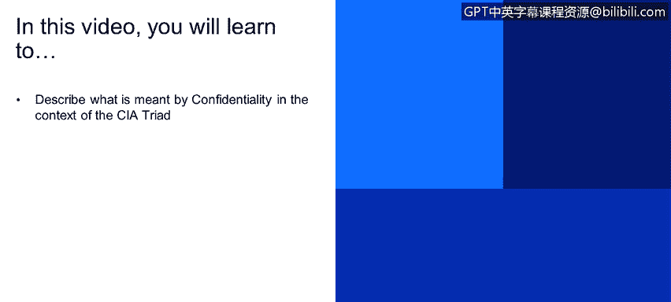
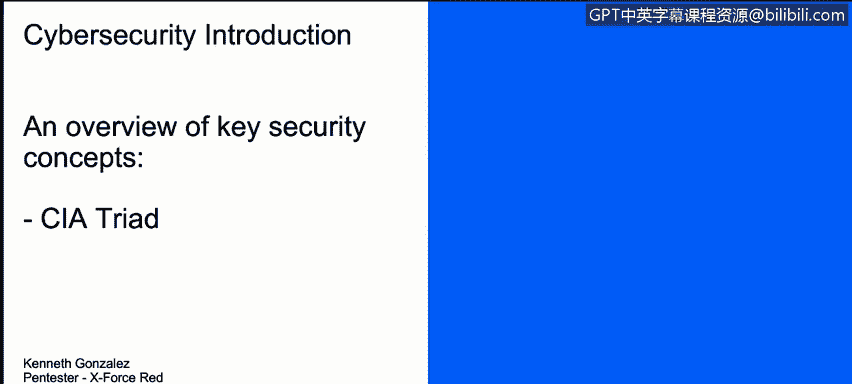

# 课程1：《网络安全工具与网络攻击简介》：1.1：CIA三要素之保密性 🔒

在本节课程中，我们将学习网络安全的核心基础概念之一——CIA三要素，并重点探讨其中的“保密性”原则。

---

## 概述

CIA三要素是网络安全领域的基石。这三个字母分别代表**保密性**、**完整性**和**可用性**。理解这些概念对于保护数据、系统和资产至关重要。本节我们将聚焦于“保密性”的具体含义及其实现方式。

---

## 理解CIA三要素

首先，我们需要明白这三个字母在网络安全中代表一切。每个字母的含义如下：
*   **C** 代表 **保密性**。
*   **I** 代表 **完整性**。
*   **A** 代表 **可用性**。

---

## 什么是保密性？

保密性的概念其实相当简单。我们几乎每天都在处理保密性问题。它意味着我们要**保护数据、系统和我们的技术资产**，防止任何机密数据或对这些计算机系统、文档的机密访问被泄露给**未经授权的各方**。

例如，我们通常使用的机密数据包括个人信息。并非所有我们认识的人都需要了解或知道我们保存在电脑、手机等设备上的所有机密数据。

---

## 如何实现保密性？

为了在我们的世界，即网络安全领域，实现保密性，我们通常使用**加密**技术。我们将在另一个视频中详细讨论加密，但简单来说，加密意味着我们将使用一种**密码**来防止任何机密数据暴露给公众或未经授权的人员。

以下是其他一些帮助我们实现保密性的关键要素：
*   **身份验证**
*   **访问控制**
*   **物理安全**

这些措施使我们能够对数据、系统和技术资产维持一定程度的访问限制。

---

## 总结

本节课我们一起学习了CIA三要素的基本构成，并深入探讨了“保密性”原则。我们了解到，保密性旨在防止数据被未经授权地访问或泄露，其核心实现手段包括加密、身份验证和访问控制等。理解并应用保密性原则是保护数字资产的第一步。