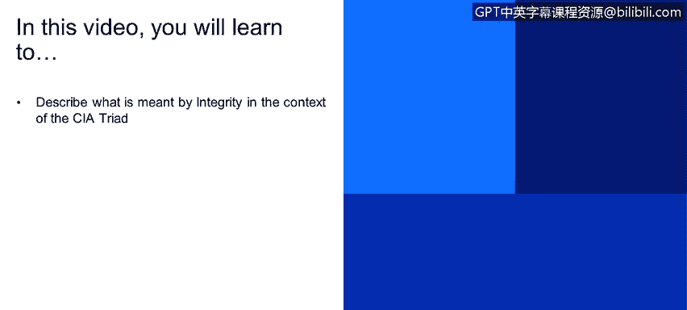
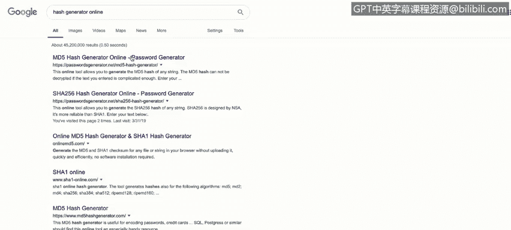
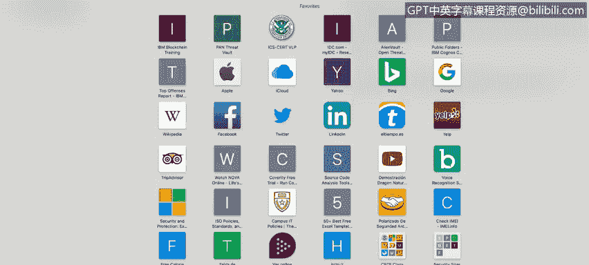
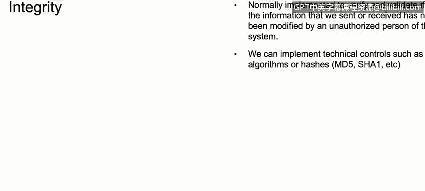

# 课程1：《网络安全工具与网络攻击简介》：
P1：CIA三要素之完整性（Integrity）🔐

在本节课程中，我们将学习CIA三要素中的第二个核心概念——**完整性**。我们将探讨完整性的定义、它与保密性的区别，以及如何在现实世界中通过技术手段（如哈希算法）来确保数据的完整性。

上一节我们介绍了CIA三要素中的保密性（Confidentiality），本节中我们来看看**完整性**。

完整性是一个与保密性相似但有所区别的概念。其核心原则是确保所有数据、信息和系统在传输或使用过程中，不会被任何系统、用户或个人未经授权地修改或篡改。

例如，假设我们需要从个人邮箱向公司总部发送一封电子邮件，内容是关于我们将使用某个特定软件远程访问客户计算机。完整性关注的关键点在于，确保这封邮件在传输过程中**不会被篡改**。简而言之，完整性处理的是信息在发送和接收过程中保持**原始状态**的问题。

那么，我们如何在公司或个人的网络安全实践中实现完整性呢？

通常，我们使用**哈希（Hash）** 技术。哈希是一个重要的概念，我们将在后续课程中深入探讨。目前，你需要理解的核心是：哈希是一种数学算法，它能为我们使用的文件、电子邮件或数据生成一个唯一的“数字签名”。

为了更清晰地说明，让我们看几个例子。

以下是使用在线工具生成哈希值的步骤演示：

1.  访问一个在线哈希生成网站，例如 `hashgenerator.net`。
2.  在文本框中输入一个单词，例如 “Secure password”。
3.  选择一种哈希算法，例如 **SHA-256**。
4.  点击生成，你会得到一串由字母和数字组成的哈希值，例如 `e3b0c44298fc1c149afbf4c8996fb92427ae41e4649b934ca495991b7852b855`。

这个哈希值就是“Secure password”这个字符串的唯一签名。如果你尝试用这串哈希值本身作为密码登录邮箱，系统会拒绝你。但在网络安全领域，这个哈希值的作用在于：只要原始数据发生**任何微小变化**，其生成的哈希值就会**完全不同**。例如，将“Secure password”改为“Secure password”，生成的哈希值就会截然不同。

另一个更贴近实际的例子是下载软件时的完整性校验。

许多软件发布网站，例如著名的渗透测试Linux发行版Kali的官网（`kali.org`），在提供下载链接的同时，会公布该安装文件的官方**SHA-256哈希值**。

以下是验证下载文件完整性的通用流程：

1.  从官网下载文件（如Kali Linux镜像）。
2.  使用哈希计算工具（如在线网站 `md5file.com` 或本地命令 `sha256sum`）计算你刚下载文件的哈希值。
3.  将你计算出的哈希值与官网公布的官方哈希值进行比对。

如果两个哈希值**完全一致**，则证明文件在下载过程中完好无损，未被篡改。如果**不一致**，则意味着文件可能已损坏或在传输过程中被恶意修改，你不应信任或使用该文件。

这就是在现实网络安全世界中，利用哈希算法来保障数据完整性的一个清晰范例。

本节课中，我们一起学习了CIA三要素中的**完整性**。我们明确了完整性的目标是防止数据被篡改，并介绍了通过**哈希算法**生成数字签名来验证数据完整性的基本原理和实践方法。理解并应用完整性保护，是构建安全系统、确保信息可信的关键一步。