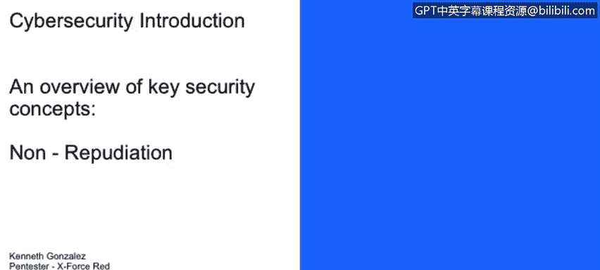

# 课程1：《网络安全工具与网络攻击简介》：122：不可否认性及其在CIA三要素中的应用

在本节课程中，我们将学习不可否认性的概念，并探讨它如何应用于信息安全的基础——CIA三要素（机密性、完整性、可用性）。

---

另一个我们需要理解的关键术语是“不可否认性”。

不可否认性其实很简单，它指的是关于数据发送者、接收者身份的确凿证据，并且这些证据表明数据在传输过程中没有被修改或篡改。

这个概念不仅关乎数据在传输中的状态，也关乎数据本身。例如，我们如何实施某种技术，来帮助我们确认一封电子邮件确实是由声称的发送者发出的，而不是来自另一个国家的攻击者试图冒充该发送者。

我们通常通过数字签名来实现这一点。显然，如果我们回到之前提到的具体场景中。

如果我们查看邮件服务器，我们也可以查看日志。例如，如果肯尼斯给他的老板发了一封邮件说他辞职了，那么如果服务器上没有日志记录，或者接收方没有能证明这封邮件确实来自肯尼斯的数字签名，这对于理解不可否认性的概念就非常重要。

因此，当肯尼斯的老板走进他的办公室询问他是否真的要辞职时，肯尼斯可以说：“不，我没有发那封邮件，是有人在冒充我。”在后续课程中，我们将讨论如何使用加密技术、如何使用公钥基础设施来生成数字签名，以及如何理解不同系统中的日志。但在现阶段，理解不可否认性这个概念至关重要。

---

在本节课中，我们一起学习了不可否认性的核心概念。不可否认性提供了数据发送和接收行为的可靠证明，是确保信息真实性和追责能力的关键，它补充并强化了CIA三要素中的完整性和可用性目标。