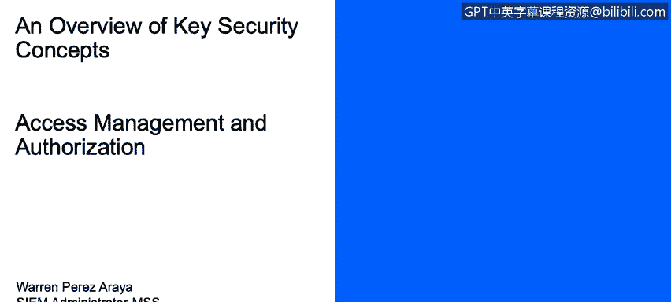

# 课程1：《网络安全工具与网络攻击简介》：123：访问管理

## 概述
在本节课程中，我们将学习如何描述确保有效访问组织计算资源的各种方法。我们将重点探讨授权、身份验证以及相关的核心概念。

---

## 授权：允许访问的过程
上一节我们介绍了访问管理的总体目标，本节中我们来看看**授权**。授权是允许某人访问特定对象的过程。

以下是几种不同的访问控制标准：
*   **按组限制访问**：例如，行业组可能比财务组能访问更多数据。
*   **按时间框架或特定日期限制**：例如，只允许在工作日（周一至周五）的上午8点至下午5点访问某些文件，此时间外的访问将被拒绝。
*   **按物理位置限制**：例如，只允许位于美国境内的用户访问某些文件。
*   **按事务类型限制**：例如，允许用户读取文件，但不允许他们写入或修改文件。

此外，还需要理解**“须知”原则**。这是某人请求访问特定数据的正当理由。如果我的具体工作需要我了解某些信息，这便是我有权访问特定文件和目录的正当理由。

---

## 单点登录与身份验证
以上这些控制措施通常集中在一个称为**单点登录**的系统中。这在企业中被广泛使用。其原理是用户只需登录一次，SSO系统便允许其访问多个网站或不同文件，无需重复登录。

接下来，我们需要理解一些身份验证相关的要点：
*   **身份证明**：在大多数系统中，你需要提供身份标识和认证凭据。例如，用户名是你的**身份标识**，而密码则用于**身份验证**，证明你确实是所声称的用户。
*   **协议与机制**：**Kerberos**是一种用于实现单点登录的协议。此外，还有像**CHAP**这样的相互认证机制，这些认证过程依赖于共享的秘密或令牌来在系统间安全通信。
*   **安全标识符**：在Active Directory等环境中，存在**安全标识符**。这是一个分配给主体（如用户）和客体（如组）的唯一ID，用于精确识别身份和权限配置。

---

## 自主访问控制
我们熟知的大多数操作系统都使用**自主访问控制**。这是一种访问控制类型，允许用户自行决定将个人数据的访问权限授予任意对象。

这意味着，如果我有一个包含敏感数据的文本文件，我将负责决定谁可以查看和编辑该文件，因为这是我的文件，我有权自主决定将访问权限授予任何我想授权的人。

---

## 总结
本节课中，我们一起学习了访问管理的核心概念。我们探讨了**授权**的不同标准（如按组、时间、位置和事务类型控制），理解了**“须知”原则**和**单点登录**的便利性，区分了**身份标识**与**身份验证**，并介绍了**DAC**这种允许数据所有者自主分配权限的访问控制模型。掌握这些是理解如何保护组织计算资源的基础。