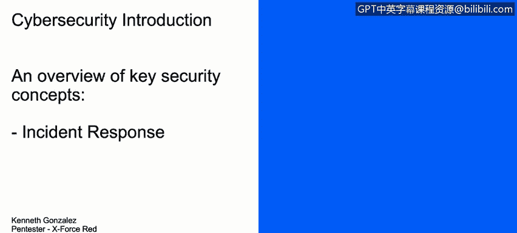
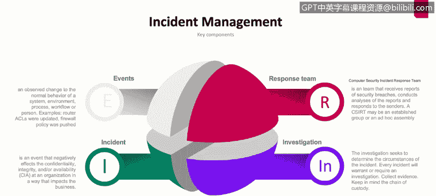

# 课程1：《网络安全工具与网络攻击简介》：124：事件响应管理

## 概述
在本节课程中，我们将学习事件响应管理过程。我们将了解其定义、实施方式，以及它为何对整体安全架构至关重要。

## 事件响应简介
上一节我们介绍了网络安全的基本概念，本节中我们来看看事件响应。事件响应是一个管理过程，是当今大多数公司都在处理的核心安全流程。它之所以非常重要，是因为它能生成关于事件、错误甚至攻击的信息，帮助我们理解计算机网络或整个网络所遭受的情况。

这意味着，一旦我们的网络中发生了某些非正常或非预期的事情，就会产生一个事件。那么，我们应如何处理这个事件？如何理解发生了什么？如何防止未来发生新的事件？或者如何尽快恢复服务、数据、计算机或网络？所有这些概念都属于事件管理范畴。显然，其中涉及许多内容，我们现在就来详细讨论。

## 核心概念解析
以下是事件管理过程中的几个关键组成部分。

### 事件
首先，理解什么是“事件”很重要。一个事件，通常指网络中或公司正常行为之外发生的某些事情。它改变了系统的正常行为，可能是一个程序，也可能不是。它改变了公司、网络或计算机上的正常流程。例如，访问控制列表更新、防火墙策略推送或更新、服务器上的日志记录事件，这些可能是正常的、预期的，也可能不是。但通常，这里的共同标准是：它改变了公司、系统或计算机的正常行为或流程。

### 事件
“事件”是事件的负面部分。举例来说，如果有人登录服务器并更新了ACL，这是一个事件。这个事件可能是预期的，因为有工单说明系统管理员需要去服务器更新ACL，以便授予对网络某部分的访问权限或VPN用户的访问权限。但是，如果检测到有人进入服务器更改了ACL，并禁止或拒绝了公司外部网络对所有服务器的访问，导致互联网上或公司外部网络的任何人都无法访问服务器，这就构成了一个**事件**。

事件会对组织安全的**机密性**、**完整性**和**可用性**产生负面影响。通常，这些事件会以多种方式影响业务，例如，影响公司的正常服务、法律层面、运营层面或财务层面。

### 响应团队
为了处理事件，我们设有响应团队。响应团队通常被称为CSIRT，这个团队的首要任务，在某些情况下，是识别漏洞、识别事件，并处理解决当前事件和问题的流程。

例如，如果有人去服务器禁用了防火墙策略，导致外部网络无法访问内部网络，响应团队将尝试修复该防火墙策略，并尝试恢复对公司内部网络的访问。

响应团队的一个重要部分是调查过程。他们需要理解发生了什么，需要收集证据，需要维护该过程、事件或事件的监管链，以便理解事件发生的原因、谁执行了操作，以及未来需要采取什么措施来防止此类事件再次发生。

## 总结
本节课中，我们一起学习了事件响应管理。我们定义了**事件**与**事件**的区别，了解了**响应团队**的角色和**调查过程**的重要性。掌握这些核心概念，是构建有效网络安全防御和响应能力的基础。