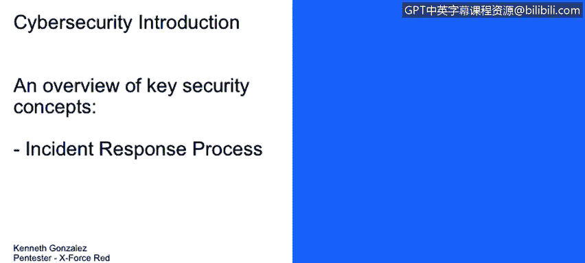
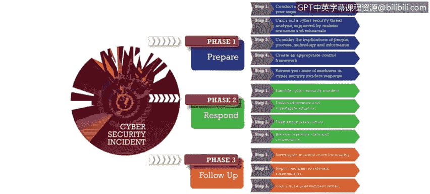
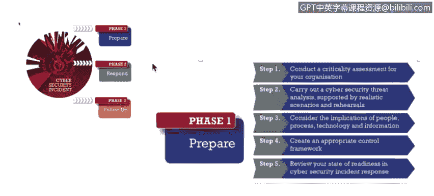
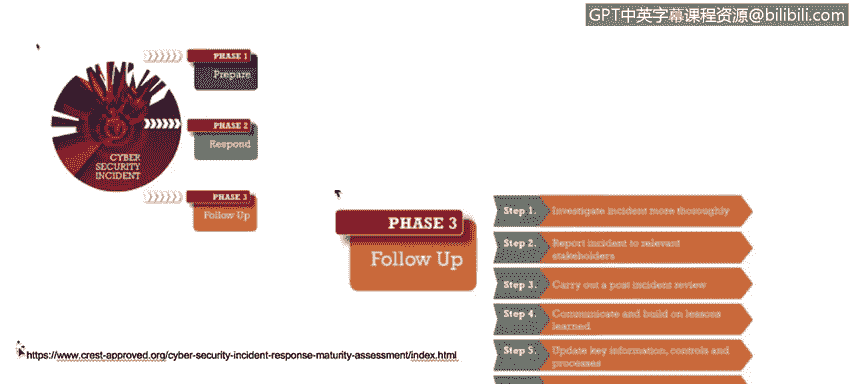
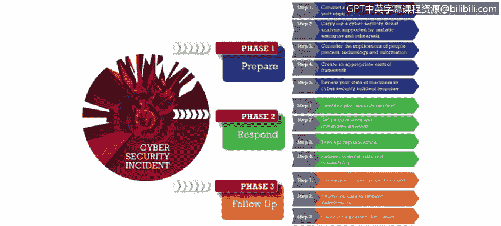
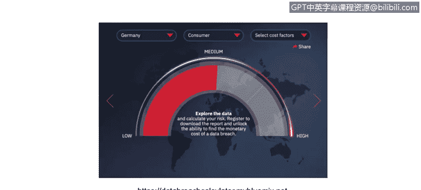
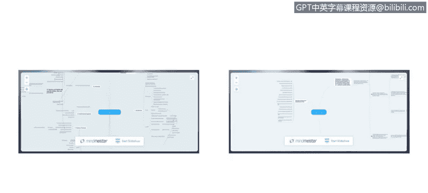
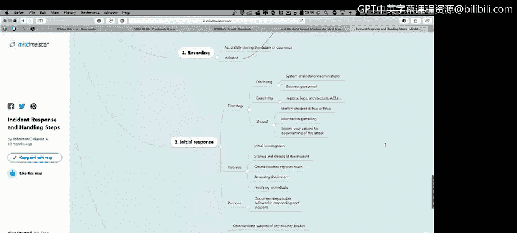

# 课程1：《网络安全工具与网络攻击简介》：126：事件响应流程

## 概述
在本节课程中，我们将学习网络安全事件响应流程。我们将了解由CREST组织总结的、包含三个核心阶段的事件响应模型，并探讨每个阶段的关键任务和重要性。

## 事件响应流程的三个阶段
网络安全事件响应流程可以概括为三个主要阶段：**准备**、**响应**和**跟进**。这个模型有助于组织系统化地处理安全事件。

### 第一阶段：准备
上一节我们概述了整体流程，本节中我们来看看第一个阶段——准备阶段。准备阶段的核心是建立对自身系统和数据的全面认知，并制定相应的防护与控制措施。

以下是准备阶段需要完成的关键任务：
*   **了解系统与数据**：你需要清楚自己管理着哪些系统，存储了哪些电子数据。
*   **数据分类**：判断这些电子数据是否经过分类，识别哪些是关键或敏感数据。
*   **实施控制措施**：部署管理性、技术性或物理性的控制措施来保护资产。
*   **进行业务影响分析**：评估特定系统宕机可能造成的财务损失和运营中断时间。

只有掌握了所有必要的信息和数据，才能有效地开始处理安全事件。

### 第二阶段：响应
在完成充分的准备后，当事件发生时，我们就进入了响应阶段。此阶段的目标是控制事态、减少损失并恢复运营。

以下是响应阶段的核心步骤：
*   **识别事件**：首先需要判断发生的是否为网络安全事件。例如，员工将捡到的U盘插入公司电脑并导致恶意软件感染，这属于网络安全事件；而有人砸碎办公楼窗户则不属于。
*   **启动恢复计划**：根据事件严重程度，可能需要触发业务恢复计划或业务连续性计划。

处理网络安全事件的方式应与处理其他类型（如物理安全）事件的方式区分开来。

### 第三阶段：跟进
响应行动结束后，流程并未终结，跟进阶段至关重要。此阶段侧重于从事件中学习，防止未来再次发生。

以下是跟进阶段的主要工作：
*   **调查与分析**：深入调查事件发生的原因、过程及影响。
*   **趋势分析**：分析事件是否反映出某种行为趋势。例如，如果多次发生员工使用外来U盘导致的安全事件，则说明存在普遍的风险行为模式。
*   **制定改进计划**：基于调查结果，制定并实施改进计划。其成果可能包括**加强员工的安全意识培训**。

## 事件影响评估工具
为了更好地理解安全事件可能对组织造成的危害，我们可以利用一些评估工具。

IBM提供了一个数据泄露成本计算器。使用该工具时，你需要选择所在国家、行业类型，并勾选组织已实施的安全措施（如人工智能平台、数据分类架构、员工培训等）。工具会动态计算数据泄露的预估成本。通常，完善的事件响应能力、加密技术的应用以及员工培训是降低泄露成本的关键因素。

## 详细的响应步骤参考
如果你想更深入地了解事件响应的具体步骤，可以参考NIST（美国国家标准与技术研究院）提供的指南。该指南包含了从事件确认到事后总结的详细阶段和步骤。

例如，在初始响应阶段，关键步骤包括：
*   确保系统和网络管理员到位。
*   让业务人员检查日志、报告和系统架构。
*   进行信息收集，全面了解受影响系统和事件本身，以便与响应团队协同开展工作。

## 总结
本节课中，我们一起学习了网络安全事件响应的标准流程，它包含**准备、响应和跟进**三个阶段。我们探讨了每个阶段的核心任务，并介绍了利用业务影响分析、数据泄露计算器等工具进行评估和规划的方法。掌握这套流程是有效管理网络安全风险、提升组织韧性的基础。