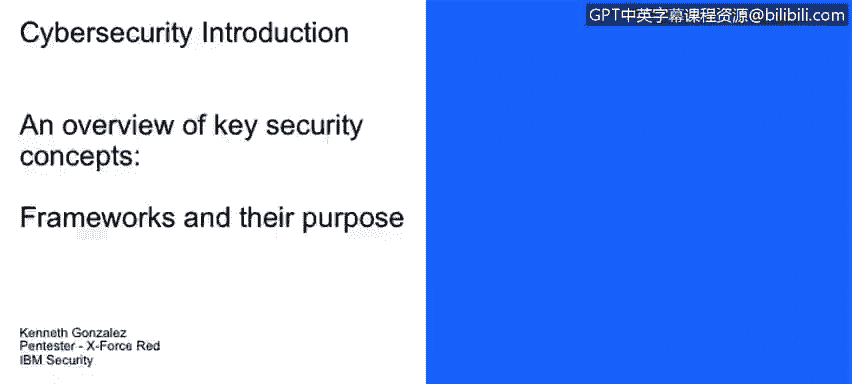
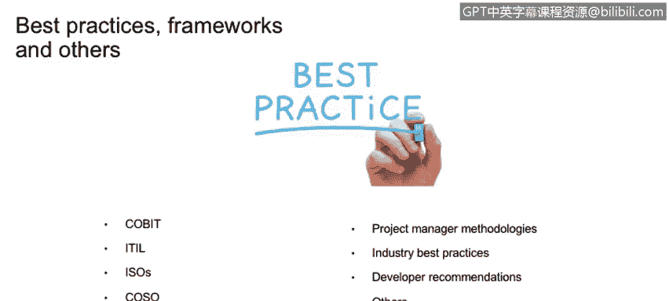

# 课程1：《网络安全工具与网络攻击简介》：127：53_01_框架与最佳实践简介 🔒

在本节课程中，我们将学习框架、基线和最佳实践在有效的网络安全策略中的目的与作用。我们将区分这些概念，并理解它们在组织治理和技术管理中的不同角色。

---

上一节我们探讨了网络安全的基础概念，本节中我们来看看如何通过结构化的方法来提升安全水平。框架、基线和最佳实践是构建稳健安全策略的关键组成部分。

## 框架、基线、最佳实践与合规性 📋

在组织中，我们会接触到多种指导性材料，例如最佳实践、基线和框架。它们旨在提升IT治理、流程、政策和程序的水平。

以下是这些概念的核心区别：

*   **最佳实践、基线、框架**：这些通常是建议性的、可选的指南。例如，COBIT框架、ITIL流程或微软针对其数据库服务器加固的最佳实践。实施它们能提升系统性能（如改进的Microsoft SQL服务器）和整体运营，但若不采用，通常不会直接导致业务受损或法律问题。
*   **规范与合规性**：这些是强制性的要求。例如，美国的医疗保健公司必须遵守HIPAA规范。即使公司实施了各种最佳实践和框架，如果未能满足HIPAA的特定要求，也可能面临政府处罚甚至无法继续运营。

因此，最佳实践和框架是“锦上添花”，而规范与合规是“必须遵守”的底线。

## 常见的框架与最佳实践示例 🛠️

正如前面提到的，存在许多框架和方法论可用于改善企业处理技术的方式。

以下是一些常见的例子：

*   **COBIT**：用于IT治理和管理的框架。
*   **ITIL**：用于IT服务管理的最佳实践框架。
*   **ISO 27000系列**：信息安全管理体系标准。
*   **NIST网络安全框架**：美国国家标准与技术研究院发布的框架。
*   **PMI**：项目管理协会提供的项目管理方法论。
*   **开发指南**：当开始使用编程语言时，会有大量关于软件开发最佳实践的文档，旨在避免可能导致软件受损的安全事件或其他事故。

---

本节课中我们一起学习了网络安全中框架、基线和最佳实践的核心概念。我们明确了建议性指南（如最佳实践、框架）与强制性要求（如规范、合规）之间的关键区别，并列举了行业内常见的几种框架实例。理解这些概念有助于构建更有效、更合规的网络安全策略。