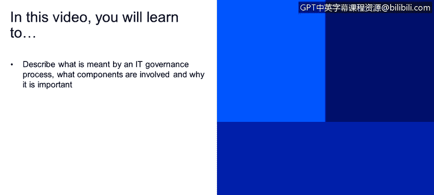
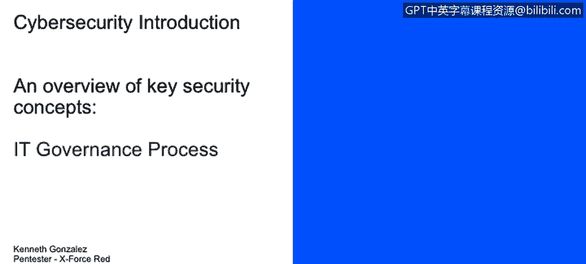
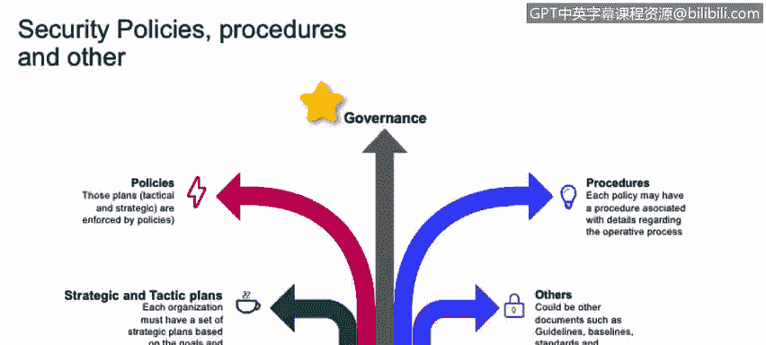

# 课程1：《网络安全工具与网络攻击简介》：128：IT治理流程

## 概述
在本节课程中，我们将学习IT治理流程。我们将描述IT治理流程的含义，了解其涉及的组成部分，并探讨其重要性。这些内容对于组织而言，不仅是“最好拥有”的知识，在大多数情况下更是“必须拥有”的。

## 战略与战术计划
上一节我们介绍了IT治理的基本概念，本节中我们来看看其核心组成部分。首先，组织拥有战略和战术计划。这类计划为组织的各个部门设定了发展方向。每个部门都将依据战略计划来努力实现目标，因为战略计划指明了公司的前进方向。例如，如果公司希望在未来两年内将电脑销售额提升20%，那么公司内部的所有部门都需要集中精力来实现这一战略目标。

战术计划则是关于如何实现战略目标的具体方法。因此，战略计划和战术计划是相辅相成的。

## 政策与程序
理解了计划之后，我们来看看政策和程序。政策实际上非常重要。你需要制定政策来设定基线，确立你希望拥有的业务结构。

以下是政策的一个简单示例：
你的业务需要为用户提供互联网访问。那么，你首先必须拥有或需要拥有的是**政策**。政策规定了用户将如何访问互联网，以及用户在互联网上可以做什么和不可以做什么。因此，一份互联网使用政策应该到位，以让用户了解他们的权限和限制。

接下来是**程序**。程序是执行某项任务需要遵循的具体步骤。例如，一个新用户为了获得互联网访问权限应该做什么。在这个场景中，程序可能允许用户向IT部门提交互联网访问请求。一旦用户获得访问权限，系统可能会提示用户阅读互联网使用政策，并且用户需要接受该政策才能开始使用互联网。这是我们在公共互联网访问场所（如星巴克）通常会遇到的情况：当你连接到Wi-Fi网络时，会收到一个强制门户页面，其中包含大量信息，本质上声明星巴克对你使用该连接发送的所有数据和信息不承担责任。

简单来说，**程序**是你为了获得某项服务或执行某项操作而需要遵循的过程；而**政策**是你需要理解并接受才能开始使用计算机、互联网或设备的一系列规则。

## 什么是治理？
在讨论了政策与程序之后，我们来深入理解“治理”本身。治理是对组织所有不同部分的理解，其目的是为了实现一个统一的目标。

例如，COBIT是一个优秀的框架，它可以帮助你的公司改善IT治理。因为它让组织的所有不同部门使用同一种“语言”进行沟通。举例来说，如果会计部门的某位员工在薪资系统中发现了一个漏洞并需要修改，他们知道，若想对系统进行修改，他们需要遵循内部流程：创建一个工单或事件案例。这个事件将被提交给IT部门，IT人员会将其按优先级排入处理队列，等待专家处理。

这实际上是一个非常标准的流程。我刚才提到的所有内容，都是IT治理流程的一部分。它可能对应着你IT部门的变更管理流程或交付与支持流程。这是一个很好的例子，说明了通常与技术无关的会计部门，如何需要理解并与IT部门使用相同的“语言”进行沟通，以便所有部门能够朝着共同的目标努力。

## 总结
本节课中，我们一起学习了IT治理流程。我们了解到，IT治理涉及**战略与战术计划**来设定和实现组织目标，通过**政策**来建立规则和基线，并通过**程序**来定义具体的操作步骤。治理的核心在于协调组织的各个部分，使用统一的框架（如COBIT）和共同的语言，以确保整个组织能够高效、一致地朝着单一目标前进。对于任何希望其技术投资与业务目标保持一致的现代组织而言，建立有效的IT治理流程都至关重要。