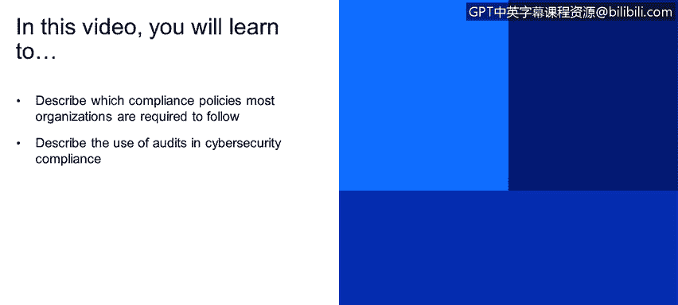

# 课程1：《网络安全工具与网络攻击简介》：129：网络安全合规与审计概述

在本节课程中，我们将学习网络安全领域的合规性与审计。我们将了解组织通常需要遵循的合规政策，并探讨审计在确保合规性方面所起的关键作用。

## 📜 什么是合规性？

合规性是指组织遵守特定法律、法规、标准和政策的过程。在全球范围内运营的组织，通常需要遵循一系列强制性规定，以确保其业务操作合法、安全且符合行业最佳实践。

以下是大多数组织，尤其是在美国或世界其他地区运营的组织，为了在特定国家开展业务而需要实施的一些法规或合规政策的例子：

*   **金融合规或金融监管计划**：例如**GLBA**，它与金融行业相关。
*   **HIPAA**：我们之前提到过，它与医疗保健相关，规范医疗机构如何处理患者的隐私数据，例如数据在医院或不同医疗机构之间传输的安全性。
*   **PCI DSS**：它与信用卡或金融流程的管理相关。例如，如果你想在自己的服务器上处理信用卡交易（比如你有一个在线商店），你可能需要遵守PCI DSS标准。许多处理PCI DSS的公司会定期进行渗透测试或漏洞评估，以满足合规要求。

以上只是合规性要求的一些例子。

## 🔍 审计的作用

理解合规性的一个重要部分是区分组织为确认自身是否符合特定法规或框架而可以执行的过程。其中一项关键活动就是**审计**。

审计可以是**内部审计**，也可以是**外部审计**。

*   **内部审计**：由组织内部的审计部门执行。这通常是一个持续进行的过程，贯穿组织的整个年度和生命周期。内部审计生成的报告主要用于改进组织的运营。
*   **外部审计**：通常基于特定要求进行。例如，为了符合PCI DSS标准，你需要聘请外部审计公司来生成报告，以了解你在PCI DSS的哪些部分不合规，或者你是否在所有部分都合规。外部公司将通过报告告知你是否可以申请PCI DSS认证，从而开始处理信用卡业务。

## 📊 审计方法论

现在，这里有一个你可以在审计项目中使用的通用方法论。这个过程基本适用于内部和外部审计，它包含三个主要阶段，每个阶段内又有一系列步骤。请注意，这只是一个基线标准，并非所有组织都严格采用完全相同的方法。

以下是审计的三个阶段：

上一节我们介绍了审计的类型，本节中我们来看看一个典型的审计过程包含哪些阶段。

**第一阶段：理解与规划**
在此阶段，你需要理解你所审计的组织。你需要识别系统中的关键参与者和关键用户，以便开始寻找任何可能在最终审计报告中报告的事件或问题。此外，你还需要创建一个威胁概况。例如，如果你正在审计一个软件，你需要了解：这是一个基于Web的软件，它可能面临的威胁之一是跨站脚本攻击。这并不意味着你正在审计的软件目前就存在跨站脚本漏洞，但这是你在第二和第三阶段需要评估和识别的潜在风险。

**第二阶段：评估与测试**
在第二阶段，你需要进行评估、理解和测试。你可能需要采访软件的创建者，询问他们是否已经对该Web系统或Web应用程序进行过任何安全审查。例如，审查结果是否包含了关于跨站脚本攻击的测试。如果没有进行过任何安全评估或审查，你可能需要创建自己的测试和评估，或者在你的报告中指出该软件没有任何能保证其安全性的安全评估或审查。

**第三阶段：风险评估**
最后一个阶段是风险评估或风险分析。这个过程将把你审计报告中的所有发现转化为具体的风险等级。以我们讨论的跨站脚本攻击为例，如果你发现组织没有进行任何安全评估，并且没有任何证据表明该软件不易受跨站脚本攻击，那么你需要将这一发现归类为风险。你需要判断这对你的组织来说是高风险、中等风险还是低风险。例如，如果你的业务依赖于那个Web系统，那么这可能是一个高风险甚至关键风险。因此，你需要将这些发现转化为可理解的风险等级。

## 🎯 总结

本节课中，我们一起学习了网络安全合规与审计的基础知识。我们了解到，合规性是组织遵守法律法规的必要过程，常见的合规框架包括HIPAA、GLBA和PCI DSS。审计是验证合规性的关键工具，分为内部审计和外部审计。一个典型的审计过程包含三个阶段：理解与规划、评估与测试、以及风险评估。掌握这些概念，对于理解和实施有效的网络安全治理至关重要。