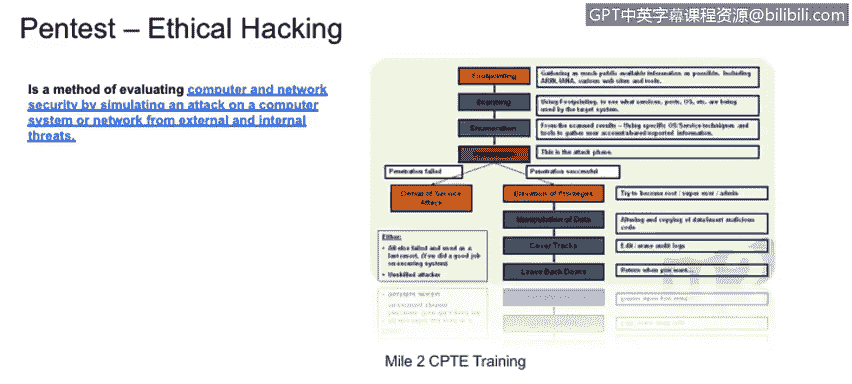

# 课程1：《网络安全工具与网络攻击简介》：130：渗透测试流程与Mile-2 CPENT培训

## 概述
在本节课程中，我们将学习渗透测试的基本流程，并理解什么是道德黑客。我们将重点介绍Mile-2 CPENT培训中提出的渗透测试方法论，并将其与安全审计进行对比。

## 渗透测试与道德黑客
上一节我们介绍了安全审计的概念。本节中，我们来看看渗透测试。渗透测试与审计不同。例如，在审计中，我们可能只是审查一个Web系统，评估其是否存在跨站脚本漏洞的风险。而在渗透测试中，我们会像攻击者或黑客一样行动，主动尝试利用系统。我们会模拟攻击，执行跨站脚本攻击，观察系统会发生什么，从而真正理解系统是否易受此类攻击。

我们可以模拟向用户发送恶意消息，诱使用户访问外部网站，进而尝试入侵用户计算机或系统。本质上，渗透测试或道德黑客流程是一种主动的安全评估方法。

## Mile-2 CPENT渗透测试流程
Mile-2是一家提供多项网络安全认证的厂商，其提出的渗透测试流程是一个基础且标准的方法论。以下是该流程的主要阶段：

### 1. 信息收集
首先，我们需要对目标进行“踩点”。对于我们的目标Web应用程序，我们需要了解我们正在处理的是何种系统。例如，它是基于WordPress的平台、定制化平台还是HTML5平台。

### 2. 扫描
扫描过程能让渗透测试员了解目标系统的状况。这包括发现开放的端口、Web服务器应用程序的操作系统类型、使用的编程语言以及Web应用程序所连接的数据库类型。

### 3. 枚举
在枚举阶段，我们将确定用于测试系统的具体技术和流程。这为进一步的渗透攻击做好准备。

### 4. 利用/渗透
这是执行攻击的阶段。如果我们发现目标是一个存在SQL注入漏洞的WordPress平台，我们就会生成并发动相应的攻击，观察攻击是否成功。

### 5. 后期利用
如果攻击成功，我们可能需要执行一系列后续步骤。例如：
*   **权限提升**：获取更高的系统访问权限。
*   **数据操纵**：访问或修改系统数据。
*   **清除痕迹**：为了避免被系统管理员或安全分析师发现，我们需要掩盖在系统中的活动踪迹。
*   **植入后门**：为了方便日后再次访问系统，而无需重复之前的攻击步骤，我们可能会在系统中留下一个后门。

## 流程的意义与对比
通过执行这一完整的渗透测试流程，我们不仅能确认系统是否存在漏洞，更能理解系统在面对攻击时的实际反应：是让攻击者完全控制系统，还是能成功阻断攻击并断开攻击者的连接。

这种测试过程通常被称为**进攻性安全扫描**。它要求你扮演攻击者的角色，像黑客一样对系统进行战术性测试。当然，**你必须事先获得客户的明确授权**才能进行此类任务。

最后，需要理解的关键点是：一次安全审计不一定包含渗透测试，而一次渗透测试也不等同于一次审计。两者在目标、方法和输出上存在诸多差异。在学习本课程介绍的各种技术和流程时，务必牢记这些区别，以便正确应用。

## 总结
本节课中，我们一起学习了Mile-2 CPENT培训中提出的标准渗透测试流程，涵盖了从信息收集到后期利用的各个阶段。我们明确了渗透测试需要模拟真实攻击者行为的核心思想，并强调了获得授权的重要性。同时，我们也区分了渗透测试与安全审计的不同之处，为后续深入学习各类安全评估技术奠定了基础。